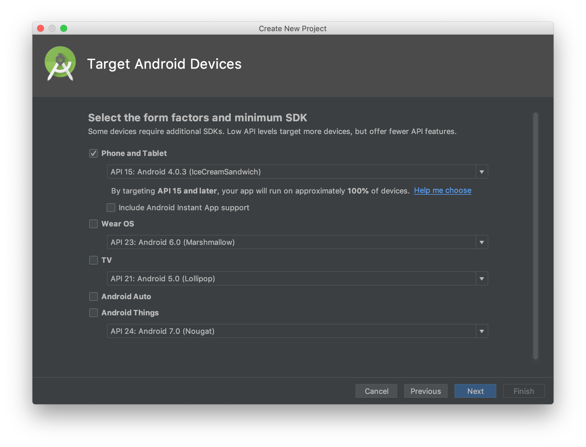
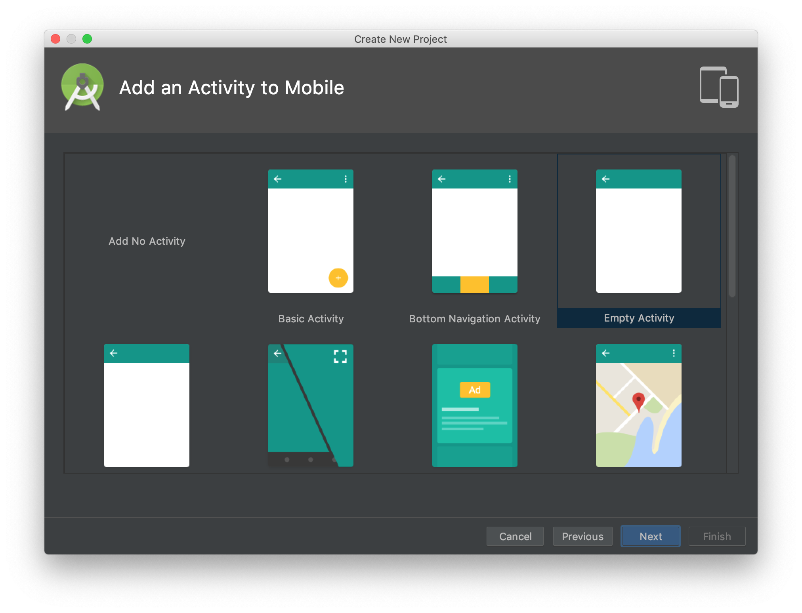

# Activity 
## Hello World Android
- Bukalah aplikasi Android Studio.
- Buatlah sebuah project baru dengan konfigurasi seperti pada gambar di bawah ini

  

  Nama aplikasi silakan disesuaikan dengan keinginan anda, perhatikan ada warning mengenai path project, sebaiknya path project tidak memiliki spasi.

  
  Targetkan phone dan pilihlah minimum sdk sesuai kebutuhan, semakin tinggi minimum sdk semakin sedikit device yang dapat menggunakan aplikasi yang anda buat.
  
  Pilihlah empty activity sebagai template starter project anda.
  

* Bukalah file MainActivity.java

  
  

## Pengertian Activity
Activity adalah:
-	Komponen yang menampilkan dan mengatur halaman aplikasi sebagai tempat interaksi antara pengguna dengan aplikasi Android.
-	Class MainActivity secara otomatis akan ter-generate ketika membuat suatu project. Class tersebut merupakan extends dari Class Activity.
-	Terdapat dua method yang pasti dimiliki oleh satu activity, yaitu:
    1. **onCreate()**. Untuk menginisiasi/membuat suatu activity
    2. **onPause()**. Untuk menyatakan ketika user meninggalkan suau activity.
-	Untuk menghubungkan Activity dengan tampilan yang telah dibentuk pada xml, digunakan fungsi **setContentView()**.
-	Untuk memanggil widget pada activity digunakan fungsi **findViewById()**.

## Activity Life Cycle (Daur Hidup Life Cycle)
-	Activity aplikasi android dikelola dengan sistem “activity stack” (antrian bertumpuk).
-	Ketika suatu activity dinyatakan “start” maka activity tersebut terletak di atas dari activity-activity yang telah berjalan pada “activity stack”. Keadaan tersebut bertahan hingga muncul suatu activity baru.
-	4 keadaan yang dimiliki activity, yaitu:
    1.	**Active/running**: Jika activity tersebut berada pada posisi atas “stack activity”.
    2. **Paused**: Jika activity tersebut tidak dipakai atau akan dibutuhkan pada suatu saat tertentu namun, activity itu masih ada atau visible. Activity yang berada pada keadaan “pause” masih tersimpan pada memory. Namun jika memori telah penuh bias saja activity tersebut terhapus. 
    3. **Stopped**: Jika activity sudah tidak dipakai dan digantikan oleh activity lain. Activity yang telah “stopped” tidak akan dipanggil lagi, dan memori akan menghapus segala informasi mengenai activity tersebut. 
    4. **Restart**: Jika activity “paused” atau “stopped”, sistem dapat menghapus activity ini dari memory, dan ketika activity ini dibutuhkan dan dipanggil kembali maka, activity akan kembali ke keadaan awal (restart).

## PRAKTIKUM

1. Buat sebuah project baru dengan nama **Activity_Life_Cycle** atau download "Starter_Code"
2. Saat membuat project baru, secara otomatis activity utama akan terbuat dengan nama "MainActivity"
3. Ketikkan kode seperti pada gambar berikut (Sudah tersedia pula di Starter_Code).
    
4. Jalankan kode tersebut
5. Perhatikan tampilan *pop up* yang keluar ketika aplikasi dijalankan.
6. Tambahkan kode seperti gambar berikut kemudian jalankan kembali.
  

