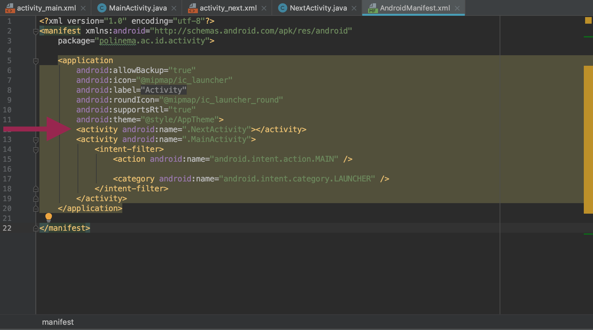

# Activity 

## Pengertian Activity
Activity adalah:
-	Komponen yang menampilkan dan mengatur halaman aplikasi sebagai tempat interaksi antara pengguna dengan aplikasi Android.
-	Class MainActivity secara otomatis akan ter-generate ketika membuat suatu project. Class tersebut merupakan extends dari Class Activity.
-	Terdapat dua method yang pasti dimiliki oleh satu activity, yaitu:
    1. **onCreate()**. Untuk menginisiasi/membuat suatu activity
    2. **onPause()**. Untuk menyatakan ketika user meninggalkan suau activity.
-	Untuk menghubungkan Activity dengan tampilan yang telah dibentuk pada xml, digunakan fungsi **setContentView()**.
-	Untuk memanggil widget pada activity digunakan fungsi **findViewById()**.

## Cara Membuat Activity
Untuk membuat activity dapat dilakukan secara manual atau menggunakan template yang disediakan oleh android studio. Berikut ini langkah langkah untuk membuat sebuah activity.
1. Klik kanan pada package yang ada pada new project kemudian pada menu yang ada pilih menu `activity` kemudian pada pilihan template pilihlah `empty activity`

2. Kemudian pada dialog yang muncul isikan nama activity yang akan anda buat, pada screenshot ini dibuat sebuah activity dengan nama `Next Activity`

3. Klik finish, ketika anda meng klik tombol finish Android Studio melakukan finalisasi pembuatan activity dengan melengkapi activity tersebut dengan sebuah file template xml dan mendaftarkannya ke Android Manifest.

4. Hasil android manifest yang sudah berubah dapat dilihat pada gambar dibawah ini

5. Jika anda ingin membuat sebuah activity tanpa mengikuti template yang disediakan android studio dapat dilakukan dengan melakukan langkah langkah di atas secara manual, mulai dari membuat sebuah class yang mengextend class `AppCompatActivity` kemudian membuat sebuah layout xml dan memanggilnya pada fungsi `onCreate()` di activity yang dibuat dan langkah terakhir adalah mendaftarkan activity tersebut ke Android Manifest.

## Activity Life Cycle (Daur Hidup Life Cycle)
-	Activity aplikasi android dikelola dengan sistem “activity stack” (antrian bertumpuk).
-	Ketika suatu activity dinyatakan “start” maka activity tersebut terletak di atas dari activity-activity yang telah berjalan pada “activity stack”. Keadaan tersebut bertahan hingga muncul suatu activity baru.
-	4 keadaan yang dimiliki activity, yaitu:
    1.	**Active/running**: Jika activity tersebut berada pada posisi atas “stack activity”.
    1. **Paused**: Jika activity tersebut tidak dipakai atau akan dibutuhkan pada suatu saat tertentu namun, activity itu masih ada atau visible. Activity yang berada pada keadaan “pause” masih tersimpan pada memory. Namun jika memori telah penuh bias saja activity tersebut terhapus. 
    2. **Stopped**: Jika activity sudah tidak dipakai dan digantikan oleh activity lain. Activity yang telah “stopped” tidak akan dipanggil lagi, dan memori akan menghapus segala informasi mengenai activity tersebut. 
    3. **Restart**: Jika activity “paused” atau “stopped”, sistem dapat menghapus activity ini dari memory, dan ketika activity ini dibutuhkan dan dipanggil kembali maka, activity akan kembali ke keadaan awal (restart).

## Praktikum 

1. Buat sebuah project baru dengan nama **Activity_Life_Cycle** atau download "Starter_Code"
2. Saat membuat project baru, secara otomatis activity utama akan terbuat dengan nama "MainActivity"
3. Ketikkan kode seperti pada gambar berikut (Sudah tersedia pula di Starter_Code).
    
4. Jalankan kode tersebut
5. Perhatikan tampilan *pop up* yang keluar ketika aplikasi dijalankan.
6. Tambahkan kode seperti gambar berikut kemudian jalankan kembali.
  

