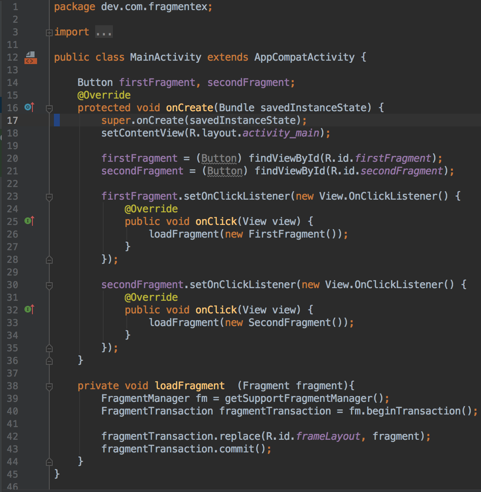

# Android Fragment Life Cycle
## Pengertian Fragment

Android Fragment adalah bagian yang dapat digunakan kembali dari antarmuka pengguna android activity yang digunakan untuk membuat UI yang dinamis dan fleksibel.

Fragmen memiliki siklus hidup itu sendiri tetapi selalu tertanam dengan aktivitas sehingga siklus hidup fragmen secara langsung dipengaruhi oleh siklus hidup aktivitas host dan fragmen yang diterimanya memiliki input peristiwa sendiri.

Misalnya, saat aktivitas dihentikan sementara, semua fragmen di dalamnya juga dihentikan sementara, dan bila aktivitas dimusnahkan, semua fragmen juga demikian. Akan tetapi, saat aktivitas berjalan (dalam status daur hidup dilanjutkan, kita bisa memanipulasi setiap fragmen secara terpisah, seperti menambah atau membuangnya. Saat melakukan transaksi fragmen, kita juga bisa menambahkannya ke back-stack yang dikelola oleh aktivitas —setiap entri back-stack merupakan catatan transaksi fragmen yang terjadi. Dengan back-stack pengguna dapat membalikkan transaksi fragmen (mengarah mundur), dengan menekan tombol Kembali.

Di aplikasi Android kita dapat menggunakan beberapa fragmen dalam satu aktivitas untuk membuat UI Multi-Pane dan juga dapat menggunakan satu fragmen dalam beberapa aktivitas.

Fragment Manager bertanggung jawab untuk menambah / menghapus atau mengganti fragmen pada waktu berjalan di mana pun aktivitas.

Bila Kita menambahkan fragmen sebagai bagian dari layout aktivitas, fragmen itu akan berada dalam ViewGroup di hierarki tampilan aktivitas tersebut dan fragmen mendefinisikan layout tampilannya sendiri. 

Kita bisa menyisipkan fragmen ke dalam layout aktivitas dengan mendeklarasikan fragmen dalam file layout aktivitas, sebagai elemen `<fragment>`, atau dari kode aplikasi dengan menambahkannya ke ViewGroup yang ada. 


Pada gambar di atas, dicontohkan bagaimana dua modul UI yang didefinisikan oleh fragmen bisa digabungkan ke dalam satu activity untuk desain tablet namun dipisahkan untuk desain handset.

## Membuat Fragment

Untuk membuat fragment, kita membuat subkelas fragment (atau subkelas yang ada). kelas fragment memiliki kode yang mirip seperti Activity. Kelas ini memiliki metode callback yang serupa dengan activity seperti onCreate(), onStart(), onPause(), dan onStop(). 

 

- **onAttach()**
metode ini panggil pertama kali bahkan sebelum onCreate() callback dan setelah fragmen telah dipasangkan ke activity
- **onCreate()**
Sistem akan memanggilnya saat membuat fragmen. Dalam implementasi, kita harus melakukan inisialisasi komponen penting dari fragmen yang ingin dipertahankan saat fragmen dihentikan sementara atau dihentikan, kemudian dilanjutkan.
- **onCreateView()**
Sistem akan memanggilnya saat fragmen menggambar antarmuka penggunanya (UI)untuk yang pertama kali. Untuk menggambar UI fragmen, Anda harus mengembalikan View dari metode ini yang menjadi akar layout fragmen. Hasil yang dikembalikan bisa berupa null jika fragmen tidak menyediakan UI.
- **onActivityCreated()**
Metode ini dipanggil setelah Activity onCreate() Callback telah menyelesaikan eksekusi. Metode ini merupakan indikasi untuk activity tersebut telah menyelesaikan eksekusi sebelum kita mencoba mengakses dan memodifikasi elemen UI dari activity secara bebas
- **onStart()**
metode yang dipanggil setelah fragmen terlihat pada activity
- **onResume()**
metode ini dipanggil ketika pengguna berinteraksi dengan fragmen dalam activity setelah Activity onResume() callback

Karena sebuah fragment tidak lagi digunakan, maka ia akan melewati serangkaian *reverse callback*

- **onPause()**
metode ini dipanggil ketika fragmen tidak lagi berinteraksi dengan pengguna baik karena aktivitasnya sedang ditunda atau operasi fragmen mengubahnya dalam activity.

- **onStop()**
metode ini dipanggil ketika fragmen tidak lagi berinteraksi dengan pengguna baik karena aktivitasnya dihentikan atau operasi fragmen mengubahnya dalam activity

- **onDestroyView()**
metode ini dipanggil untuk memungkinkan fragmen membersihkan resources yang terkait dengan view yang ada pada activity

- **onDestroyView()**
metode ini dipanggil untuk melakukan pembersihan akhir dari status fragmen

- **onDetach()**
metode ini dipanggil ke fragmen yang tidak lagi dikaitkan dengan aktivitasnya

Biasanya kita harus mengimplementasikan setidaknya metode alur onCreate(), onCreateView(), dan onPause().

- **onSaveInstanceState()**
callback ini disebut dimana kita diizinkan untuk menyimpan beberapa data mengenai peristiwa fragmen tepat sebelum aplikasi di pause sehingga pengguna kembali ke aplikasi merekadengan mendapatkan data yang disimpan. Disini dibutuhkan Bundle sehingga kita dapat menyimpan data sebagai key atau nilai.

## Kegunaan Fragmen Di Android

Sebelum Fragment diperkenalkan, kita hanya dapat menampilkan satu activity di layar pada satu waktu tertentu sehingga tidak dapat membagi layar dan mengontrol bagian yang berbeda secara terpisah. Dengan bantuan Fragment, kita dapat membagi layar di berbagai bagian dan mengontrol bagian-bagian yang berbeda secara terpisah.

Dengan menggunakan Fragment, kita dapat membentuk beberapa Fragment dalam satu activity. Fragment memiliki event, layout, dan status mereka sendiri. Hal ini memberikan fleksibilitas dan juga meniadakan limitasi dalam activity tunggal di layar pada suatu waktu.

### Kode Fragment Dasar Dalam XML
```
 <fragment
android:id="@+id/fragments"
android:layout_width="match_parent"
android:layout_height="match_parent" />
```

### Buat Kelas Fragment di Android Studio

Untuk membuat Fragment, pertama kali kita extend kelas Fragment, lalu override method status utama lalu masukkan logic kode aplikasi, serupa dengan cara menggunakan kelas activity. Saat membuat Fragment kita harus menggunakan callback onCreateView () untuk menentukan layout dan untuk menjalankan Fragment.


Di sini parameter "inflater" adalah "LayoutInflater" yang digunakan untuk melakukan "inflate layout". Parameter "container" adalah parent ViewGroup (dari layout activity) tempat susunan Fragment yang akan disisipkan.

Parameter "savedInstanceState" adalah "Bundle" yang menyediakan data tentang "instance" sebelumnya dari Fragment. Method inflate () memiliki tiga argumen, pertama adalah "resource layout" yang ingin kita inflate, kedua adalah "ViewGroup" sebgai parent dari layout yang diinflate. Parameter ketiga adalah nilai boolean yang mengindikasikan apakah layout yang diinflate haruskah di attach ke ViewGroup (parameter kedua).

## Implementasi Fragment

1. Buat proyek baru dan beri nama FragmentEx
2. Buka res > layout > activity_main (atau) main.xml dan modifikasi seperti berikut :

3. buka MainActivity.java
Pada langkah ini,buka MainActivity dan tambahkan kode untuk inisiasi tombol. Setelah itu buat event "setOnClickListener" di kedua Button. Pada klik Tombol Pertama kita replace "First Fragment " dan saat klik Tombol Kedua kita akan replace "Second Fragment" dengan layout (FrameLayout). Untuk mengganti Fragment dengan FrameLayout pertama-tama kita buat Fragment Manager dan kemudian mulai transaksi menggunakan Fragment Transaction dan akhirnya replace Fragment dengan layout yaitu FrameLayout.


4. buat dua fragment dengan cara klik kanan pada folder package dan buat class kemudian beri nama sebagai "FirstFragment" dan "SecondFragment" dan tambahkan kode berikut di masing-masing clas fragment.
5. FirstFragment.class

Di Fragment ini pertama-tama kita inflate layout dan dapatkan referensi terhadap Button object. Setelah itu kita lakukan event setOnClickListener di Button sehingga setiap kali pengguna mengklik tombol dengan pesan "First Fragment" ditampilkan di layar dengan menggunakan Toast.

6. SecondFragment.class


7. Buat 2 xml layout. beri nama sebagai fragment_first dan fragment_second dan tambahkan kode berikut di file masing-masing
8. fragment_first.xml


9. fragment_second.xml


<<<<<<< HEAD
10. Buka res > value > color.xml. 
Disini kita akan mendefinisikan warna yang akan digunakan dalam file xml


11. Buka AndroidManifest.xml.  Pada langkah ini, kita buka file Android Manifest yang sebenarnya tidak perlu kita edit sama sekali karena aplikasi ini hanya berisi satu Activitty yaitu MainActivity yang sudah didefinisikan di dalamnya. Dalam proyek ini, kita memang membuat dua Fragment tetapi kedua fragment tersebut tidak perlu didefinisikan dalam manifest karena fragment adalah bagian dari activity.

12. Jalankan aplikasi
=======
10. buka res > value > color.xml. 
Pada tahap ini kita akan mendefinisikan warna yang akan digunakan dalam file xml


11. buka AndroidManifest.xml.  Pada langkah ini, kita buka file Android Manifest yang sebenarnya tidak perlu kita edit sama sekali karena aplikasi ini hanya berisi satu Activitty yaitu MainActivity yang sudah didefinisikan didalamnya. Dalam proyek ini, kita memang membuat dua fragment tetapi kedua fragment tersebut tidak perlu didefinisikan dalam manifest karena fragment adalah bagian dari activity.

12. jalankan aplikasi.
  
>>>>>>> 637da133233b2ced5a500727bda3496148b6f28a
