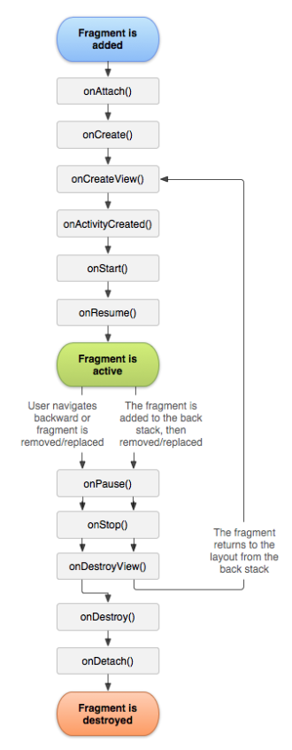

# Android Fragment Life Cycle
## Pengertian Fragment

Android Fragment adalah bagian yang dapat digunakan kembali dari antarmuka pengguna android activity yang digunakan untuk membuat UI yang dinamis dan fleksibel.

Fragmen memiliki siklus hidup itu sendiri tetapi selalu tertanam dengan aktivitas sehingga siklus hidup fragmen secara langsung dipengaruhi oleh siklus hidup aktivitas host dan fragmen yang diterimanya memiliki input peristiwa sendiri.

Misalnya, saat aktivitas dihentikan sementara, semua fragmen di dalamnya juga dihentikan sementara, dan bila aktivitas dimusnahkan, semua fragmen juga demikian. Akan tetapi, saat aktivitas berjalan (dalam status daur hidup dilanjutkan, kita bisa memanipulasi setiap fragmen secara terpisah, seperti menambah atau membuangnya. Saat melakukan transaksi fragmen, kita juga bisa menambahkannya ke back-stack yang dikelola oleh aktivitas —setiap entri back-stack merupakan catatan transaksi fragmen yang terjadi. Dengan back-stack pengguna dapat membalikkan transaksi fragmen (mengarah mundur), dengan menekan tombol Kembali.

Di aplikasi Android kita dapat menggunakan beberapa fragmen dalam satu aktivitas untuk membuat UI Multi-Pane dan juga dapat menggunakan satu fragmen dalam beberapa aktivitas.

Fragment Manager bertanggung jawab untuk menambah / menghapus atau mengganti fragmen pada waktu berjalan di mana pun aktivitas.

Bila Kita menambahkan fragmen sebagai bagian dari layout aktivitas, fragmen itu akan berada dalam ViewGroup di hierarki tampilan aktivitas tersebut dan fragmen mendefinisikan layout tampilannya sendiri. 

Kita bisa menyisipkan fragmen ke dalam layout aktivitas dengan mendeklarasikan fragmen dalam file layout aktivitas, sebagai elemen `<fragment>`, atau dari kode aplikasi dengan menambahkannya ke ViewGroup yang ada. 

Pada gambar diatas, dicontohkan bagaimana dua modul UI yang di definisikan oleh fragmen bisa digabungkan ke dalam satu activity untuk desain tablet namun dipisahkan untuk desain handset

## Membuat Fragment

untuk membuat fragmen, kita membuat subkelas fragmen (atau subkelas yang ada). kelas fragmen memiliki kode yang mirip seperti Activity. Kelas ini memiliki metode callback yang serupa dengan activity seperti onCreate(), onStart(), onPause(), dan onStop(). 

 

- onAttach()
metode ini panggil pertama kali bahkan sebelum onCreate() callback dan setelah fragmen telah dipasangkan ke activity
- onCreate()
Sistem akan memanggilnya saat membuat fragmen. Dalam implementasi, kita harus melakukan inisialisasi komponen penting dari fragmen yang ingin dipertahankan saat fragmen dihentikan sementara atau dihentikan, kemudian dilanjutkan.
- onCreateView()
Sistem akan memanggilnya saat fragmen menggambar antarmuka penggunanya (UI)untuk yang pertama kali. Untuk menggambar UI fragmen, Anda harus mengembalikan View dari metode ini yang menjadi akar layout fragmen. Hasil yang dikembalikan bisa berupa null jika fragmen tidak menyediakan UI.
- onActivityCreated()
Metode ini dipanggil setelah Activity onCreate() Callback telah menyelesaikan eksekusi. Metode ini merupakan indikasi untuk activity tersebut telah menyelesaikan eksekusi sebelum kita mencoba mengakses dan memodifikasi elemen UI dari activity secara bebas
- onStart()
metode yang dipanggil setelah fragmen terlihat pada activity
- onResume()
metode ini dipanggil ketika pengguna berinteraksi dengan fragmen dalam activity setelah Activity onResume() callback

Karena sebuah fragment tidak lagi digunakan, maka ia akan melewati serangkaian reverse callback

- onPause()
metode ini dipanggil ketika fragmen tidak lagi berinteraksi dengan pengguna baik karena aktivitasnya sedang ditunda atau operasi fragmen mengubahnya dalam activity.

- onStop()
metode ini dipanggil ketika fragmen tidak lagi berinteraksi dengan pengguna baik karena aktivitasnya dihentikan atau operasi fragmen mengubahnya dalam activity

- onDestroyView()
metode ini dipanggil untuk memungkinkan fragmen membersihkan resources yang terkait dengan view yang ada pada activity

- onDestroyView()
metode ini dipanggil untuk melakukan pembersihan akhir dari status fragmen

- onDetach()
metode ini dipanggil ke fragmen yang tidak lagi dikaitkan dengan aktivitasnya

Biasanya kita harus mengimplementasikan setidaknya metode alur onCreate(), onCreateView(), dan onPause().

- onSaveInstanceState()
callback ini disebut dimana kita diizinkan untuk menyimpan beberapa data mengenai peristiwa fragmen tepat sebelum aplikasi di pause sehingga pengguna kembali ke aplikasi merekadengan mendapatkan data yang disimpan. Disini dibutuhkan Bundle sehingga kita dapat menyimpan data sebagai key atau nilai.

