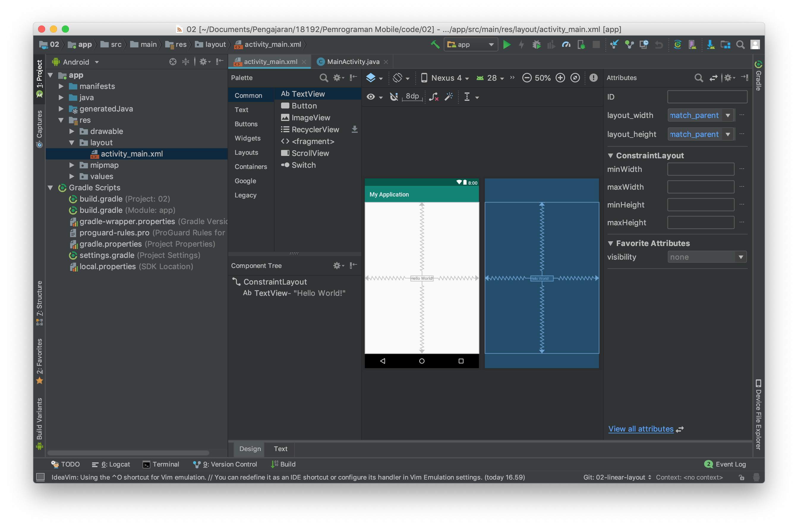
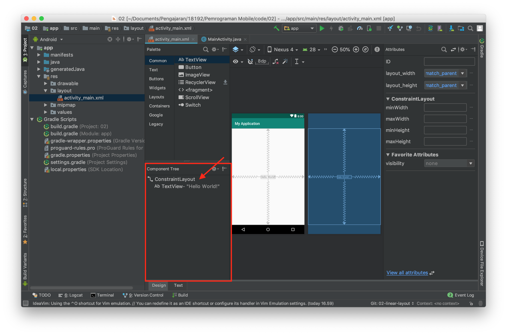
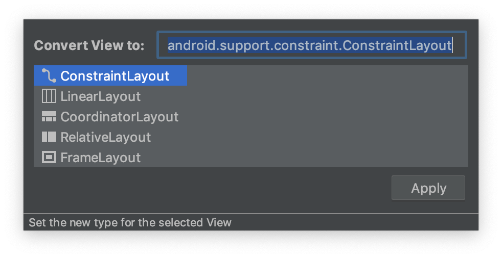
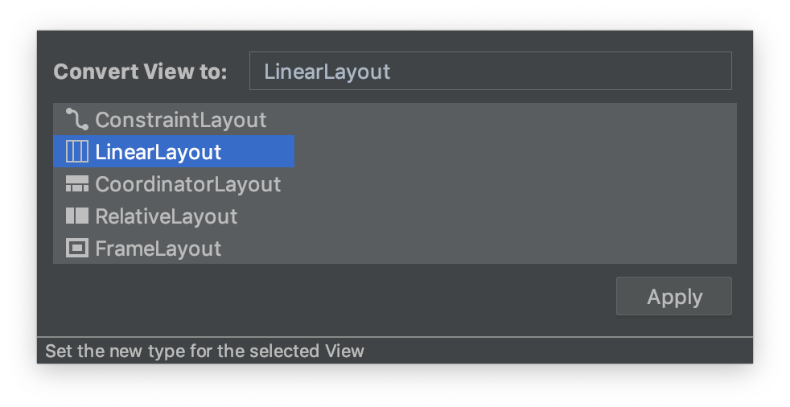
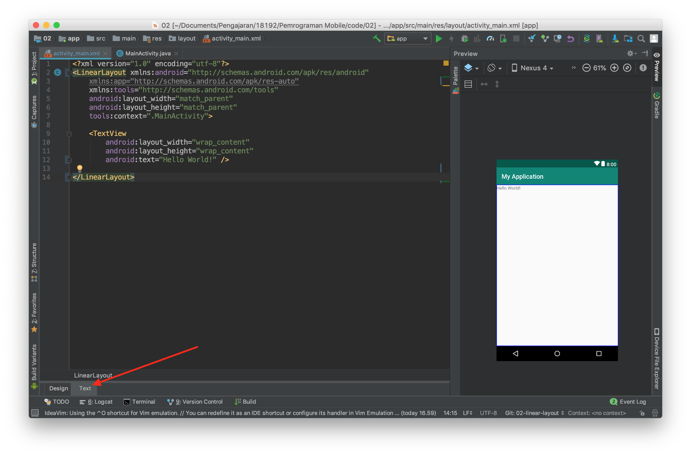
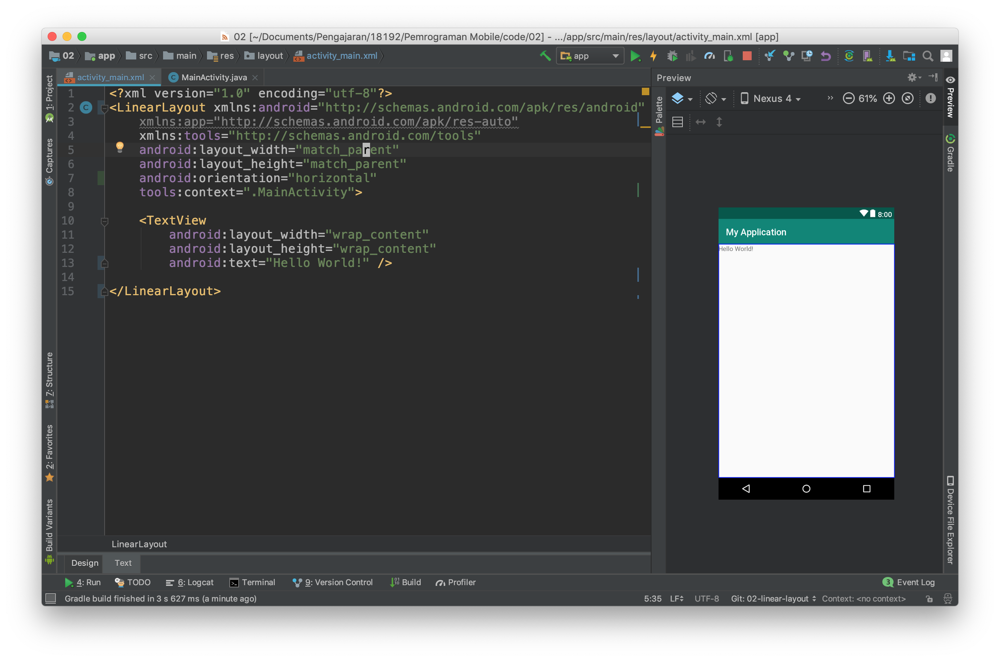
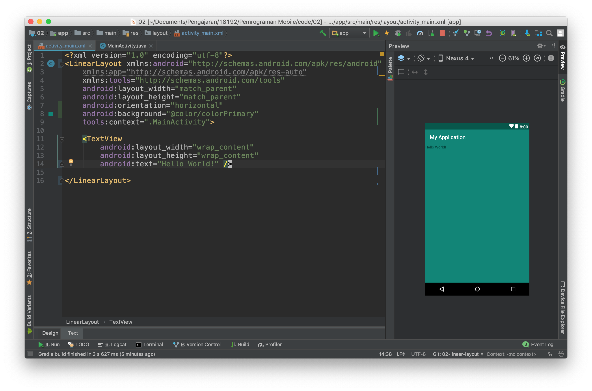
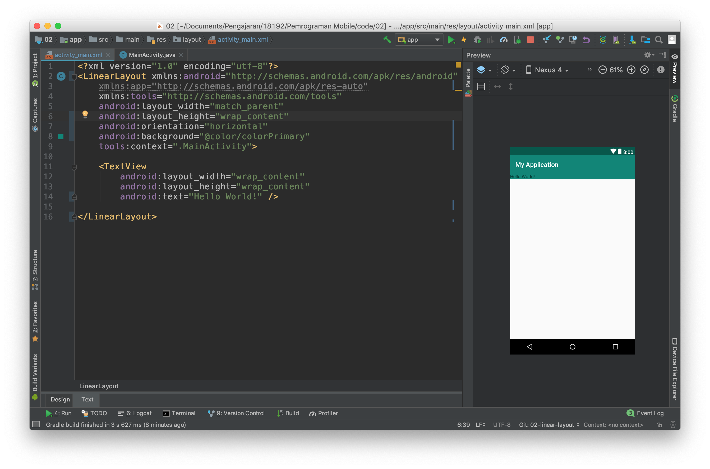
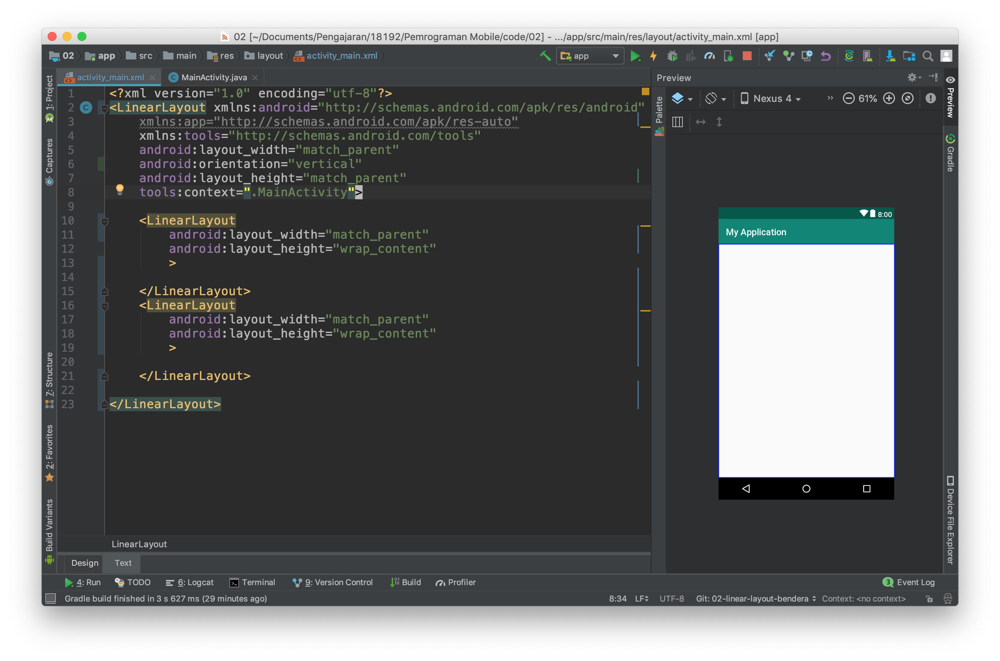
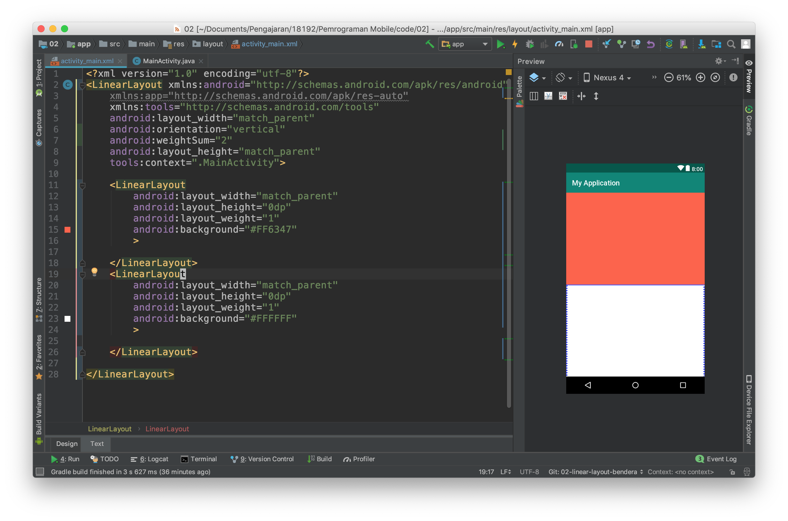

# Membuat aplikasi dengan linear layout
- Buatlah kembali sebuah project baru dengan konfigurasi yang disesuaikan dengan kebutuhan anda seperti pada langkah praktikum sebelumnya.
- Bukalah file `activity_main.xml` kemudian buka dengan menggunakan design mode.

- Pada bagian jendela **Component Tree**, klik kanan pada **ConstraintLayout**.

- Kemudian lakukan konversi view dari constraint layout ke linear layout.

- Kemudian gantilah design mode ke text mode. 

- Tambahkan property `android:orientation="vertical"` pada tag `LinearLayout`

Anda baru saja menambahkan atribut baru pada tag xml. Ada banyak property lain yang perlu Anda ketahui. Silahkan melakukan eksplorasi untuk property atribut lain.

- Selanjutnya tambahkan property **background** pada linear layout seperti pada gambar dibawah ini sehingga layout Anda berubah background nya menjadi hijau.

- Kemudian ubahlah nilai dari property `layout_height` menjadi **wrap_content**

- Lakukanlah kompilasi, kemudian simpulkan apakah perbedaan antara `wrap_content` dan `match_parent`

Selain properties diatas linear layout mempunyai properties khusus yang hanya ada pada tipe layout ini, yaitu `weigth_sum` dan `layout_weight`

- **weight_sum** adalah bobot yang diberikan kepada `LinearLayout` bobot ini nantinya dapat digunakan untuk membagi ukuran yang dapat dimiliki oleh child dari `LinearLayout`.
- **layout_weight** adalah bobot yang diberikan kepada child dari LinearLayout untuk menentukan ukuran dari child ini pada layar.

Untuk memahami penggunaannya lakukan langkah percobaaan berikut ini :

- Buka kembali project sebelumnya, kemudian kembalikan `layout_height` ke `match_parent`, hapus juga property background seperti pada gambar dibawah ini :

- Hapuslah tag xml `TextView` kemudian isilah LinearLayout dengan dua buah child lain yang juga sebuah LinearLayout. Hasilnya akanb seperti pada gambar dibawah ini.

- Jika Anda perhatikan, belum terjadi perubahan apapun pada layout. Untuk itu lanjutkan dengan menambahkan property `background`, `weight_sum`, dan `layout_weight` seperti pada gambar dibawah ini.

> Kita dapat menggunakan `LinearLayout` sebagai child dari `LinearLayout` atau layout lain proses ini dinamakan nested layout.

- Berdasarkan percobaan di atas lakukanlah perubahan-perubahan sebagai berikut, 
  - ubah *orientation* menjadi horizontal
  - ubah *weight sum* menjadi angka integer yang lain
  - ubah *layout_weight* dari salah satu **LinearLayout**
  
  Ambillah kesimpulan dari percobaan tersebut.