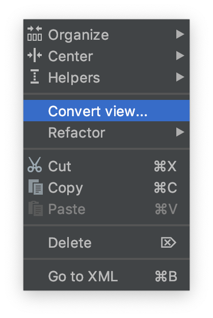
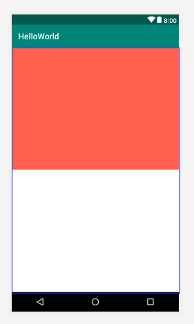

# Membuat aplikasi dengan linear layout
- Buatlah kembali sebuah project baru dengan konfigurasi yang disesuaikan dengan kebutuhan anda seperti pada langkah praktikum sebelumnya.
- Bukalah file `activity_main.xml` kemudian buka dengan menggunakan design mode.


- Pada bagian jendela **Component Tree**, klik kanan pada **ConstraintLayout**.


- Kemudian lakukan konversi view dari constraint layout ke linear layout.



- Kemudian gantilah design mode ke text mode. 


- Tambahkan property `android:orientation="vertical"` pada tag `LinearLayout`

```xml
<?xml version="1.0" encoding="utf-8"?>
<LinearLayout xmlns:android="http://schemas.android.com/apk/res/android"
    xmlns:app="http://schemas.android.com/apk/res-auto"
    xmlns:tools="http://schemas.android.com/tools"
    android:layout_width="match_parent"
    android:layout_height="match_parent"
    android:orientation="vertical"
    tools:context=".MainActivity">

    <TextView
        android:id="@+id/hello_text"
        android:layout_width="wrap_content"
        android:layout_height="wrap_content"
        android:text="Hello World!" />

</LinearLayout>
```

Anda baru saja menambahkan atribut baru pada tag xml yaitu `orientation` dengan nilai `vertical`. Property `orientation` merupakan property wajib yang harus ada pada layout dengan tipe *Linear*. Pada layout linear layout akan disusuh secara berjajar baik secara vertikal maupun horizontal. Selain menggunakan nilai `vertical`, dapat juga digunakan nilai `horizontal`. Ada banyak property lain yang perlu Anda ketahui. Silahkan melakukan eksplorasi untuk property atribut lain.

- Selanjutnya tambahkan property **background** pada linear layout seperti pada gambar dibawah ini sehingga layout Anda berubah background nya menjadi hijau.

```xml
<?xml version="1.0" encoding="utf-8"?>
<LinearLayout xmlns:android="http://schemas.android.com/apk/res/android"
    xmlns:app="http://schemas.android.com/apk/res-auto"
    xmlns:tools="http://schemas.android.com/tools"
    android:layout_width="match_parent"
    android:layout_height="match_parent"
    android:orientation="vertical"
    android:background="@color/colorPrimary"
    tools:context=".MainActivity">

    <TextView
        android:id="@+id/hello_text"
        android:layout_width="wrap_content"
        android:layout_height="wrap_content"
        android:text="Hello World!" />

</LinearLayout>
```

- Kemudian ubahlah nilai dari property `layout_height` menjadi **wrap_content**

```xml
<?xml version="1.0" encoding="utf-8"?>
<LinearLayout xmlns:android="http://schemas.android.com/apk/res/android"
    xmlns:app="http://schemas.android.com/apk/res-auto"
    xmlns:tools="http://schemas.android.com/tools"
    android:layout_width="match_parent"
    android:layout_height="wrap_content"
    android:orientation="vertical"
    android:background="@color/colorPrimary"
    tools:context=".MainActivity">

    <TextView
        android:id="@+id/hello_text"
        android:layout_width="wrap_content"
        android:layout_height="wrap_content"
        android:text="Hello World!" />

</LinearLayout>
```

- Lakukanlah kompilasi, kemudian simpulkan apakah perbedaan antara `wrap_content` dan `match_parent`

Selain properties diatas linear layout mempunyai properties khusus yang hanya ada pada tipe layout ini, yaitu `weigth_sum` dan `layout_weight`

- **weight_sum** adalah bobot yang diberikan kepada `LinearLayout` bobot ini nantinya dapat digunakan untuk membagi ukuran yang dapat dimiliki oleh child dari `LinearLayout`.
- **layout_weight** adalah bobot yang diberikan kepada child dari LinearLayout untuk menentukan ukuran dari child ini pada layar.

Untuk memahami penggunaannya lakukan langkah percobaaan berikut ini :

- Buka kembali project sebelumnya, kemudian kembalikan `layout_height` ke `match_parent`, hapus juga property background seperti pada gambar dibawah ini :

```xml
<?xml version="1.0" encoding="utf-8"?>
<LinearLayout xmlns:android="http://schemas.android.com/apk/res/android"
    xmlns:app="http://schemas.android.com/apk/res-auto"
    xmlns:tools="http://schemas.android.com/tools"
    android:layout_width="match_parent"
    android:layout_height="match_parent"
    android:orientation="vertical"
    tools:context=".MainActivity">

</LinearLayout>
```

- Hapuslah tag xml `TextView` kemudian isilah LinearLayout dengan dua buah child lain yang juga sebuah LinearLayout.

```xml
<?xml version="1.0" encoding="utf-8"?>
<LinearLayout xmlns:android="http://schemas.android.com/apk/res/android"
    xmlns:app="http://schemas.android.com/apk/res-auto"
    xmlns:tools="http://schemas.android.com/tools"
    android:layout_width="match_parent"
    android:layout_height="match_parent"
    android:orientation="vertical"
    tools:context=".MainActivity">

    <LinearLayout
        android:layout_width="match_parent"
        android:layout_height="wrap_content">

    </LinearLayout>
    <LinearLayout
        android:layout_width="match_parent"
        android:layout_height="wrap_content">

    </LinearLayout>

</LinearLayout>
```

- Jika Anda perhatikan, belum terjadi perubahan apapun pada layout. Untuk itu lanjutkan dengan menambahkan property `background`, `weight_sum`, dan `layout_weight` seperti code snippet dibawah ini.

```xml
<?xml version="1.0" encoding="utf-8"?>
<LinearLayout xmlns:android="http://schemas.android.com/apk/res/android"
    xmlns:app="http://schemas.android.com/apk/res-auto"
    xmlns:tools="http://schemas.android.com/tools"
    android:layout_width="match_parent"
    android:layout_height="match_parent"
    android:orientation="vertical"
    android:weightSum="2"
    tools:context=".MainActivity">

    <LinearLayout
        android:layout_width="match_parent"
        android:layout_height="0dp"
        android:layout_weight="1"
        android:background="#FF6347">

    </LinearLayout>
    <LinearLayout
        android:layout_width="match_parent"
        android:layout_height="0dp"
        android:layout_weight="1"
        android:background="#FFFFFF">

    </LinearLayout>

</LinearLayout>
```

Hasilnya akan nampak seperti gambar berikut,



> Kita dapat menggunakan `LinearLayout` sebagai child dari `LinearLayout` atau layout lain proses ini dinamakan nested layout.

- Berdasarkan percobaan di atas lakukanlah perubahan-perubahan sebagai berikut, 
  - ubah *orientation* menjadi horizontal
  - ubah *weight sum* menjadi angka integer yang lain
  - ubah *layout_weight* dari salah satu **LinearLayout**
  
  Ambillah kesimpulan dari percobaan tersebut.