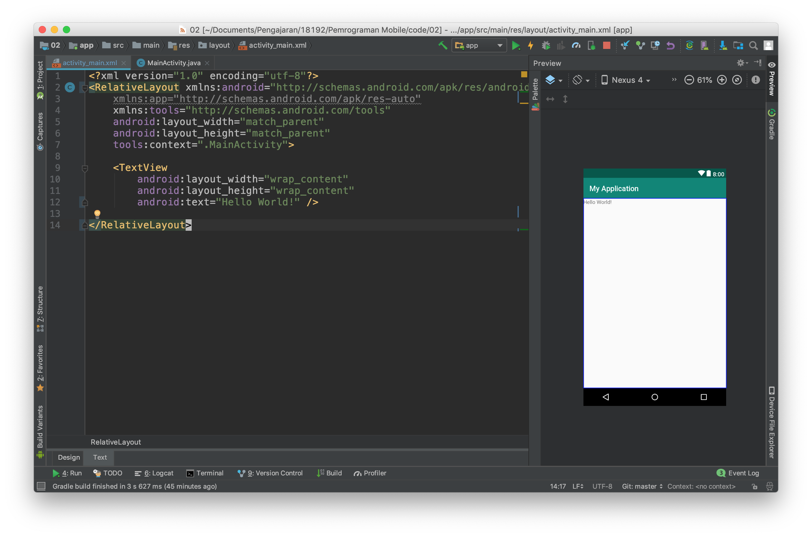
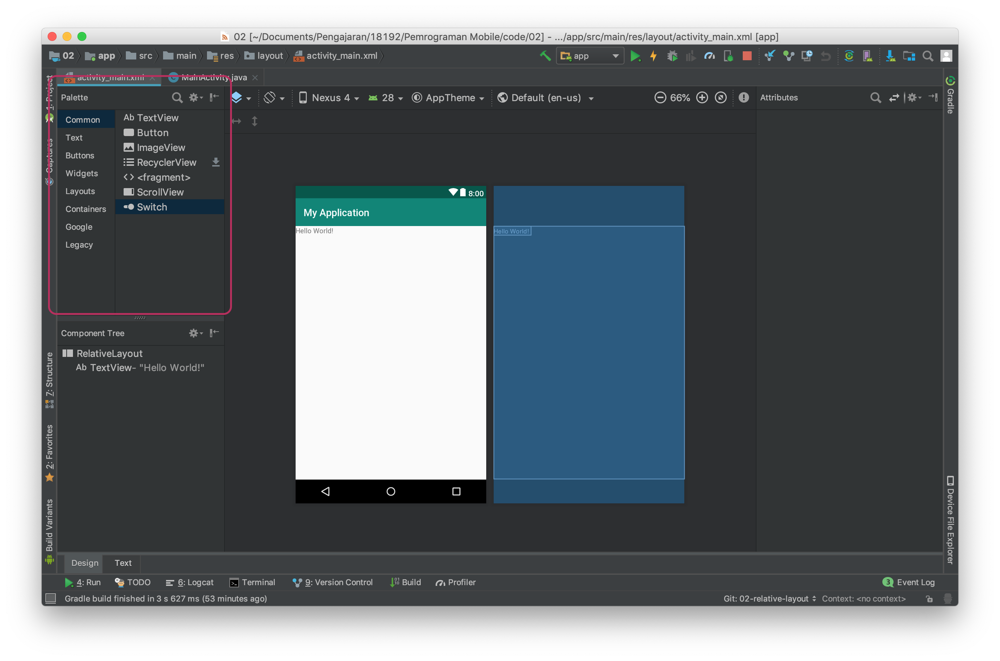
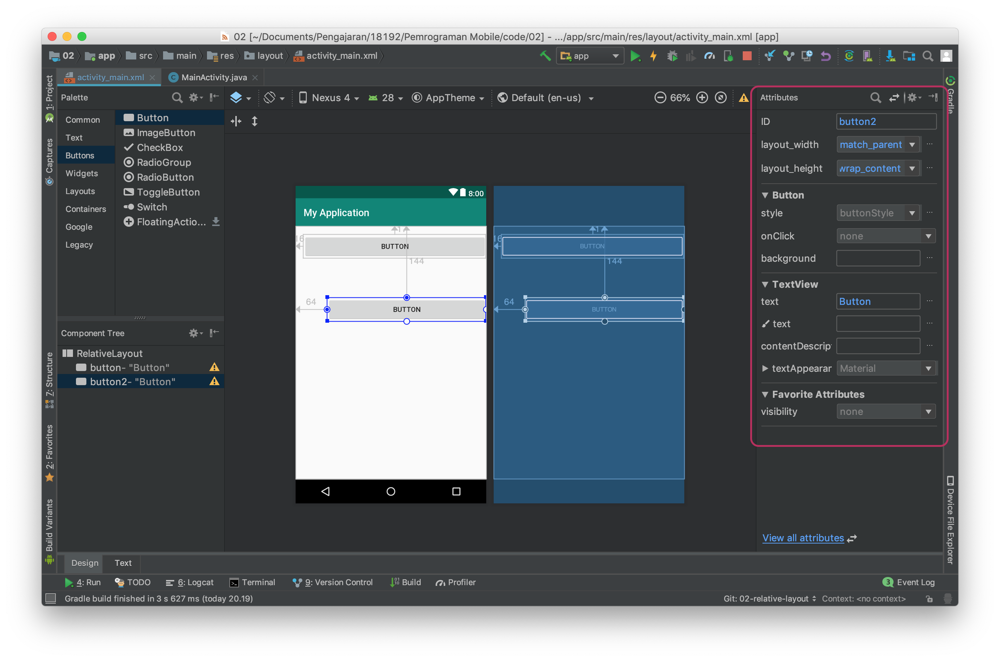
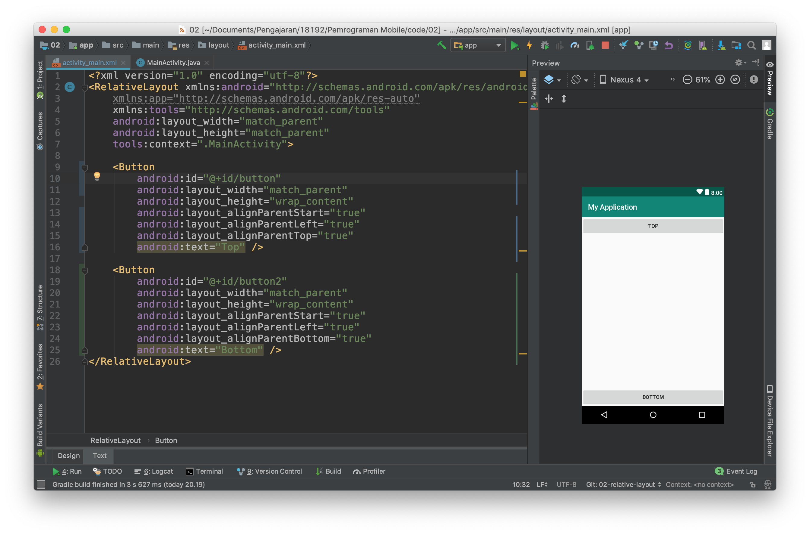
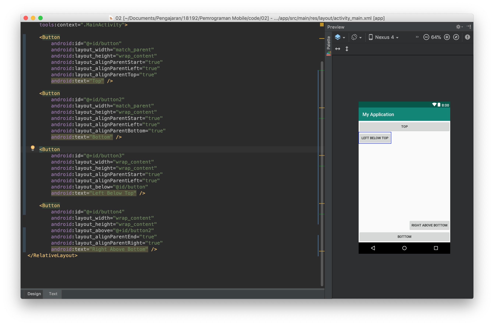

# Membuat aplikasi dengan relative layout
- Untuk memahami **relative layout**, kembalikan kode program pada `activity_main.xml` ke kondisi awal. Ubahlah *layout*-nya menjadi **relative layout**. Sehingga kode program dan tampilan berubah seperti gambar di bawah ini.
  

 > **RelativeLayout** adalah layout yang menempatkan suatu item relative terhadap parent atau item lain pada UI.

 - Untuk mencobanya, tambahkan dua buah button pada layout. Anda dapat menambahkan button dengan menggunakan **pallet** yang ada di sebelah kiri tampilan design. Kemudian jangan lupa menghapus `TextView` "hello world".

- Ubahlah teks dan lebar dari button sehingga menjadi seperti gambar di bawah ini.

> Untuk mengubah teks dan lebar button, Anda dapat menggunakan **text mode** atau pada **design mode** dengan mengklik button dan mengganti properties di bagian kanan editor.

- Selanjutnya, ubahlah tampilan dengan mengubah kode program melalui text mode sehingga menjadi seperti gambar di bawah ini.

Perhatikan pada kode program tersebut. Sebuah item di posisikan pada layout dengan memberikan detail posisinya yang relative terhadap parent.

Pada *button* pertama ini mempunyai *properties*
- `android:layout_alignParentStart="true"`
- `android:layout_alignParentLeft="true"`
- `android:layout_alignParentTop="true"`

Dengan konfigurasi properties seperti di atas, sebuah item akan diposisikan di sebelah kiri atas.

- untuk lebih memahami relative layout buatlah layout baru seperti pada gambar dibawah ini.

- Berdasarkan percobaan di atas cobalah membuat layout yang sebelumnya menggunakan *linear layout* dengan *relative layout*.