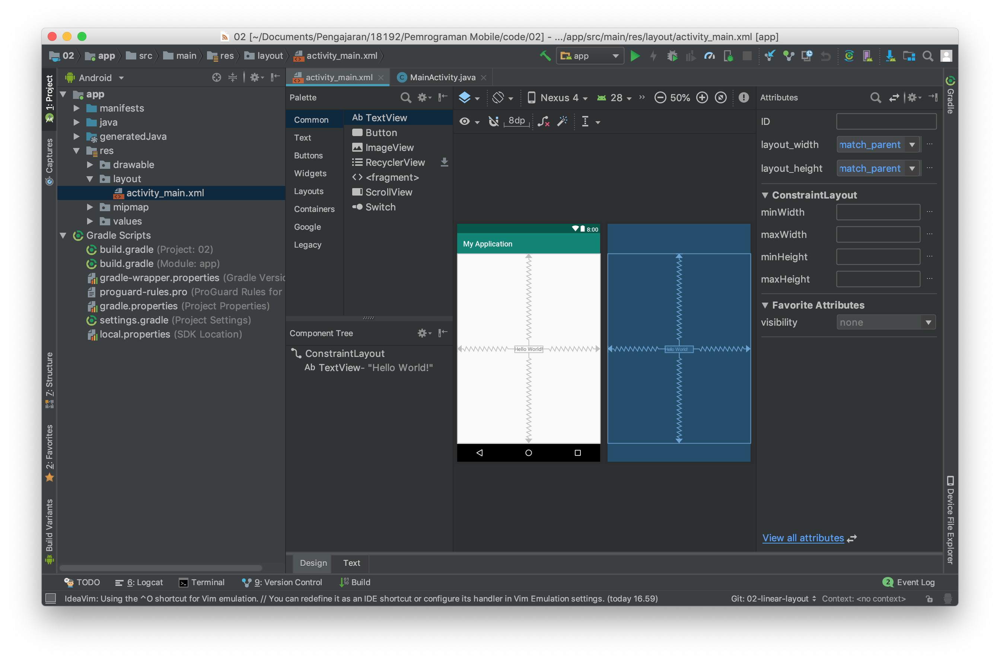

### Membuat aplikasi dengan constraint layout

Constraint layout merupakan layout terbaru dari android, layout ini berbasis relative layout namun mempunyai tingkat kemudahan yang lebih baik dalam penggunaannya.

Penggunaan Constraint layout ini mirip dengan relative layout namun dengan kemudahan dalam mengoperasikannya karena sudah dapat digunakan dengan baik pada editor di design mode.

Setiap item pada constraint layout memiliki 4 arah constraint yaitu top, left, right, dan bottom. Ke empat arah ini terdapat sebuah connection source yang dapat di tarik ke parent atau ke objek lain. Perhatikan gambar dibawah ini.

Pada text view hello world terdapat 4 constraint dan masing masing constraint di hubungkan ke parent dengan mode panah bergerigi, panah bergerigi ini mewakili `wrap_content` pilihan lain selain wrap content adalah fixed dan match constraint. Silahkan mencoba dan berikan kesimpulan terhadap pengamatan dan percobaan ada mengenai hal ini.

- untuk mencoba silahkan kembalikan kode program pada `activity_main.xml` ke kondisi awal.
- Kemudian buatlah layout pada latihan LinearLayout menggunakan ConstraintLayout
  > Untuk membagi layout menjadi dua bagian gunakan guidelines
- Selanjutnya buatlah layout pada latihan RelativeLayout menggunakan ConstraintLayout
  > Untuk membuat ini lebih cepat menggunakan design mode dan menarik constraint ke parent atau object lain
