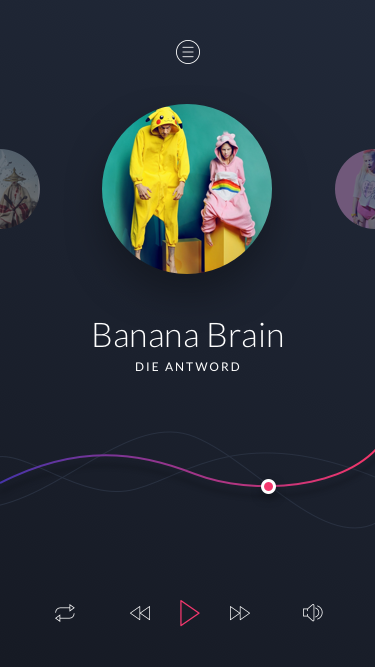

# Latihan
Pada latihan kali ini silahkan Anda belajar mengkonversi layout dengan desain dibawah ini,

Untuk memulai latihan ini silahkan clone starter code pada repository berikut ini [Starter Code Chapter 2](https://github.com/polinema-mobile/dtschapter02-starter). Pada code starter tersebut, sudah disediakan file drawable dan font yang digunakan pada layout diatas.
