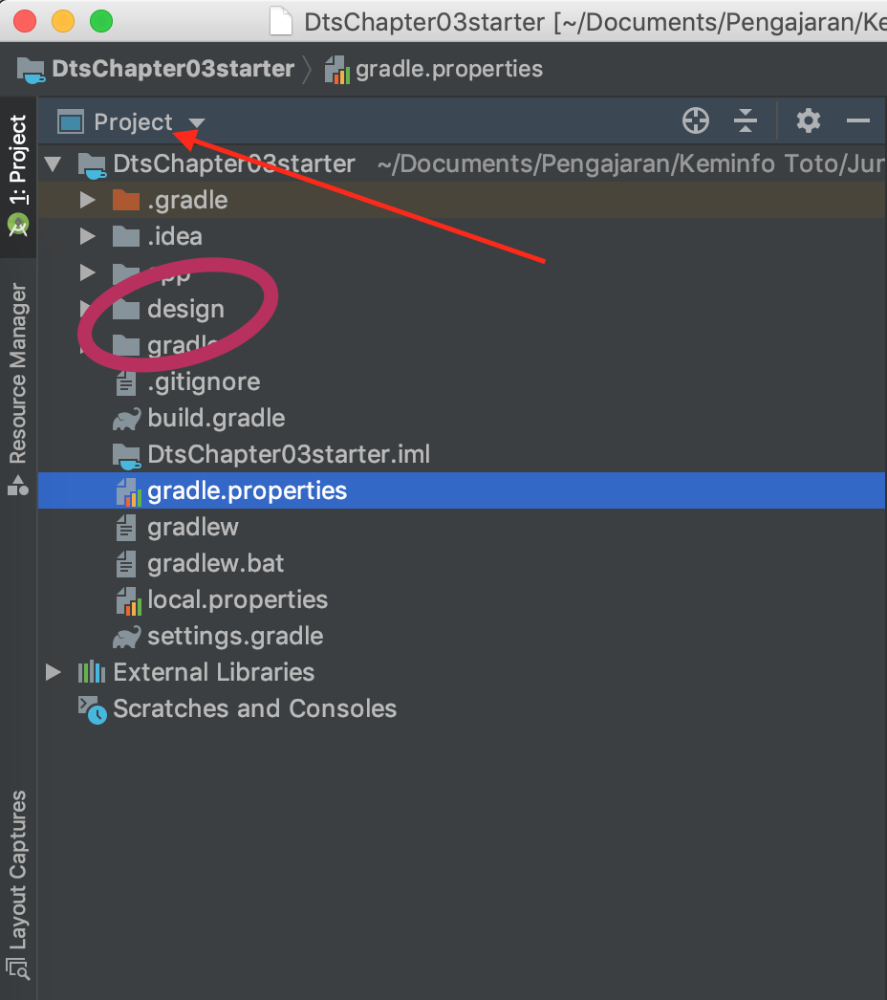

# Buka Project Starter Code

## Yang sudah ada di starter code
Clone repository starter code [Starter Code Chapter 3](https://github.com/siubie/dtschapter03-starter). Jika Anda menggunakan git jalankan perintah ini di console
```
git clone https://github.com/polinema-mobile/dtschapter03-starter.git
```

Jika tidak memiliki git silahkan download zip dari url repository


## Screen Layout Desain
Screen layout desain sudah disediakan di dalam starter code layout ini. Layout dapat Anda lihat pada folder `design`. Untuk melihat isi folder design, ganti view pada Android Studio menjadi `project`


## Cara Import Drawable
Untuk mengubah desain layout menjadi layout android xml, diperlukan asset berupa potongan gambar yang sudah disesuaikan ukurannya. Resolusi asset pada Android mulai dari `hdpi`, `mdpi`, `xdpi`, `xxhdpi`, dan `xxxhdpi`. Untuk semua layout pada folder design sudah dipotongkan dan disiapkan gambarnya di dalam starter code. 

Sebagai pengetahuan tambahan, proses untuk memasukkan aset gambar ke folder `res` pada Android Studio dilakukan dengan cara berikut,

1. Buka tab Resource Manager

2. Klik tombol `+`

3. Pilih menu import drawables

4. Select semua folder kemudian klik open

5. Pilih gambar yang akan di import kemudian klik import


## Cara Import Custom Font
Pada starter code juga sudah disediakan dua varian custom font yang dapat digunakan pada layout android. Untuk mengimport custom font dilakukan dengan langkah langkah berikut,

1. Klik kanan pada folder `res` kemudian pilih **New -> Android Resource Directory**


2. Pada Resource type, pilih `font`


3. Copy dan paste custom font yang Anda miliki ke dalam folder font yang Anda buat sebelumnya. **Font yang Anda copy kedalam folder harus menggunakan huruf kecil dan disambungkan dengan menggunakan underscore jika lebih dari satu suku kata**.
