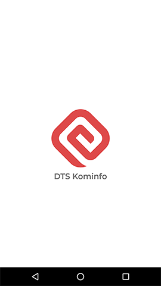
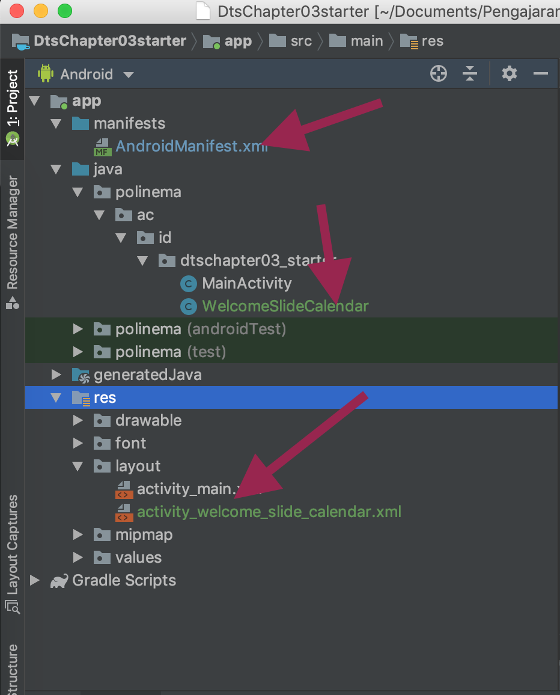
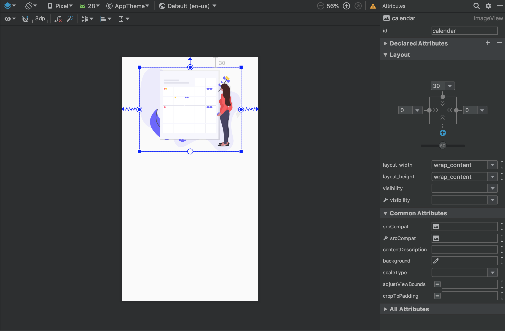
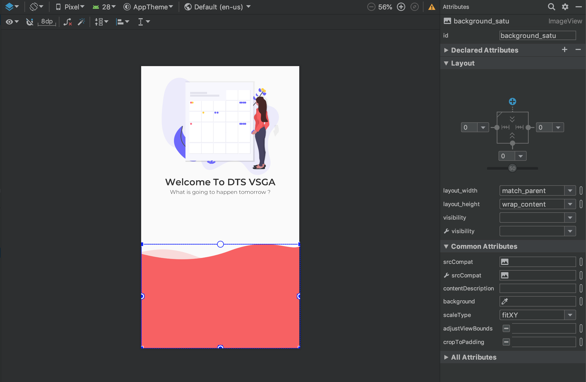
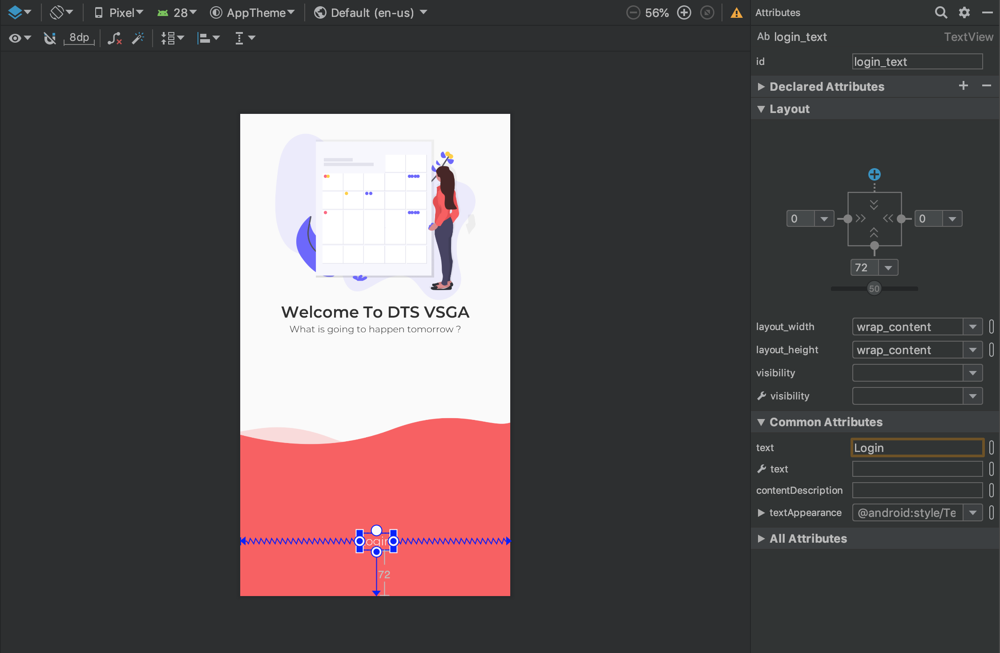
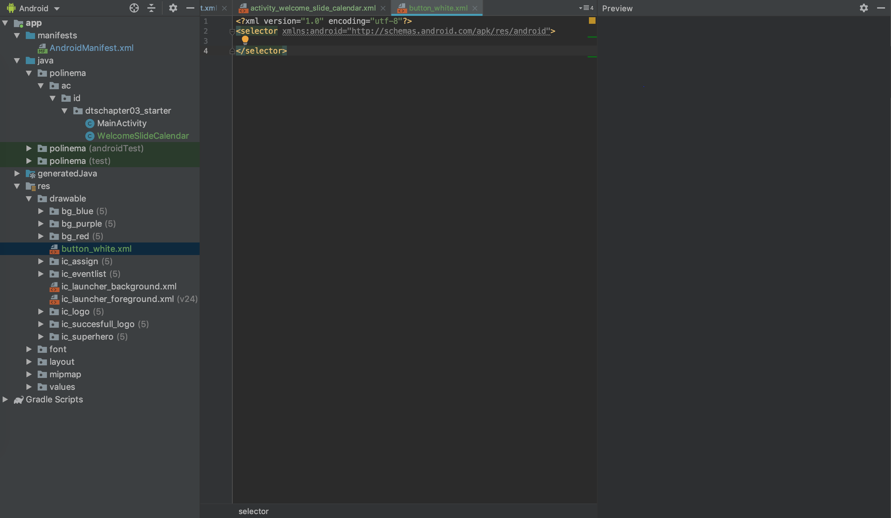

# Welcome Activity
Welcome activity adalah activity yang di jalankan setelah splash screen. Pada activity welcome ini, akan ditampilkan secara singkat fitur-fitur aplikasi. Berikut ini screenshoot tampilan aplikasi yang diharapkan.



## Buat Activity Baru WelcomeSlideCalendar
Buatalah activity baru dengan nama **WelcomeSlideCalendar**. Untuk membuatnya, perhatikan gambar dibawah ini. Klik Kanan pada package **dtschapter03_starter->new->activity->empty activity**.


Beri nama activity yang baru, yaitu **WelcomeSlideCalendar** seperti pada gambar dibawah ini.


Setelah itu tekan tombol **OK**. Android Studio akan melakukan proses pembuatan activity. Perhatikan folder  **manifest**. Jika activity sudah ditambahkan, maka akan muncul pada file `AndroidManifest.xml`. Selain itu, pada folder res->layout sudah terdapat file layout baru sesuai dengan nama activity yang dibuat.

```xml
<?xml version="1.0" encoding="utf-8"?>
<manifest xmlns:android="http://schemas.android.com/apk/res/android"
    package="polinema.ac.id.dtschapter03_starter">

    <application
        android:allowBackup="true"
        android:icon="@mipmap/ic_launcher"
        android:label="@string/app_name"
        android:roundIcon="@mipmap/ic_launcher_round"
        android:supportsRtl="true"
        android:theme="@style/AppTheme">
        <!--Activity baru ditmbahkan-->
        <activity android:name=".WelcomeSlideCalendar"></activity>
        <activity android:name=".MainActivity">
            <intent-filter>
                <action android:name="android.intent.action.MAIN" />

                <category android:name="android.intent.category.LAUNCHER" />
            </intent-filter>
        </activity>
    </application>

</manifest>
```
Jika berhasil struktur file projectnya akan seperti pada gambar dibawah ini.


## Edit File activity_welcome_slide_calendar.xml
Langkah selanjutnya adalah mengubah isi file `activity_welcome_slide_calendar.xml`. Jenis layout yang digunakan adalah constraint layout. Pastikan layout xml dimulai dengan tag berikut ini. Tambahkan background warna putih.

```xml
<android.support.constraint.ConstraintLayout xmlns:android="http://schemas.android.com/apk/res/android"
    xmlns:app="http://schemas.android.com/apk/res-auto"
    xmlns:tools="http://schemas.android.com/tools"
    android:layout_width="match_parent"
    android:layout_height="match_parent"
    android:background="#FFFFFF"
    tools:context=".WelcomeSlideCalendar">

</android.support.constraint.ConstraintLayout>
```

Pada desain layout terdapat beberapa komponen, yaitu:
1. Gambar Character dengan Calender
2. Text Welcome
3. Sub Text Welcome
4. Button Get Started
5. Text Login
6. Background Footer Merah

### Tambahkan Gambar
Tambahkan gambar dengan nama `ic_eventlist` dari folder drawable ke layout

```xml
    <ImageView
        android:id="@+id/calendar"
        android:layout_width="wrap_content"
        android:layout_height="wrap_content"
        android:src="@drawable/ic_eventlist"
        app:layout_constraintTop_toTopOf="parent"
        app:layout_constraintLeft_toLeftOf="parent"
        app:layout_constraintRight_toRightOf="parent"
        android:layout_marginTop="30dp"
        />
```


perhatikan penamaan **id** dan **constraint** dari image


### Tambahkan Text
Tambahkan sebuah `TextView` dengan id `welcome_text`. Ganti isi teks dengan **Welcome To DTS VSGA**

```xml
    <TextView
        android:id="@+id/welcome_text"
        android:layout_width="wrap_content"
        android:layout_height="wrap_content"
        android:textSize="24sp"
        android:textColor="#313131"
        android:text="Welcome To DTS VSGA"
        app:layout_constraintTop_toBottomOf="@id/calendar"
        app:layout_constraintLeft_toLeftOf="parent"
        app:layout_constraintRight_toRightOf="parent"
        android:fontFamily="@font/montserrat_semi_bold"
        />
```

Perhatikan bagaimana `TextView` disusun dan bagaimana cara mengganti font serta warna dari `TextView`.


### Tambahkan Sub Text
Tambahkan sebuah sub text baru di bawah `welcome_text` dengan id `sub_welcome`

```xml
    <TextView
        android:id="@+id/sub_welcome"
        android:layout_width="wrap_content"
        android:layout_height="wrap_content"
        android:textColor="#313131"
        android:text="What is going to happen tomorrow ?"
        app:layout_constraintTop_toBottomOf="@+id/welcome_text"
        app:layout_constraintLeft_toLeftOf="parent"
        app:layout_constraintRight_toRightOf="parent"
        android:fontFamily="@font/montserrat_light"
        />
```


### Tambahkan Gambar Footer
Tambahkan gambar footer dengan membuat sebuah `ImageView` dengan id `background_satu`. Perhatikan bahwa footer memiliki constraint ke parent bottom dan menggunakan `scaleType` dengan value `fitXY`.

```xml
    <ImageView
        android:id="@+id/background_satu"
        android:layout_width="match_parent"
        android:layout_height="wrap_content"
        android:scaleType="fitXY"
        android:src="@drawable/bg_red"
        app:layout_constraintBottom_toBottomOf="parent"
        app:layout_constraintEnd_toEndOf="parent"
        app:layout_constraintStart_toStartOf="parent" />
```



### Tambahkan Text Login
Buatlah sebuah `TextView` dengan id `login_text`. Ganti font dengan `montserrat_light`, `textSize` sebesar `18sp` dan `textColor` dengan warna `#FFFFFF`

```xml
    <TextView
        android:id="@+id/login_text"
        app:layout_constraintBottom_toBottomOf="parent"
        app:layout_constraintLeft_toLeftOf="parent"
        app:layout_constraintRight_toRightOf="parent"
        android:layout_marginBottom="72dp"
        android:textColor="#FFFFFF"
        android:layout_width="wrap_content"
        android:layout_height="wrap_content"
        android:text="Login"
        android:textSize="18sp"
        android:fontFamily="@font/montserrat_light"
        />
```


### Tambahkan Button Get Started
Buat button dengan id `btn_get_started`. Ganti button text dengan **GET STARTED**. Ganti `fontFamily` dengan font `montserrat_light`. Atur `textSize` menjadi `18sp`. Selanjutnya,  atur constraint agar posisi button menyerupai posisi pada desain layout.

```xml
    <Button
        android:id="@+id/btn_get_started"
        android:layout_width="match_parent"
        android:layout_height="wrap_content"
        android:text="GET STARTED"
        android:layout_marginLeft="48dp"
        android:layout_marginRight="48dp"
        app:layout_constraintBottom_toTopOf="@id/login_text"
        app:layout_constraintLeft_toLeftOf="parent"
        app:layout_constraintRight_toRightOf="parent"
        android:layout_marginBottom="32dp"
        android:textSize="18sp"
        android:fontFamily="@font/montserrat_light"
        />
```

### Tambahkan Drawable button_white.xml
Setelah membuat button, tambahkan sebuah file pada package **res->drawable** dengan nama `button_white.xml`. File `button_white.xml` digunakan untuk memodifikasi bentuk dari button. 

Klik kanan pada folder package `drawable` kemudian pilih **New->Drawable Resource File**


Isi pilihan form dengan konfigurasi seperti pada gambar berikut ini,


Hasil file `button_white.xml`


Ganti isi file `button_white.xml`
```xml
<?xml version="1.0" encoding="utf-8"?>
<shape xmlns:android="http://schemas.android.com/apk/res/android"
    android:shape="rectangle">
    <solid android:color="#FFFFFF" />
    <corners android:radius="5dp" />
</shape>
```


Keterangan kode `button_white.xml`

- `android:shape="rectangle"` digunakan untuk membentuk button dengan bentuk persegit empat

- `<solid android:color=#FFFFFF>` digunakan untuk memberikan warna putih (#FFFFFF) dengan tipe perwarnaan *solid*

- `<corners android:radius="5dp">` digunakan untuk membentuk sisi-sisi ujung (pinggiran) button menjadi bulat dengan tingkat kelengkungan sebesar 5dp