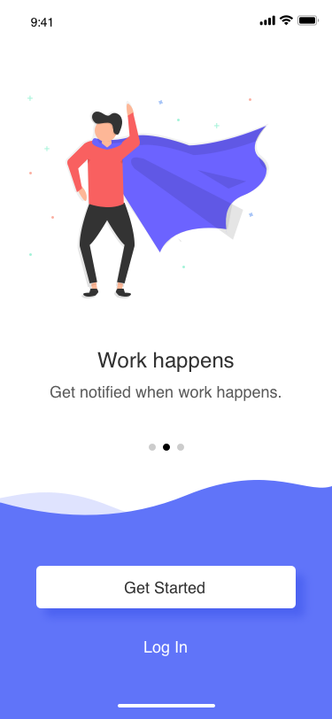

# Form
Pada langkah ini akan dibuat beberapa activity yang terdiri dari:
1. Acitivity WelcomeBack
2. Activity WelcomeSlideSuperHero
3. Activity WelcomeSlideAssign
4. Activity ResetPassword
5. Activity ForgotPassword
6. Activity Success

## Membuat Activity WelcomeBack
Buatlah activity baru dengan nama WelcomeBack. Halaman ini akan digunakan sebagai form login. Login Form merupakan tampilan yang dijalankan setelah welcome activity. Untuk membuatnya activity tersebut adalah Klik Kanan di package dtschapter03_starter->new->activity->empty activity. 
Langkah selanjutnya adalah melakukan desain layout pada file `activity_welcome_back.xml`, Berikut ini screen shot tampilan aplikasi yang diharapkan.


### Edit activity_welcome_back.xml
Untuk membuat form login seperti gambar diatas yaitu dengan mengubah isi file dari `activity_welcome_back.xml`, pada layout ini akan digunakan constraint layout pastikan layout xml dimulai dengan tag berikut ini. Tambahkan background warna putih. 

```xml
<android.support.constraint.ConstraintLayout xmlns:android="http://schemas.android.com/apk/res/android"
    xmlns:app="http://schemas.android.com/apk/res-auto"
    xmlns:tools="http://schemas.android.com/tools"
    android:layout_width="match_parent"
    android:layout_height="match_parent"
    android:background="#FFFFFF"
    tools:context=".WelcomeBack">

</android.support.constraint.ConstraintLayout>
```
Pada desain layout terdapat beberapa komponen yaitu:
1. Judul
2. Sub Judul
3. Username
4. Edit Text Username
5. Password
6. Edit Text Password
7. Text Forgot Password
8. Button Login

#### Tambahkan Judul
Tambahkan sebuah TextView untuk menulis judul
```xml
<TextView
        android:id="@+id/welcome_back"
        android:layout_width="wrap_content"
        android:layout_height="wrap_content"
        android:layout_marginLeft="24dp"
        android:fontFamily="@font/montserrat_semi_bold"
        android:text="Welcome Back"
        android:textColor="#313131"
        android:textSize="32sp"
        app:layout_constraintLeft_toLeftOf="parent"
        app:layout_constraintTop_toTopOf="parent"
        android:layout_marginTop="90dp"
        />
```

#### Tambahkan Sub Judul
Tambahkan sebuah sub text baru di bawah judul, berilah id `sign_in`
```xml
<TextView
        android:id="@+id/sign_in"
        android:layout_width="wrap_content"
        android:layout_height="wrap_content"
        android:layout_marginLeft="24dp"
        android:layout_marginTop="8dp"
        android:fontFamily="@font/montserrat_light"
        android:text="@string/sign_in_to_continue"
        android:textColor="#9b9b9b"
        android:textSize="16sp"
        app:layout_constraintLeft_toLeftOf="parent"
        app:layout_constraintTop_toBottomOf="@id/welcome_back" />
```

#### Tambahkan Username
Tambahkan Text View untuk label Username.
```xml
<TextView
        android:id="@+id/reset_code"
        android:layout_width="wrap_content"
        android:layout_height="wrap_content"
        android:layout_marginLeft="20dp"
        android:layout_marginTop="48dp"
        android:text="Username"
        android:textColor="#313131"
        android:textSize="20sp"
        app:layout_constraintLeft_toLeftOf="parent"
        app:layout_constraintTop_toBottomOf="@+id/sign_in" />
```

#### Tambahkan Edit Text Username
Tambahkan Edit Text untuk pengisian Username
```xml
<EditText
        android:id="@+id/edt_reset_code"
        android:layout_width="match_parent"
        android:layout_height="wrap_content"
        android:layout_marginLeft="24dp"
        android:layout_marginTop="8dp"
        android:layout_marginRight="24dp"
        android:hint="Enter Your Email"
        app:layout_constraintLeft_toLeftOf="parent"
        app:layout_constraintRight_toRightOf="parent"
        app:layout_constraintTop_toBottomOf="@id/reset_code"
        />
```

#### Tambahkan Password
Tambahkan label Password menggunakan TextView
```xml
<TextView
        android:id="@+id/new_password"
        android:layout_width="wrap_content"
        android:layout_height="wrap_content"
        android:layout_marginLeft="20dp"
        android:layout_marginTop="8dp"
        android:text="Password"
        android:textColor="#313131"
        android:textSize="20sp"
        app:layout_constraintLeft_toLeftOf="parent"
        app:layout_constraintTop_toBottomOf="@+id/edt_reset_code" />
```

#### Tambahkan Edit Text Password
Tambahkan EditText untuk pengisian password.
```xml
<EditText
        android:id="@+id/edt_new_password"
        android:layout_width="match_parent"
        android:layout_height="wrap_content"
        android:layout_marginLeft="24dp"
        android:layout_marginTop="8dp"
        android:layout_marginRight="24dp"
        android:hint="@string/enter_your_password"
        app:layout_constraintLeft_toLeftOf="parent"
        app:layout_constraintRight_toRightOf="parent"
        app:layout_constraintTop_toBottomOf="@+id/new_password" />
```

#### Tambahkan Text Forgot Password
Tambahkan text Forgot Password yang dapat di-klik untuk pengguna yang lupa password.
```xml
<TextView
        android:id="@+id/forgot_password"
        android:layout_width="wrap_content"
        android:layout_height="wrap_content"
        android:layout_marginTop="8dp"
        android:layout_marginRight="24dp"
        android:text="@string/forgot_password"
        android:textColor="#313131"
        android:textSize="18sp"
        app:layout_constraintRight_toRightOf="parent"
        app:layout_constraintTop_toBottomOf="@id/edt_new_password"
        android:onClick="clickForgot"
        />
```
#### Buat Drawable button_red.xml
Tambahkan sebuah file res drawable dengan nama `button_red.xml`. Ganti isi file `button_red.xml`
```xml
<?xml version="1.0" encoding="utf-8"?>
<shape xmlns:android="http://schemas.android.com/apk/res/android"
    android:shape="rectangle">
    <solid android:color="#F96060" />
    <corners android:radius="5dp" />
</shape>
```

#### Tambahkan Button Login
Buat Button Log In, beri text `LOG IN` dengan warna text putih.
```xml
<Button
        android:layout_width="match_parent"
        android:layout_height="wrap_content"
        android:layout_marginStart="24dp"
        android:layout_marginEnd="24dp"
        android:textSize="18sp"
        android:layout_marginBottom="200dp"
        android:background="@drawable/button_red"
        android:text="LOG IN"
        android:textColor="#FFFFFF"
        app:layout_constraintTop_toBottomOf="@id/forgot_password"
        android:layout_marginTop="80dp"
        app:layout_constraintEnd_toEndOf="parent"
        app:layout_constraintStart_toStartOf="parent"
        android:onClick="postLogin"
        />
```

## Membuat Activity Welcome SlideSuperHero
Buatlah activity baru dengan nama WelcomeSlideSuperhero. Activity ini yang nantinya akan muncul sebagai aksi button "Get Started" di klik pada activity welcome slide. Untuk membuatnya activity tersebut adalah Klik Kanan di package dtschapter03_starter->new->activity->empty activity. 
Langkah selanjutnya adalah melakukan desain layout pada file `activity_welcome_slide_superhero`, Berikut ini screen shot tampilan aplikasi yang diharapkan.


### Edit activity_welcome_slide_superhero.xml
Untuk membuat form seperti gambar diatas yaitu dengan mengubah isi file dari `activity_welcome_slide_superhero`, pada layout ini akan digunakan constraint layout pastikan layout xml dimulai dengan tag berikut ini. Tambahkan background warna putih. 

```xml
<?xml version="1.0" encoding="utf-8"?>
<android.support.constraint.ConstraintLayout xmlns:android="http://schemas.android.com/apk/res/android"
    xmlns:app="http://schemas.android.com/apk/res-auto"
    xmlns:tools="http://schemas.android.com/tools"
    android:layout_width="match_parent"
    android:background="#FFFFFF"
    android:layout_height="match_parent"
    tools:context=".WelcomeSlideSuperhero">

</android.support.constraint.ConstraintLayout>
```
Pada desain layout terdapat beberapa komponen yaitu:
1. Image Icon
2. Judul Image
3. Sub judul image
4. Image Background
5. Button get started
6. Text Login


#### Tambahkan Image Icon
Tambahkan sebuah ImageView untuk menambahkan gambar dengan nama id= slide_dua, serta panggil file gambar ic_superhero di drawable.
```xml
<ImageView
        android:id="@+id/slide_dua"
        android:layout_width="wrap_content"
        android:layout_height="wrap_content"
        android:layout_marginStart="8dp"
        android:layout_marginEnd="8dp"
        app:layout_constraintTop_toTopOf="parent"
        android:layout_marginTop="30dp"
        android:src="@drawable/ic_superhero"
        app:layout_constraintEnd_toEndOf="parent"
        app:layout_constraintStart_toStartOf="parent" />
```

#### Tambahkan Judul Image
Tambahkan sebuah TextView untuk menulis judul dengan nama id=welcome_text
```xml
<TextView
        android:id="@+id/welcome_text"
        android:layout_width="wrap_content"
        android:layout_height="wrap_content"
        app:layout_constraintTop_toBottomOf="@+id/slide_dua"
        app:layout_constraintLeft_toLeftOf="parent"
        app:layout_constraintRight_toRightOf="parent"
        android:text="Work Happen"
        android:textColor="#313131"
        android:textSize="24sp"
        android:fontFamily="@font/montserrat_semi_bold"
        />
```

#### Tambahkan Sub Judul Image
Tambahkan sebuah sub text baru di bawah judul dengan nama id=sub_welcome
```xml
<TextView
        android:id="@+id/sub_welcome"
        android:layout_width="wrap_content"
        android:layout_height="wrap_content"
        app:layout_constraintTop_toBottomOf="@id/welcome_text"
        app:layout_constraintLeft_toLeftOf="parent"
        app:layout_constraintRight_toRightOf="parent"
        android:text="Get Notified When Work Happens"
        android:fontFamily="@font/montserrat_light"
        android:textColor="#313131"
        />
```

#### Tambahkan Image Backgroud
Tambahkan sebuah ImageView untuk menambahkan gambar dengan nama id= backgorud_dua, serta panggil file gambar bg_blue di drawable.
```xml
 <ImageView
        android:id="@+id/background_dua"
        android:layout_width="match_parent"
        android:layout_height="wrap_content"
        android:scaleType="fitXY"
        android:src="@drawable/bg_blue"
        app:layout_constraintBottom_toBottomOf="parent"
        app:layout_constraintLeft_toLeftOf="parent"
        app:layout_constraintLeft_toRightOf="parent"
        />
```

#### Tambahkan Button get started
Buat Button get started, beri text `GET STARTED` dengan nama id=btn_get_started
```xml
<Button
<Button
        android:id="@+id/btn_get_started"
        android:layout_width="match_parent"
        android:layout_height="wrap_content"
        app:layout_constraintBottom_toTopOf="@id/login_text"
        app:layout_constraintLeft_toLeftOf="parent"
        app:layout_constraintRight_toRightOf="parent"
        android:layout_marginLeft="42dp"
        android:layout_marginRight="42dp"
        android:textSize="18sp"
        android:text="@string/get_started"
        android:fontFamily="@font/montserrat_light"
        android:background="@drawable/button_white"
        android:layout_marginBottom="42dp"      

        />
```
#### Tambahkan Text Login
Tambahkan text Login yang nantinya dapat di klik untuk menuju form login, kemudian berilah nama id=login_text.
```xml
<TextView
        android:id="@+id/login_text"
        android:layout_width="wrap_content"
        android:layout_height="wrap_content"
        app:layout_constraintBottom_toBottomOf="parent"
        app:layout_constraintLeft_toLeftOf="parent"
        app:layout_constraintRight_toRightOf="parent"
        android:text="@string/log_in"
        android:fontFamily="@font/montserrat_light"
        android:textSize="18sp"
        android:textColor="#FFFFFF"
        android:layout_marginBottom="72dp"
        android:onClick="clickLogin"
        />
```
