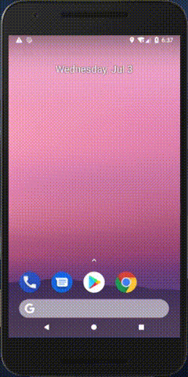
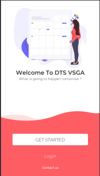

# Tujuan
Pada praktikum kali ini kita akan belajar untuk memanfaatkan component
build in atau bawaan dari android untuk tujuan pengembangan aplikasi
yang akan kita bangun.

## Intent Implicit
Jika pada pertemuan sebelumnya kita telah mempelajari intent explicit,
kali ini kita akan belajar mengenai intent implicit. Skenario yang akan
kita buat adalah memanggil mail client bawaan aplikasi andorid untuk
mengirimkan sebuah email, untuk lebih jelasnya dapat dilihat pada gambar
di bawah ini

<p align="center"></p>

Tampilan di atas adalah kelanjutan dari pertemuan ke-3 yang dimodifikasi
pada bagian halaman utama setelah splash screen ditambahkan label
**contact us** untuk mengirimkan email.

## Praktikum
Kita akan mencoba membuat implementasi seperti output yang ditampilkan
seperti di atas
1. Silakan buka project pertemuan yang ke-3, dan buka file
   `activity_welcome_slide.xml` kemudian tambahkan label menggunakan
   `TextView`. Potongan kode seperti di bawah ini 
   ```java
   <TextView
        android:id="@+id/tv_contact_us"
        android:layout_width="wrap_content"
        android:layout_height="wrap_content"
        android:layout_marginStart="8dp"
        android:layout_marginTop="8dp"
        android:layout_marginEnd="8dp"
        android:layout_marginBottom="8dp"
        android:text="Contact us"
        android:onClick="clickContactUs"
        android:textColor="#FFFFFF"
        app:layout_constraintBottom_toBottomOf="@+id/background_satu"
        app:layout_constraintEnd_toEndOf="parent"
        app:layout_constraintStart_toStartOf="parent"
        app:layout_constraintTop_toBottomOf="@+id/login_text" />
   ```
   Sehingga setelah ditambahkan layout di atas hasilnya dapat dilihat
   pada gambar di bawah ini
   
   <p align="center"></p>
   
2. Untuk mengimplementasikan perubahan layout di atas, kita perlu
   menambahkan kode program pada class `WelcomeSlideCalendar` seperti
   berikut ini 
   
   ```java
   public void clickContactUs(View view) {
        Intent i = new Intent(Intent.ACTION_SEND);
        i.setType("text/plain");
        i.putExtra(Intent.EXTRA_EMAIL, new String[]{"dts@polinema.ac.id"});
        i.putExtra(Intent.EXTRA_SUBJECT, "Test Email");
        i.putExtra(Intent.EXTRA_TEXT, "Welcome to dts 2019");
        startActivity(i.createChooser(i, "Pilih email client"));
    }
   ```
   Potongan program di atas berfungsi untuk mengirimkan email ke
   `dts@polinema.ac.id` dengan subject `Test Email` dan isinya adalah
   `Welcome to dts 2019`. Sedangkan fungsi `createChooser` digunakan
   untuk menampilkan dialog pemilihan email client, jika menginginkan
   email default yang digunakan parameter yang dilewatkan cukup intent.
   Baris program cukup dengan `startActivity(i);`
   
   >Dengan memanfaatkan implicit intent tentunya aplikasi yang akan kita
   >buat akan lebih interaktif ketika dapat memanfaatkan layanan-layanan
   >yang terdapat pada handphone android yang kita miliki, selain itu
   >kita sebagai programmer tidak perlu membuat lagi fungsi-fungsi atau
   >komponen build tetapi lebih fokus ke logic aplikasi yang akan
   >dikembangkan.

## Latihan
1. Tambahkan alamat email yang dituju lebih dari satu alamat?
2. Masih tentang mengirimkan email, silakan ditambahkan fungsi untuk CC
   dan BCC ke email yang lain?
