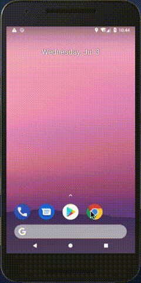
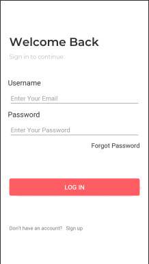
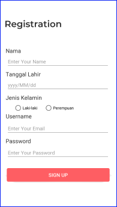
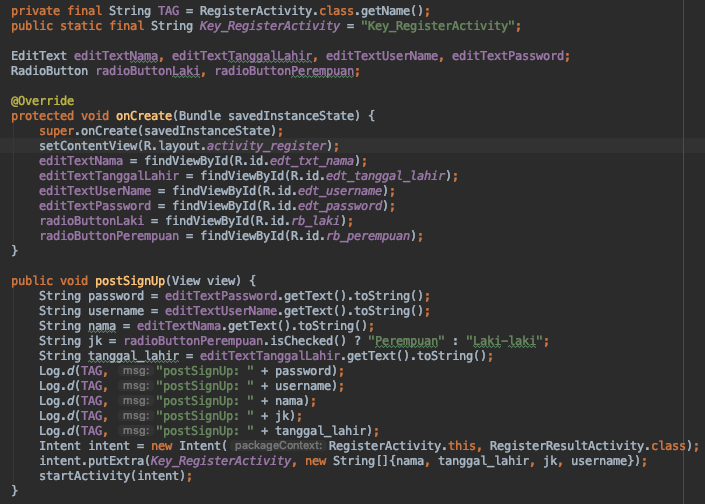
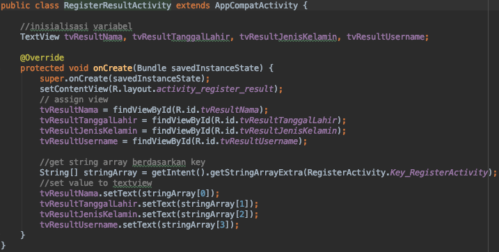

# Tujuan
Setelah pada praktikum sebelumnya telah kita pelajari tentang activity
dan intent, ada kalanya kita sebuah activity berkomuniasi dengan
activity yang lain. Selain itu juga terkadang sebuah activity
membutuhkan sebuah data dari activity yang sebelumnya, pada praktikum
kali ini hal tersebut yang akan dilakukan.

## Intent dengan Data
Sebuah intent dapat melewatkan sebuah data, tidak hanya data primivite,
tetapi juga data array atau bahkan sebuah data bertipe object. Yang akan
dicontohkan kira-kira adalah sebagai berikut

<p align="center"></p>

Tampilan di atas adalah salah contoh penerapan intent dengan melewatkan
sebuah data, setelah klik `sign up` akan dibawa ke sebuah form
registrasi yang selanjutnya akan menampilkan data-data hasil inputan.
Antara form registrasi ke form untuk menampilkan menggunakan intent
dengan membawa data.

## Praktikum
Kita akan mencoba membuat implementasi seperti output yang ditampilkan
di atas
1. Silakan buka file `activity_welcome_back.xml` kemudian tambahkan
   label menggunakan `TextView`. Potongan kode seperti di bawah ini
   ```java
   <TextView
        <TextView
        android:id="@+id/tv_signup"
        android:layout_width="wrap_content"
        android:layout_height="wrap_content"
        android:layout_marginStart="8dp"
        android:layout_marginTop="80dp"
        android:layout_marginEnd="8dp"
        android:text="Sign up"
        app:layout_constraintEnd_toEndOf="parent"
        app:layout_constraintHorizontal_bias="0.016"
        app:layout_constraintStart_toEndOf="@+id/textView"
        app:layout_constraintTop_toBottomOf="@+id/button"
        android:onClick="clickSignUp"/>
   ```
   Sehingga setelah ditambahkan layout di atas hasilnya dapat dilihat
   pada gambar di bawah ini
   
   <p align="center"></p>
   
2. Untuk mengimplementasikan perubahan layout di atas, kita perlu
   menambahkan kode program untuk membuat sebuah method pada class
   `WelcomeBack` seperti berikut ini
   
   <p align="center"></p>
   
   Potongan program di atas berfungsi untuk menjalankan sebuah activity
   `RegisterActivity`, activity tersebut berisi sebuah form registrasi. Kode `RegisterActivity` sudah terdapat dalam **starter-code** chapter04, sehingga Anda perlu membuat ulang activity tersebut. 
   
3. Buka file `activity_register.xml` kemudian tambahkan widget pada
   layout tersebut seperti di bawah ini
   
   ```xml
   <TextView
        android:id="@+id/register"
        android:layout_width="wrap_content"
        android:layout_height="wrap_content"
        android:layout_marginLeft="16dp"
        android:layout_marginTop="60dp"
        android:fontFamily="@font/montserrat_semi_bold"
        android:text="@string/registration"
        android:textColor="#313131"
        android:textSize="32sp"
        app:layout_constraintLeft_toLeftOf="parent"
        app:layout_constraintTop_toTopOf="parent" />

    <TextView
        android:id="@+id/txt_nama"
        android:layout_width="wrap_content"
        android:layout_height="wrap_content"
        android:layout_marginLeft="20dp"
        android:layout_marginTop="60dp"
        android:text="Nama"
        android:textColor="#313131"
        android:textSize="20sp"
        app:layout_constraintLeft_toLeftOf="parent"
        app:layout_constraintTop_toBottomOf="@+id/register" />
    
    <EditText
        android:id="@+id/edt_txt_nama"
        android:layout_width="361dp"
        android:layout_height="40dp"
        android:layout_marginStart="24dp"
        android:layout_marginTop="8dp"
        android:layout_marginRight="24dp"
        android:hint="Enter Your Name"
        android:inputType="textEmailAddress"
        app:layout_constraintRight_toRightOf="parent"
        app:layout_constraintStart_toStartOf="parent"
        app:layout_constraintTop_toBottomOf="@+id/txt_nama" />

    <Button
        android:id="@+id/bt_signup"
        android:layout_width="match_parent"
        android:layout_height="wrap_content"
        android:layout_marginStart="24dp"
        android:layout_marginTop="32dp"
        android:layout_marginEnd="24dp"
        android:background="@drawable/button_red"
        android:onClick="postSignUp"
        android:text="SIGN UP"
        android:textColor="#FFFFFF"
        android:textSize="18sp"
        app:layout_constraintEnd_toEndOf="parent"
        app:layout_constraintHorizontal_bias="0.0"
        app:layout_constraintStart_toStartOf="parent"
        app:layout_constraintTop_toBottomOf="@+id/edt_password" />

    <TextView
        android:id="@+id/txt_tanggal_lahir"
        android:layout_width="wrap_content"
        android:layout_height="wrap_content"
        android:layout_marginStart="20dp"
        android:layout_marginTop="8dp"
        android:text="Tanggal Lahir"
        android:textColor="#313131"
        android:textSize="20sp"
        app:layout_constraintStart_toStartOf="parent"
        app:layout_constraintTop_toBottomOf="@+id/edt_txt_nama" />

    <EditText
        android:id="@+id/edt_tanggal_lahir"
        android:layout_width="361dp"
        android:layout_height="40dp"
        android:layout_marginStart="24dp"
        android:layout_marginTop="8dp"
        android:layout_marginEnd="24dp"
        android:ems="10"
        android:hint="yyyy/MM/dd"
        android:inputType="date"
        app:layout_constraintEnd_toEndOf="parent"
        app:layout_constraintHorizontal_bias="0.0"
        app:layout_constraintStart_toStartOf="parent"
        app:layout_constraintTop_toBottomOf="@+id/txt_tanggal_lahir" />

    <TextView
        android:id="@+id/textView2"
        android:layout_width="wrap_content"
        android:layout_height="wrap_content"
        android:layout_marginStart="20dp"
        android:layout_marginTop="8dp"
        android:text="Jenis Kelamin"
        android:textColor="#313131"
        android:textSize="20sp"
        app:layout_constraintStart_toStartOf="parent"
        app:layout_constraintTop_toBottomOf="@+id/edt_tanggal_lahir" />

    <RadioGroup
        android:id="@+id/rg_jenis_kelamin"
        android:layout_width="386dp"
        android:layout_height="31dp"
        android:layout_marginStart="24dp"
        android:layout_marginTop="8dp"
        android:orientation="horizontal"
        app:layout_constraintStart_toStartOf="parent"
        app:layout_constraintTop_toBottomOf="@+id/textView2">

        <RadioButton
            android:id="@+id/rb_laki"
            android:layout_width="wrap_content"
            android:layout_height="wrap_content"
            android:layout_marginStart="24dp"
            android:text="Laki-laki"
            android:checked="true"
            app:layout_constraintStart_toStartOf="parent"
            tools:layout_editor_absoluteY="367dp" />

        <RadioButton
            android:id="@+id/rb_perempuan"
            android:layout_width="wrap_content"
            android:layout_height="wrap_content"
            android:layout_marginStart="24dp"
            android:text="Perempuan"
            app:layout_constraintStart_toEndOf="@+id/rb_laki"
            tools:layout_editor_absoluteY="367dp" />
    </RadioGroup>

    <TextView
        android:id="@+id/textView3"
        android:layout_width="wrap_content"
        android:layout_height="wrap_content"
        android:layout_marginStart="20dp"
        android:text="@string/username"
        android:textColor="#313131"
        android:textSize="20sp"
        app:layout_constraintStart_toStartOf="parent"
        app:layout_constraintTop_toBottomOf="@+id/rg_jenis_kelamin" />

    <EditText
        android:id="@+id/edt_username"
        android:layout_width="362dp"
        android:layout_height="45dp"
        android:layout_marginStart="24dp"
        android:layout_marginTop="8dp"
        android:layout_marginEnd="24dp"
        android:ems="10"
        android:hint="@string/enter_your_txt_email"
        android:inputType="textPersonName"
        app:layout_constraintEnd_toEndOf="parent"
        app:layout_constraintHorizontal_bias="0.0"
        app:layout_constraintStart_toStartOf="parent"
        app:layout_constraintTop_toBottomOf="@+id/textView3" />

    <TextView
        android:id="@+id/textView4"
        android:layout_width="wrap_content"
        android:layout_height="wrap_content"
        android:layout_marginStart="20dp"
        android:layout_marginTop="8dp"
        android:text="@string/password"
        android:textColor="#313131"
        android:textSize="20sp"
        app:layout_constraintStart_toStartOf="parent"
        app:layout_constraintTop_toBottomOf="@+id/edt_username" />

    <EditText
        android:id="@+id/edt_password"
        android:layout_width="362dp"
        android:layout_height="43dp"
        android:layout_marginStart="24dp"
        android:layout_marginTop="8dp"
        android:layout_marginEnd="24dp"
        android:ems="10"
        android:hint="Enter Your Password"
        android:inputType="textPassword"
        app:layout_constraintEnd_toEndOf="parent"
        app:layout_constraintHorizontal_bias="0.0"
        app:layout_constraintStart_toStartOf="parent"
        app:layout_constraintTop_toBottomOf="@+id/textView4" />
   ```
   Hasil dari design layout di atas ada seperti ini 
   
   <p align="center"></p>

4. Selanjutnya implementasi file `RegisterActivity` dengan menambahkan
   kode program seperti di bawah ini
   
   <p align="center"></p>

   Keterangan kode program di atas adalah variabel `TAG` digunakan untuk
   kebutuhan debug aplikasi ketika dijalankan, `Key_RegisterActivity`
   digunakan memberikan nama sebuah key ketika akan disimpan dan
   dipanggil dalam sebuah intent. Kemudian untuk melewatkan sebuah data
   pada sebuah intent membutuhkan sebuah method `putExtra()` dengan
   parameter berupa nama key dan tipe data yang akan disimpan.
   
5. Buka file `activity_register_result.xml`, layout tersebut digunakan
   untuk menampilkan data-data dari form `activity_register.xml`. Widget
   yang perlu dibutuhkan adalah sebagai berikut
   
   ```xml
   <TextView
        android:id="@+id/textView16"
        android:layout_width="wrap_content"
        android:layout_height="wrap_content"
        android:layout_marginStart="115dp"
        android:layout_marginTop="16dp"
        android:text="="
        app:layout_constraintStart_toStartOf="parent"
        app:layout_constraintTop_toBottomOf="@+id/textView15" />

    <TextView
        android:id="@+id/textView13"
        android:layout_width="wrap_content"
        android:layout_height="wrap_content"
        android:layout_marginStart="53dp"
        android:layout_marginTop="32dp"
        android:text="="
        app:layout_constraintStart_toEndOf="@+id/textView6"
        app:layout_constraintTop_toBottomOf="@+id/textView5" />

    <TextView
        android:id="@+id/textView15"
        android:layout_width="wrap_content"
        android:layout_height="wrap_content"
        android:layout_marginStart="115dp"
        android:layout_marginTop="16dp"
        android:text="="
        app:layout_constraintStart_toStartOf="parent"
        app:layout_constraintTop_toBottomOf="@+id/textView12" />

    <TextView
        android:id="@+id/textView5"
        android:layout_width="wrap_content"
        android:layout_height="wrap_content"
        android:layout_marginStart="24dp"
        android:layout_marginTop="24dp"
        android:layout_marginEnd="24dp"
        android:text="Register Success"
        android:textSize="24sp"
        app:layout_constraintEnd_toEndOf="parent"
        app:layout_constraintStart_toStartOf="parent"
        app:layout_constraintTop_toTopOf="parent" />

    <TextView
        android:id="@+id/textView6"
        android:layout_width="wrap_content"
        android:layout_height="wrap_content"
        android:layout_marginStart="24dp"
        android:layout_marginTop="32dp"
        android:text="Nama"
        app:layout_constraintStart_toStartOf="parent"
        app:layout_constraintTop_toBottomOf="@+id/textView5" />

    <TextView
        android:id="@+id/textView7"
        android:layout_width="wrap_content"
        android:layout_height="wrap_content"
        android:layout_marginStart="24dp"
        android:layout_marginTop="16dp"
        android:text="Tanggal Lahir"
        app:layout_constraintStart_toStartOf="parent"
        app:layout_constraintTop_toBottomOf="@+id/textView6" />

    <TextView
        android:id="@+id/textView8"
        android:layout_width="wrap_content"
        android:layout_height="wrap_content"
        android:layout_marginStart="24dp"
        android:layout_marginTop="16dp"
        android:text="Jenis Kelamin"
        app:layout_constraintStart_toStartOf="parent"
        app:layout_constraintTop_toBottomOf="@+id/textView7" />

    <TextView
        android:id="@+id/textView9"
        android:layout_width="wrap_content"
        android:layout_height="wrap_content"
        android:layout_marginStart="24dp"
        android:layout_marginTop="16dp"
        android:text="@string/username"
        app:layout_constraintStart_toStartOf="parent"
        app:layout_constraintTop_toBottomOf="@+id/textView8" />

    <TextView
        android:id="@+id/textView12"
        android:layout_width="wrap_content"
        android:layout_height="wrap_content"
        android:layout_marginStart="5dp"
        android:layout_marginTop="16dp"
        android:text="="
        app:layout_constraintStart_toEndOf="@+id/textView7"
        app:layout_constraintTop_toBottomOf="@+id/textView13" />

    <TextView
        android:id="@+id/tvResultNama"
        android:layout_width="wrap_content"
        android:layout_height="wrap_content"
        android:layout_marginStart="8dp"
        android:layout_marginTop="32dp"
        android:layout_marginEnd="24dp"
        android:text="TextView"
        app:layout_constraintEnd_toEndOf="parent"
        app:layout_constraintHorizontal_bias="0.0"
        app:layout_constraintStart_toEndOf="@+id/textView13"
        app:layout_constraintTop_toBottomOf="@+id/textView5" />

    <TextView
        android:id="@+id/tvResultTanggalLahir"
        android:layout_width="wrap_content"
        android:layout_height="wrap_content"
        android:layout_marginStart="8dp"
        android:layout_marginTop="16dp"
        android:layout_marginEnd="24dp"
        android:text="TextView"
        app:layout_constraintEnd_toEndOf="parent"
        app:layout_constraintHorizontal_bias="0.0"
        app:layout_constraintStart_toEndOf="@+id/textView12"
        app:layout_constraintTop_toBottomOf="@+id/tvResultNama" />

    <TextView
        android:id="@+id/tvResultJenisKelamin"
        android:layout_width="wrap_content"
        android:layout_height="wrap_content"
        android:layout_marginStart="8dp"
        android:layout_marginTop="16dp"
        android:layout_marginEnd="24dp"
        android:text="TextView"
        app:layout_constraintEnd_toEndOf="parent"
        app:layout_constraintHorizontal_bias="0.0"
        app:layout_constraintStart_toEndOf="@+id/textView15"
        app:layout_constraintTop_toBottomOf="@+id/tvResultTanggalLahir" />

    <TextView
        android:id="@+id/tvResultUsername"
        android:layout_width="wrap_content"
        android:layout_height="wrap_content"
        android:layout_marginStart="8dp"
        android:layout_marginTop="16dp"
        android:layout_marginEnd="24dp"
        android:text="TextView"
        app:layout_constraintEnd_toEndOf="parent"
        app:layout_constraintHorizontal_bias="0.0"
        app:layout_constraintStart_toEndOf="@+id/textView16"
        app:layout_constraintTop_toBottomOf="@+id/tvResultJenisKelamin" />
   ```
   
6. Seperti biasa, setelah membuat sebuah layout kita harus
   mengimplementasikan ke dalam sebuah activity atau fragment. Layout di
   atas kita implementasikan ke dalam class `RegisterResultActivity`.
   Potongan kode program tersebut adalah sebagai berikut
   
   <p align="center"></p>
   
   Dari potongan program di atas untuk dapat mengambil data yang
   dilewatkan dari sebuah intent dapat menggunakan
   `getIntent().getStringArrayExtra(RegisterActivity.Key_RegisterActivity)`.
   Parameter yang terdapat pada method tersebut adalah key yang
   digunakan, sedangkan nilai kembalian sesuai dengan nilai yang
   dilewatkan ketika memanggil sebuah intent. Dalam contoh di atas,
   nilai kembalian berupa string array.
   
>Jika pada contoh di atas data yang dilewatkan adalah string array,
>intent dapat juga melewatkan tipe data primitive lainnya dan juga
>object. Yang membedakan adalah nama method ketika mengambilnya,
>misalkan ketika akan mengambil data string menggunakan
>`getStringExtra`, boolan array mengunakan `getBooleanExtra`, objek pojo
>menggunakan `getParcelableExtra`, dan lainnya.
