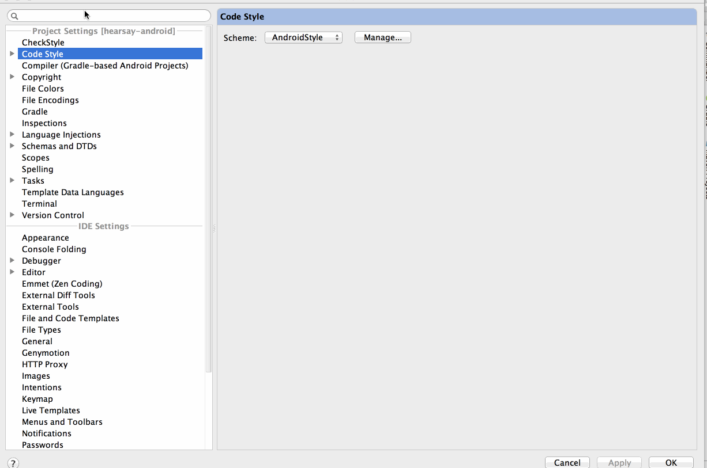
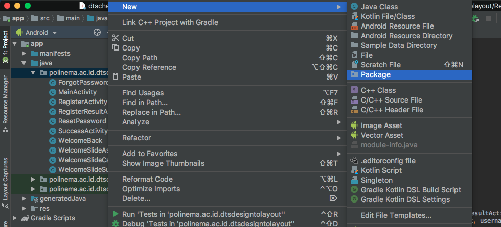
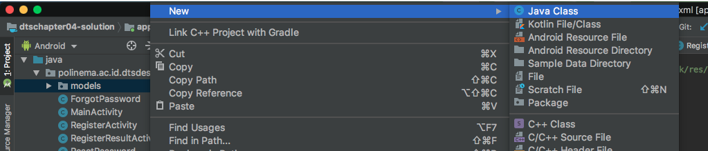
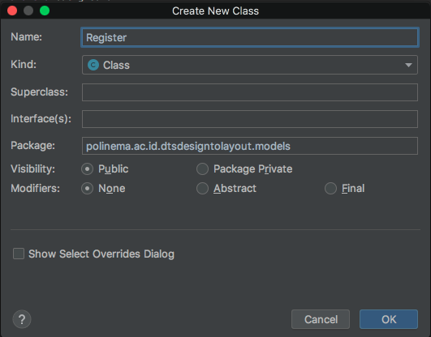
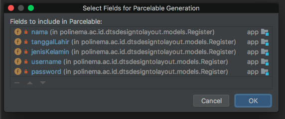
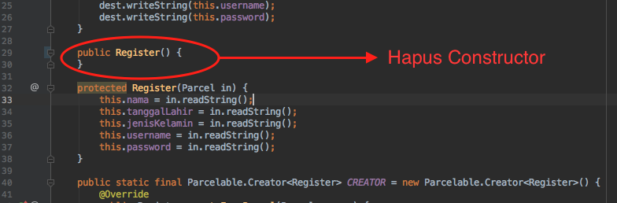
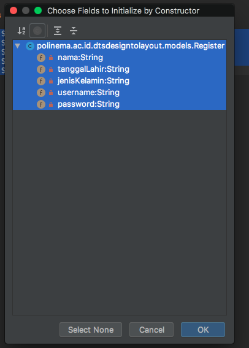

# Tujuan
Intent dapat dimanfaatkan untuk mengirimkan informasi antar activity. Namun bagaimana jika data yang kita kirimkan sangat banyak ? Apakah intent menjadi solusi yang efektif ? Kemungkinan jawabannya adalah tidak. Untuk itu, Android menyediakan kelas [Parcelable](https://developer.android.com/reference/android/os/Parcelable) untuk mengatasi permasalahan ini. Kita dapat mengirimkan banyak informasi atau data dengan menggunakan `Parcelable` dalam satu kali pengiriman. Hal ini dikarenakan, `Parcelable` merupakan sebuah object yang dapat berisi banyak data.

## Plugin Tambahan
Untuk mempermudah pembuatan object `parcelable` kita akan menambahkan plugin kedalam Android Studio.

1. Buka File->Settings->Plugins (OS Windows)
2. Cari plugin dengan nama **Android Parcelable code generator**
3. Install plugin
4. Restart Android Studio

Berikut ilustrasi instalasi plugin pada Android Studio. Ilustrasi mungkin berbeda pada versi dan OS yang digunakan



## Membuat Model Parcelable
**Parcelable** merupakan sebuah object yang memiliki property didalamnya. Property dalam sebuah object dapat kita `set` nilainya dan dapat kita ambil atau `get` nilai yang sudah di definisikan. Object yang digunakan sebagai **Parcelable** lebih merujuk pada konsep sebuah model. Model merupakan kerangka object yang property-propertynya dapat dimanfaatkan secara berulang.

Pada percobaan kali ini, kita akan mencoba untuk membuat model **Parcelable** dari form **Register** yang sudah dilakukan sebelumnya. Selanjutnya kita akan mencoba memanfaatkan **Parcelable** untuk mengirim data dengan menggunakan intent.

Untuk membuat sebuah model **Parcelable** langkah-langkah yang harus dilakukan adalah,

1. Pertama, buatlah `package` baru bernama model didalam package `polinema.ac.id.dtsdesigntolayout`. Klik kanan package `polinema.ac.id.dtsdesigntolayout` -> New -> Package

    

2. Berikan nama `models` pada package. Klik **OK**

3. Klik kanan pada package models -> New -> Java Class

    

4. Berikan nama **Register**. Klik **OK**

    

5. Buka model `Register.java`, buatlah 5 variabel `string` seperti kode dibawah ini

    ```java
    package polinema.ac.id.dtsdesigntolayout.models;


    public class Register {

        private String nama;
        private String tanggalLahir;
        private String jenisKelamin;
        private String username;
        private String password;
        
    }
    ```

6. Tekan kombinasi `alt + ins` (Windows) atau `command + n` (Mac) pada keyboard. Akan muncul jendela generator kode.

7. Pilih `Parcelable`. Klik **OK**

    

8. Hapuslah kode konstruktor seperti yang ditunjukkan oleh gambar berikut,

    

9. Ulangi langkah ke-6, kemudian pilih `Constructor` untuk membuat konstruktor. Pilih semua variabel yang ada (Ctrl + A), lalu klik **OK**

    

10. Ulangi langkah ke-6, kemudian pilih `Getter and Setter`, untuk memuat kode `getter` dan `setter`. Pilih semua variabel yang ada (Ctrl + A), lalu klik **OK**

    

11. Sampai tahapan ini kita sudah membuat model **Parcelable** untuk form register.

## Implementasi Parcelable

Setelah model selesai kita buat, selanjutnya kita akan mengimplementasi model **Parcelable** pada activity **Register**

1. Buka kode activity `RegisterActivity.java`

2. Modifikasi kode menjadi seperti berikut,

    ```java
    public class RegisterActivity extends AppCompatActivity {

        private final String TAG = RegisterActivity.class.getName();
        public static final String Key_RegisterActivity = "Key_RegisterActivity";

        EditText editTextNama, editTextTanggalLahir, editTextUserName, editTextPassword;
        //RadioButton radioButtonLaki, radioButtonPerempuan;
        RadioButton radioButtonJK;
        RadioGroup rgJenisKelamin;

        @Override
        protected void onCreate(Bundle savedInstanceState) {
            super.onCreate(savedInstanceState);
            setContentView(R.layout.activity_register);
            editTextNama = findViewById(R.id.edt_txt_nama);
            editTextTanggalLahir = findViewById(R.id.edt_tanggal_lahir);
            editTextUserName = findViewById(R.id.edt_username);
            editTextPassword = findViewById(R.id.edt_password);
    //        radioButtonLaki = findViewById(R.id.rb_laki);
    //        radioButtonPerempuan = findViewById(R.id.rb_perempuan);

            rgJenisKelamin = findViewById(R.id.rg_jenis_kelamin);
        }

        public void postSignUp(View view) {
            String password = editTextPassword.getText().toString();
            String username = editTextUserName.getText().toString();
            String nama = editTextNama.getText().toString();
    //        String jk = radioButtonPerempuan.isChecked() ? "Perempuan" : "Laki-laki";

            // Ambil id radio button yang dipilih
            int selectedJk = rgJenisKelamin.getCheckedRadioButtonId();
            // Jadikan id radio button sebagai rujukan binding view
            radioButtonJK = findViewById(selectedJk);

            // Hasilnya sama persis dengan baris 40, namun dengan pendekatan yang berbeda
            String jk = radioButtonJK.getText().toString();

            String tanggal_lahir = editTextTanggalLahir.getText().toString();

            Register register = new Register(nama, tanggal_lahir, jk, username, password);

            Intent intent = new Intent(RegisterActivity.this, RegisterResultActivity.class);
            intent.putExtra(Key_RegisterActivity, register);
            startActivity(intent);
        }
    }
    ```
Keterangan kode :

- Baris kode `Register register = new Register(nama, tanggal_lahir, jk, username, password);` digunakan inisiasi model parcelable

- nama, tanggal_lahir, jk, username, dan password merupakan property dari model parcelable yang harus diisikan pada saat model dibuat (inisiasi kelas dengan constructor)

- Pada kode `intent.putExtra(Key_RegisterActivity, register);` hanya akan mem-*passing* object parcelable.

3. Selanjutnya buka kode activity `RegisterResultActivity.java`

4. Modifikasi kode activity tersebut menjadi seperti berikut,

    ```java
    package polinema.ac.id.dtsdesigntolayout;

    import android.os.Bundle;
    import android.support.v7.app.AppCompatActivity;
    import android.widget.TextView;

    import polinema.ac.id.dtsdesigntolayout.models.Register;

    public class RegisterResultActivity extends AppCompatActivity {

        //inisialisasi variabel
        TextView tvResultNama, tvResultTanggalLahir, tvResultJenisKelamin, tvResultUsername;

        // Intent key
        public static final String Key_RegisterActivity = "Key_RegisterActivity";

        @Override
        protected void onCreate(Bundle savedInstanceState) {
            super.onCreate(savedInstanceState);
            setContentView(R.layout.activity_register_result);
            // assign view
            tvResultNama = findViewById(R.id.tvResultNama);
            tvResultTanggalLahir = findViewById(R.id.tvResultTanggalLahir);
            tvResultJenisKelamin = findViewById(R.id.tvResultJenisKelamin);
            tvResultUsername = findViewById(R.id.tvResultUsername);

            //get string array berdasarkan key
            //String[] stringArray = getIntent().getStringArrayExtra(RegisterActivity.Key_RegisterActivity);

            Register register = getIntent().getParcelableExtra(Key_RegisterActivity);

            //set value to textview
    //        tvResultNama.setText(stringArray[0]);
    //        tvResultTanggalLahir.setText(stringArray[1]);
    //        tvResultJenisKelamin.setText(stringArray[2]);
    //        tvResultUsername.setText(stringArray[3]);

            // Set value to TextView based on Parcel Object
            tvResultNama.setText(register.getNama());
            tvResultTanggalLahir.setText(register.getTanggalLahir());
            tvResultJenisKelamin.setText(register.getJenisKelamin());
            tvResultUsername.setText(register.getUsername());

        }
    }
    ```

Keterangan kode :

- Pada baris kode `Register register = getIntent().getParcelableExtra(Key_RegisterActivity);` kita membuat object register (model register). Object ini memiliki value dari parcelable yang dikirim oleh activity `RegisterActivity`.

- Kemudian kita melakukan penggatian text dari TextView dengan menggunakan property dari object register. Perhatikan potongan kode dibawah ini. 

```java
tvResultNama.setText(register.getNama());
tvResultTanggalLahir.setText(register.getTanggalLahir());
tvResultJenisKelamin.setText(register.getJenisKelamin());
tvResultUsername.setText(register.getUsername());
```

- `register` merupakan variable yang kita inisiasi dengan tipe model `Register`. Sehingga variabel ini juga memiliki nama, tanggal lahir, jenis kelamin, username, dan password (Perhatikan kembali model yang dibuat)

- Untuk mendapatkan value dari property tersebut, kita dapat menggunakan method `get` sesuai `getter` yang sudah kita generate.


5. Build kembali aplikasi Anda. Maka hasil pada activity **RegisterResultActivity** tidak jauh berbeda dengan hasil intent dengan data. Namun kali ini kita melakukannya dengan menggunakan metode parcelable yang sangat dianjurkan jika mengirim data dalam jumlah yang banyak dalam satu kali kirim.