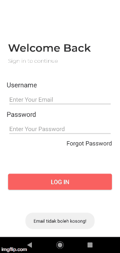

# Pendahuluan

Pada praktikum pertama chapter 4 ini Anda akan mencoba membuat validasi input pada halaman login dari chapter sebelumnya. Mengapa kita perlu membuat validasi pada input ? Validasi input dilakukan untuk memastikan data yang diisi oleh user sesuai dengan apa yang dibutuhkan oleh aplikasi. Pada kasus halaman login terdapat minimal 2 input yang harus Anda validasi. Pertama adalah inputan email dan yang kedua adalah inputan kata sandi atau password. Pertanyaan selanjutnya adalah bagaimana cara memvalidasi inputan email dan password ? Untuk menjawab hal tersebut, kita harus mengetahui ciri khusus dari kedua inputan tersebut. Apa ciri khusus dari email ? Ciri yang paling sederhana dari email adalah memiliki karakter penguhubung yaitu *@*. Selanjutnya, apa ciri dari password ? Inputan password **tidak boleh** ditampilkan dalam interface. Ciri password lainnya dapat kita definisikan sesuai dengan kebutuhan. Contoh ciri password adalah jumlah karakter, penggunaan *lowercase* dan *uppercase*, serta penggunaan karakter unik dalam sebuah password.

## Validasi Inputan Email
Validasi email akan dilakukan pada bagian layout dan kode activity. Buka kode layout `activity_welcome_back.xml`. Tambahkan parameter `android:inputType="textEmailAddress"` pada bagian `editText` untuk email. Hasil modifikasi adalah sebagai berikut,

```xml
<EditText
    android:id="@+id/edt_txt_email"
    android:layout_width="match_parent"
    android:layout_height="wrap_content"
    android:layout_marginLeft="24dp"
    android:layout_marginTop="8dp"
    android:layout_marginRight="24dp"
    android:hint="Enter Your Email"
    android:inputType="textEmailAddress"
    app:layout_constraintLeft_toLeftOf="parent"
    app:layout_constraintRight_toRightOf="parent"
    app:layout_constraintTop_toBottomOf="@id/txt_email"
    />
```

Validasi pada bagian layout sudah kita selesaikan. Selanjutnya kita akan melakukan validasi pada kode activity. Validasi dilakukan dengan memanfaatkan kelas [Patterns](https://developer.android.com/reference/android/util/Patterns). Kelas Patterns merupakan kelas yang digunakan untuk melakukan *matching string* dengan memanfaatkan *regular expression* (RegEx). Mengapa kita menggunakan Patterns pada kasus ini ? Patterns sudah menyediakan pola-pola umum dari RegEx yang biasa digunakan, sehingga kita tidak perlu mendefinisikan ulang karakter yang digunakan melalui RegEx.

Buka kode activity `WelcomeBack.java` tambahkan method berikut,

```java
public static boolean isValidEmail(CharSequence email) {
    return (Patterns.EMAIL_ADDRESS.matcher(email).matches());
}
```

Kemudian buatlah variable `EditText editTextEmail` pada `WelcomeBack.java`. Selanjutnya assign view `edt_txt_email` ke variabel `editTextEmail` pada method onCreate.

```java
// Deklarasi variable editTextEmail dengan tipe EditText
EditText editTextEmail;

@Override
protected void onCreate(Bundle savedInstanceState) {
    super.onCreate(savedInstanceState);
    setContentView(R.layout.activity_welcome_back);

    // Binding edt_txt_email ke variabel editTextEmail
    editTextEmail = findViewById(R.id.edt_txt_email);

}
```

Proses validasi akan berlangsung ketika tombol **Login** ditekan oleh user. Even tombol **Login** ditangani oleh method **postLogin**. Modifikasi method **postLogin** menjadi seperti berikut,

```java
public void postLogin(View view) {
    // Validasi input email kosong
    if(TextUtils.isEmpty(editTextEmail.getText().toString().trim())){
        Toast.makeText(view.getContext(), "Email tidak boleh kosong!", Toast.LENGTH_LONG).show();
    }
    // Validasi inputan tipe email
    else if(!isValidEmail(editTextEmail.getText().toString().trim())) {
        Toast.makeText(view.getContext(), "Email tidak valid!", Toast.LENGTH_LONG).show();
    }
    else {
        Intent i = new Intent(WelcomeBack.this, SuccessActivity.class);
        startActivity(i);
    }
}
```

Keterangan kode :

1. `TextUtils.isEmpty()` digunakan untuk pengecekan apakan inputan yang diberikan kosong
atau tidak. Parameter `editTextEmail.getText().toString().trim()` berisi text string dari
inputan email. `toString()` digunakan untuk mengubah object menjadi sebuah string. `trim()` digunakan untuk membuang karakter spasi pada string.

2. `isValidEmail()` merupakan method yang telah kita buat untuk pengecekan email dengan menggunakan kelas Patterns.

3. Pesan tidak valid akan dimunculkan dengan menggunakan [Toast](https://developer.android.com/reference/android/widget/Toast). Toast merupakan tampilan pesan yang disediakan oleh Android untuk menampilkan pesan dalam kurun waktu yang singkat. `Toast.makeText()` digunakan untuk membuat pesan pada toast. `Toast.makeText()` memiliki 3 parameter, yaitu **Context**, **Pesan**, dan **Durasi**.
Sampai tahap ini, validasi akan berjalan seperti berikut,

<p align="center"></p>

##Validasi Password
Pada validasi password, pertama kita harus menghubah tipe EditText menjadi tipe password pada layout. Tentunya kita tidak ingin jika password yang dimasukkan oleh user ditampilkan dalam *plaintext*. Tambahkan property `android:inputType="textPassword" pada EditText dengan id **edt_txt_password**. Hasil kode akan nampak seperti berikut,

```xml
<EditText
    android:id="@+id/edt_txt_password"
    android:layout_width="match_parent"
    android:layout_height="wrap_content"
    android:layout_marginLeft="24dp"
    android:layout_marginTop="8dp"
    android:layout_marginRight="24dp"
    android:hint="@string/enter_your_password"
    android:inputType="textPassword"
    app:layout_constraintLeft_toLeftOf="parent"
    app:layout_constraintRight_toRightOf="parent"
    app:layout_constraintTop_toBottomOf="@+id/txt_password" />
```

Selanjutnya kita akan melakukan modifikasi pada kode activity. Pada percobaan kali ini, kita hanya akan melakukan pengecekan apakah password disi oleh user atau tidak (kosong).
Deklarasi variabel dengan tipe EditText untuk variabel `editTextPassword`. Selanjutnya lakukan binding view `edt_txt_password` pada method onCreate().

```java
// Deklarasi variabel editTextEmail dengan tipe EditText
EditText editTextEmail;
// Deklarasi variabel editTextPassword dengan tipe EditText
EditText editTextPassword;

@Override
protected void onCreate(Bundle savedInstanceState) {
    super.onCreate(savedInstanceState);
    setContentView(R.layout.activity_welcome_back);

    // Binding edt_txt_email ke variabel editTextEmail
    editTextEmail = findViewById(R.id.edt_txt_email);
    // Binding edt_txt_password ke variabel editTextPassword
    editTextPassword = findViewById(R.id.edt_txt_password);

}
```

Selanjutnya, modifikasi method `postLogin()` menjadi seperti berikut,

```java
public void postLogin(View view) {
    // Validasi input email dan password kosong
    if(TextUtils.isEmpty(editTextEmail.getText().toString().trim()) &&
            TextUtils.isEmpty(editTextPassword.getText().toString().trim())) {
        Toast.makeText(view.getContext(), "Email dan Password tidak boleh kosong!",
                Toast.LENGTH_LONG).show();
    }
    // Validasi input email kosong
    else if(TextUtils.isEmpty(editTextEmail.getText().toString().trim())) {
        Toast.makeText(view.getContext(), "Email tidak boleh kosong!", Toast.LENGTH_LONG).show();
    }
    // Validasi inputan tipe email
    else if(!isValidEmail(editTextEmail.getText().toString().trim())) {
        Toast.makeText(view.getContext(), "Email tidak valid!", Toast.LENGTH_LONG).show();
    }
    else if(TextUtils.isEmpty(editTextPassword.getText().toString()) {
        Toast.makeText(view.getContext(), "Password tidak boleh kosong!", Toast.LENGTH_LONG).show();
    }
    else {
        Intent i = new Intent(WelcomeBack.this, SuccessActivity.class);
        startActivity(i);
    }
}
```
Hasil akhir praktikum validasi akan nampak seperti gambar dibawah ini,

<p align="center"></p>

Sampai tahap ini, kita telah melakukan validasi sederhana untuk inputan email dan password. Anda sudah melakukan,

1. Validasi apakah inputan email dan password kosong.
2. Validasi apakah inputan email sesuai dengan format email atau tidak.

Selanjutnya, Anda akan belajar bagaimana cara interaksi antar activity dengan mengirimkan data. Data akan dikirim dengan menggunakan intent.