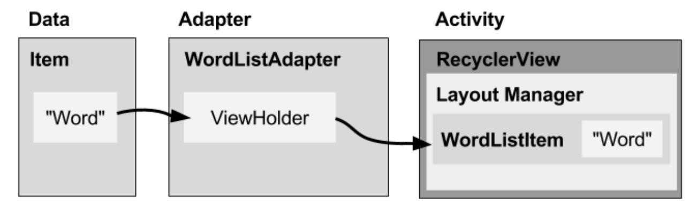

# Recycler View

Saat menampilkan banyak item dalam daftar (list) yang bisa digulir (scroll), sebagian besar item tidak terlihat. Misalnya, dalam daftar kata yang panjang atau banyak judul berita, user hanya melihat sedikit item daftar untuk setiap kalinya. **RecyclerView** digunakan untuk menampilkan daftar kata dari database.

Atau, jika memiliki kumpulan data yang akan berubah saat user berinteraksi dengannya. Jika membuat tampilan baru setiap kali data berubah, maka harus membuat banyak tampilan, bahkan untuk kumpulan data yang kecil.

**RecyclerView** adalah versi **ListView** yang lebih canggih dan fleksibel. Widget ini adalah kontainer untuk menampilkan rangkaian data besar yang bisa digulir secara sangat efisien dengan mempertahankan tampilan dalam jumlah terbatas.

## Komponen Recycle View

Untuk menampilkan data dalam RecyclerView, Anda memerlukan bagian berikut:

### Data
asal data bisa dari lokal, seperti atau dari database, atau atau menariknya dari internet.

### RecyclerView.

Scroll list yang berisi **item**.
Instance RecyclerView sebagaimana didefinisikan dalam file layout **activity**, bertindak sebagai kontainer tampilan.
    
### Layout item 
Semua list item akan  tampak sama, sehingga layout yang sama bisa digunakan untuk semuanya. Layout item harus dibuat secara terpisah dari layout **activity**, sehingga satu per satu tampilan item bisa dibuat dan diisi data.

###  Layout Manager 
Pengelola layout menangani penyusunan (layout) komponen antarmuka pengguna dalam suatu tampilan. Semua grup tampilan memiliki pengelola layout. Untuk LinearLayout, sistem Android menangani layout untuk Anda. RecyclerView memerlukan pengelola layout eksplisit untuk mengelola susunan list item yang terdapat di dalamnya. Layout ini bisa vertikal, horizontal, atau berupa petak.

    
### Adapter
Adapter menghubungkan data Anda dengan **RecyclerView**. Adapter menyiapkan data dan cara menampilkan data dalam **view holder**. Bila data berubah, adapter akan memperbarui materi tampilan item daftar terkait dalam RecyclerView.

Adapter juga merupakan ekstensi dari RecyclerView.Adapter. Adapter menggunakan ViewHolder untuk menampung tampilan yang menyusun setiap item dalam RecyclerView, dan mengikat data untuk ditampilkan dalam tampilan yang menampilkannya.

### View holder. 
View holder berisi tampilan informasi untuk menampilkan satu item dari layout item.

Diagram di bawah ini menampilkan hubungan antara komponen-komponen tersebut.

 

 
Pada bab ini akan dibahas cara untuk membuat **RecyclerView** sederhana dengan layout custom. Recycler yang akan dibuat adalah daftar film. 
