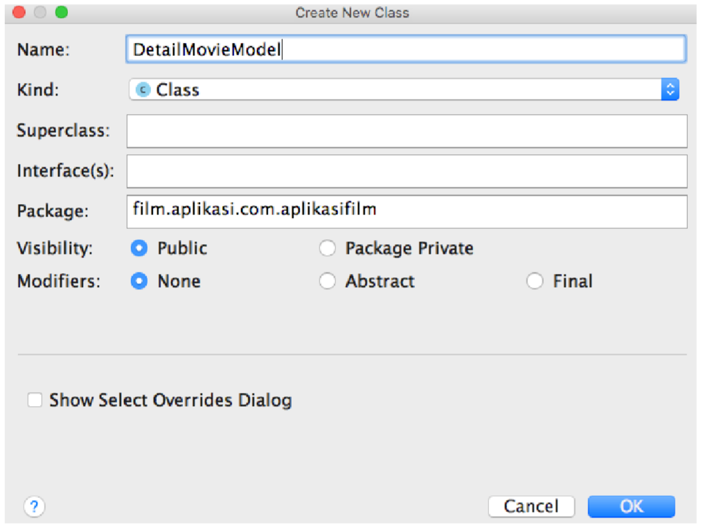
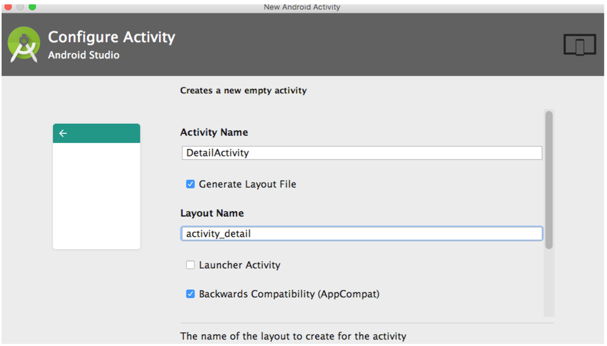

# Praktikum Recycle View

 1. Menambah internet permision pada **AndroidManifest.xml**

```xml
<?xml version="1.0" encoding="utf-8"?>
<manifest xmlns:android="http://schemas.android.com/apk/res/android"
    package="film.aplikasi.com.aplikasifilm">

    <uses-permission android:name="android.permission.INTERNET"></uses-permission>
    <application
        android:allowBackup="true"
        android:icon="@mipmap/ic_launcher"
        android:label="@string/app_name"
        android:roundIcon="@mipmap/ic_launcher_round"
        android:supportsRtl="true"
        android:theme="@style/AppTheme">
        <activity android:name=".MainActivity">
            <intent-filter>
                <action android:name="android.intent.action.MAIN" />

                <category android:name="android.intent.category.LAUNCHER" />
            </intent-filter>
        </activity>
    </application>

</manifest>
```

2.Menambah library RecyclerView pada **build.gradle**

```xml
dependencies {
    implementation fileTree(dir: 'libs', include: ['*.jar'])
    //noinspection GradleCompatible
    implementation 'com.android.support:appcompat-v7:28.0.0'
    implementation 'com.android.support:recyclerview-v7:28.0.0'
    implementation 'com.android.support.constraint:constraint-layout:1.1.3'
    implementation 'com.jakewharton:butterknife:8.8.1'
    implementation 'com.squareup.picasso:picasso:2.71828'
    annotationProcessor 'com.jakewharton:butterknife-compiler:8.8.1'
    testImplementation 'junit:junit:4.12'
    androidTestImplementation 'com.android.support.test:runner:1.0.2'
    androidTestImplementation 'com.android.support.test.espresso:espresso-core:3.0.2'
}
```

 3.Membuat Activity baru dengan nama **PosterActivity.java**

 <p align="center"> </p>

 4.Mengubah Tampilan atau Layout **activity_poster.xml**

```python
<?xml version="1.0" encoding="utf-8"?>
<android.support.constraint.ConstraintLayout xmlns:android="http://schemas.android.com/apk/res/android"
    xmlns:app="http://schemas.android.com/apk/res-auto"
    xmlns:tools="http://schemas.android.com/tools"
    android:layout_width="match_parent"
    android:layout_height="match_parent"
    tools:context="film.aplikasi.com.aplikasifilm.PosterActivity">

    <android.support.v7.widget.RecyclerView
        android:id="@+id/rcPoster"
        android:layout_width="368dp"
        android:layout_height="wrap_content"
        tools:layout_editor_absoluteY="0dp"
        tools:layout_editor_absoluteX="8dp">
    </android.support.v7.widget.RecyclerView>
</android.support.constraint.ConstraintLayout>
```

Tampilan activity_poster.xml yang telah dibuat dapat dilihat seperti pada gambar berikut:

<p align="center"> </p>

kemudian kita perlu membuat Poster Grid layout (**poster_grid.xml**) yang akan digunakan untuk mengisi RecyclerView dengan id rcPoster yang ada di activity_poster.xml.

```python
<?xml version="1.0" encoding="utf-8"?>
<android.support.v7.widget.CardView xmlns:android="http://schemas.android.com/apk/res/android"
    xmlns:card_view="http://schemas.android.com/apk/res-auto"
    android:layout_width="match_parent"
    android:layout_height="wrap_content"
    card_view:cardCornerRadius="10dp">
    <ImageView
        android:id="@+id/imgPoster"
        android:adjustViewBounds="true"
        android:layout_width="wrap_content"
        android:layout_height="wrap_content" />
</android.support.v7.widget.CardView>
```

 5.Setelah membuat layout selanjutnya kita mengubah PosterActivity.java. Jika Terdapat error Pada PosterActivity maka tambahkan file di setelah **PosterActivity.java**

```python
package film.aplikasi.com.aplikasifilm;

import android.content.Context;
import android.os.AsyncTask;
import android.support.v7.app.AppCompatActivity;
import android.os.Bundle;
import android.support.v7.widget.GridLayoutManager;
import android.support.v7.widget.RecyclerView;
import android.widget.Toast;

import org.json.JSONArray;
import org.json.JSONException;
import org.json.JSONObject;
import java.util.ArrayList;
import java.util.List;

import butterknife.BindView;
import butterknife.ButterKnife;

public class PosterActivity extends AppCompatActivity {

    @BindView(R.id.rcPoster) RecyclerView mRecyclerView;
    RecyclerView.LayoutManager mLayoutManager;
    RecyclerView.Adapter mAdapter;
    Context mContext;
    PosterAdapter posterAdapter;
    List<String> posterPathList = new ArrayList<>();
    List<DetailMovieModel> detailMovieModelList = new ArrayList<>();
    @Override
    protected void onCreate(Bundle savedInstanceState) {
        super.onCreate(savedInstanceState);
        setContentView(R.layout.activity_poster);

        ButterKnife.bind(this);
        mContext = PosterActivity.this;
        mLayoutManager = new GridLayoutManager(mContext,3); // ini layoutnya
        mRecyclerView.setLayoutManager(mLayoutManager); //ini set layout manager ke recycler

        posterAdapter = new PosterAdapter(detailMovieModelList);
        mRecyclerView.setAdapter(posterAdapter);

        new GetMovieData().execute();
    }

    private class GetMovieData extends AsyncTask<Void, String, List<DetailMovieModel>>{
        List<String> test = new ArrayList<>();
        @Override
        protected List<DetailMovieModel> doInBackground(Void... params) {

            String url = "http://api.themoviedb.org/3/movie/popular?api_key=a57ad9ba5b3888623524f0113a60c3ac";
            String result = HtttRequest.AksesInternet(url);

            DetailMovieModel movieData = null;

            try {
                if (result !=null){
                    JSONObject objectMovie =  new JSONObject(result);
                    JSONArray arrayResult = objectMovie.getJSONArray("results");

                    for(int ii=0;ii<arrayResult.length();ii++) //banyak
                    {
                        movieData = new DetailMovieModel(
                                arrayResult.getJSONObject(ii).getInt("id"),
                                arrayResult.getJSONObject(ii).getDouble("vote_average"),
                                arrayResult.getJSONObject(ii).getString("poster_path"),
                                arrayResult.getJSONObject(ii).getString("release_date"),
                                arrayResult.getJSONObject(ii).getString("title")
                        );
                        detailMovieModelList.add(movieData);
                    }
                }else{
                    Toast.makeText(mContext,"Internet Off", Toast.LENGTH_SHORT).show();
                }
            } catch (JSONException e) {
                e.printStackTrace();
            }
            return detailMovieModelList;
        }

        @Override
        protected void onPostExecute(List<DetailMovieModel> s) {
            super.onPostExecute(s);
            posterAdapter.setPosterAdapter(s);
        }
    }
}
```

 6.Kemudian buat Adapter dari RecyclerView yang bertanggung jawab untuk menangani data, berikut kode dari **PosterAdapter.java**

```python
package film.aplikasi.com.aplikasifilm;

import android.content.Intent;
import android.os.Bundle;
import android.support.v7.widget.RecyclerView;
import android.view.LayoutInflater;
import android.view.View;
import android.view.ViewGroup;
import android.widget.ImageView;

import com.squareup.picasso.Picasso;

import java.util.ArrayList;
import java.util.List;

import butterknife.BindView;
import butterknife.ButterKnife;

/**
 * Created by arie on 8/20/17.
 */

class PosterAdapter extends RecyclerView.Adapter<PosterAdapter.Holder> {
    List<DetailMovieModel> detailMovieModelList ;

    public PosterAdapter(List<DetailMovieModel> detailMovieModelList) {
        this.detailMovieModelList = new ArrayList<>(detailMovieModelList);
    }

    public void setPosterAdapter(List<DetailMovieModel> posterPathList) {
        this.detailMovieModelList = new ArrayList<>(posterPathList);
        notifyDataSetChanged();
    }

    @Override
    public Holder onCreateViewHolder(ViewGroup parent, int viewType) {

        View mView = LayoutInflater.from(parent.getContext())
                .inflate(R.layout.poster_grid, parent, false);
        Holder mHolder = new Holder(mView);
        return mHolder;
    }

    @Override
    public void onBindViewHolder(final Holder holder, final int position) {
        Picasso.with(holder.itemView.getContext())
                .load("http://image.tmdb.org/t/p/w500/"+detailMovieModelList.get(position).getPoster_path())
                .placeholder(R.mipmap.ic_launcher)
                .into(holder.mImageView1);

        holder.itemView.setOnClickListener(new View.OnClickListener() {
            @Override
            public void onClick(View v) {
                Intent mIntent = new Intent(holder.itemView.getContext(),
                        DetailActivity.class);
                mIntent.putExtra(DetailMovieModel.KEY_ID,detailMovieModelList.get(position).getId());
                mIntent.putExtra(DetailMovieModel.KEY_POPULARITY,detailMovieModelList.get(position).getPopularity());
                mIntent.putExtra(DetailMovieModel.KEY_POSTER_PATH,detailMovieModelList.get(position).getPoster_path());
                mIntent.putExtra(DetailMovieModel.KEY_RELEASE_DATE,detailMovieModelList.get(position).getRelease_date());
                mIntent.putExtra(DetailMovieModel.KEY_TITLE,detailMovieModelList.get(position).getTitle());

                holder.itemView.getContext().startActivity(mIntent);
            }
        });
    }

    @Override
    public int getItemCount() {
//        return paramPosterPathList.size();
        return (detailMovieModelList != null ? detailMovieModelList.size(): 0);
    }

    public class Holder extends RecyclerView.ViewHolder {
        @BindView(R.id.imgPoster) ImageView mImageView ;
        ImageView mImageView1;

        public Holder(View itemView) {
            super(itemView);
            mImageView1 = (ImageView) itemView.findViewById(R.id.imgPoster);

            ButterKnife.bind(this,itemView);
        }
    }
}
```

 7.Buat **model** atau yang sering dikenal _POJO (Plain Old Java Object)_. Dengan cara membuat new Java Class bernama *DetailMovieModel* seperti pada Gambar berikut:

 <p align="center"> </p>

 8.Kemudian kita ubah isi dari **DetailMovieModel.java**.

```python
package film.aplikasi.com.aplikasifilm;

public class DetailMovieModel {

    public static final String KEY_ID = "id";
    public static final String KEY_POPULARITY = "popularity";
    public static final String KEY_POSTER_PATH = "poster_path";
    public static final String KEY_RELEASE_DATE = "release_date";
    public static final String KEY_TITLE = "title";

    int id;
    double popularity;
    String poster_path;
    String release_date;
    String title;

    public DetailMovieModel(int id, double popularity, String poster_path, String release_date, String title) {
        this.id = id;
        this.popularity = popularity;
        this.poster_path = poster_path;
        this.release_date = release_date;
        this.title = title;
    }

    public int getId() {
        return id;
    }

    public double getPopularity() {
        return popularity;
    }

    public String getPoster_path() {
        return poster_path;
    }

    public String getRelease_date() {
        return release_date;
    }

    public String getTitle() {
        return title;
    }
}
 ```

 9.Lalu buat file java untuk melakukan koneksi ke server dengan nama **HttpRequest.java**

```python
package film.aplikasi.com.aplikasifilm;

import android.util.Log;
import java.io.BufferedReader;
import java.io.IOException;
import java.io.InputStream;
import java.io.InputStreamReader;
import java.net.HttpURLConnection;
import java.net.URL;


public class HtttRequest {


    public static String AksesInternet(String urlParam){
        HttpURLConnection urlConnection = null;
        BufferedReader reader = null;

        // Will contain the raw JSON response as a string.
        String jsonStr = null;

        try {
            // Construct the URL for the OpenWeatherMap query
            // Possible parameters are available at OWM's forecast API page, at
            // http://openweathermap.org/API#forecast
            URL url = new URL(urlParam);

            // Create the request to OpenWeatherMap, and open the connection
            urlConnection = (HttpURLConnection) url.openConnection();
            urlConnection.setRequestMethod("GET");
            urlConnection.connect();

            // Read the input stream into a String
            InputStream inputStream = urlConnection.getInputStream();
            StringBuffer buffer = new StringBuffer();
            if (inputStream == null) {
                // Nothing to do.
                jsonStr = null;
            }
            reader = new BufferedReader(new InputStreamReader(inputStream));

            String line;
            while ((line = reader.readLine()) != null) {
                // Since it's JSON, adding a newline isn't necessary (it won't affect parsing)
                // But it does make debugging a *lot* easier if you print out the completed
                // buffer for debugging.
                buffer.append(line + "\n");
            }

            if (buffer.length() == 0) {
                // Stream was empty.  No point in parsing.
                jsonStr = null;
            }
            jsonStr = buffer.toString();

        } catch (IOException e) {
            Log.e("PlaceholderFragment", "Error ", e);
            // If the code didn't successfully get the weather data, there's no point in attempting
            // to parse it.
            jsonStr = null;
        } finally{
            if (urlConnection != null) {
                urlConnection.disconnect();
            }
            if (reader != null) {
                try {
                    reader.close();
                } catch (final IOException e) {
                    Log.e("PlaceholderFragment", "Error closing stream", e);
                }
            }
        }
        return  jsonStr;
    }
}

```

 10.Buat activity **DetailActivity.java** untuk melihat detail film seperti berikut: 

 <p align="center"> </p>

 11.Setelah membuat Activity, ubah layout  **activity_detail.xml**  

```python
<?xml version="1.0" encoding="utf-8"?>
<LinearLayout xmlns:android="http://schemas.android.com/apk/res/android"
    xmlns:tools="http://schemas.android.com/tools"
    android:layout_width="match_parent"
    android:layout_height="match_parent"
    android:orientation="vertical"
    android:weightSum="4"
    tools:context="film.aplikasi.com.aplikasifilm.DetailActivity">

    <FrameLayout
        android:layout_width="match_parent"
        android:layout_height="wrap_content"
        android:layout_weight="1"
        android:background="#009688">

        <TextView
            android:id="@+id/tvJudul"
            android:layout_width="match_parent"
            android:layout_height="wrap_content"
            android:textColor="@android:color/white"
            android:textSize="40sp"
            android:textStyle="bold"
            tools:text="Judul Film" />
    </FrameLayout>

    <LinearLayout
        android:layout_width="match_parent"
        android:layout_height="wrap_content"
        android:layout_weight="2"
        android:orientation="horizontal"
        android:weightSum="3">

        <ImageView
            android:id="@+id/imgJudul"
            android:layout_width="0dp"
            android:layout_height="match_parent"
            android:layout_weight="1"
            tools:src="@mipmap/ic_launcher" />

        <LinearLayout
            android:layout_width="0dp"
            android:layout_height="match_parent"
            android:layout_marginLeft="5dp"
            android:layout_weight="2"
            android:orientation="vertical"
            android:weightSum="4">

            <TextView
                android:id="@+id/tvTahun"
                android:layout_width="wrap_content"
                android:layout_height="0dp"
                android:layout_weight="1"
                android:textSize="35sp"
                android:textStyle="bold"
                tools:text="Tahun" />

            <TextView
                android:id="@+id/tvMenit"
                android:layout_width="wrap_content"
                android:layout_height="0dp"
                android:layout_weight="1"
                android:textSize="25sp"
                android:textStyle="bold"
                tools:text="Menit" />

            <TextView
                android:id="@+id/tvRating"
                android:layout_width="wrap_content"
                android:layout_height="0dp"
                android:layout_weight="1"
                android:textSize="20sp"
                android:textStyle="bold"
                tools:text="7.0" />

            <Button
                android:id="@+id/btFavorite"
                android:layout_width="wrap_content"
                android:layout_height="0dp"
                android:layout_weight="1"
                android:background="#26A69A"
                android:text="@string/mark_as_favorite" />

        </LinearLayout>
    </LinearLayout>

    <android.support.v7.widget.RecyclerView
        android:id="@+id/rcTrailer"
        android:layout_width="match_parent"
        android:layout_height="wrap_content"
        android:layout_weight="1"></android.support.v7.widget.RecyclerView>

</LinearLayout>
```
Preview tampilan dari file activity_detail.xml 

 <p align="center"> </p>

 12. Setelah membuat layoutnya selanjutnya mengedit file **DetailActivity.java**

```python
package film.aplikasi.com.aplikasifilm;

import android.content.Intent;
import android.support.v7.app.AppCompatActivity;
import android.os.Bundle;
import android.support.v7.widget.RecyclerView;
import android.widget.ImageView;
import android.widget.TextView;

import com.squareup.picasso.Picasso;

import butterknife.BindView;
import butterknife.ButterKnife;

public class DetailActivity extends AppCompatActivity {
    @BindView(R.id.imgJudul) ImageView imageJudul;
    @BindView(R.id.tvJudul) TextView tvJudul;
    @BindView(R.id.tvTahun) TextView tvTahun;
    @BindView(R.id.tvMenit) TextView tvMenit;
    @BindView(R.id.tvRating) TextView tvRating;
    @BindView(R.id.rcTrailer) RecyclerView rcTrailer;


    @Override
    protected void onCreate(Bundle savedInstanceState) {
        super.onCreate(savedInstanceState);
        setContentView(R.layout.activity_detail);
        ButterKnife.bind(this);

        Intent mIntent = getIntent();
        getIntent().getIntExtra(DetailMovieModel.KEY_ID,0);
        tvJudul.setText(getIntent().getStringExtra(DetailMovieModel.KEY_TITLE));

        tvTahun.setText(getIntent().getStringExtra(DetailMovieModel.KEY_RELEASE_DATE).substring(0,4));
        tvRating.setText(String.valueOf(getIntent().getDoubleExtra(DetailMovieModel.KEY_POPULARITY,0))+"/10");

        Picasso.with(getApplicationContext())
                .load("http://image.tmdb.org/t/p/w342"+getIntent().getStringExtra(DetailMovieModel.KEY_POSTER_PATH))
                .placeholder(R.mipmap.ic_launcher)
                .into(imageJudul);

        //tvTahun.setText(getIntent().getStringExtra()tExtra(DetailMovieModel.KEY_RELEASE_DATE,0));


    }
}

```

13.Hasil Akhir dari praktikum RecyclerView dapat dilihat pada Gambar 2.1 dan 2.2.

  <p align="center"> </p>
<p align="center"> gambar 2.1 Hasil akhir RecycleView

  <p align="center"> </p>
 <p align="center"> gambar 2.2 Hasis DetailActivity