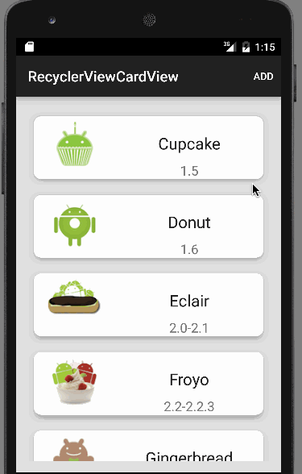
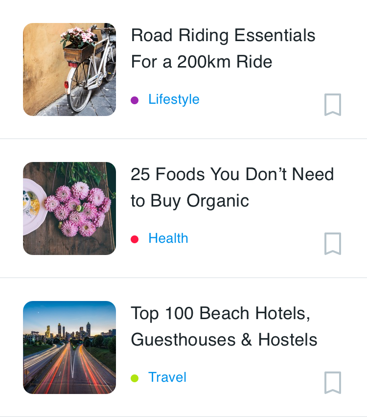
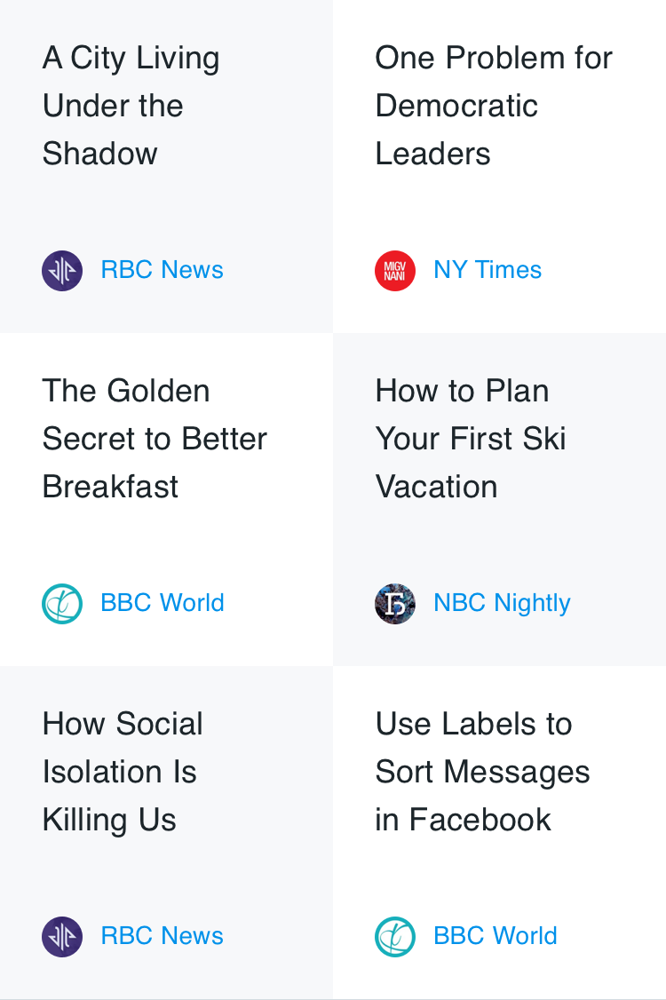
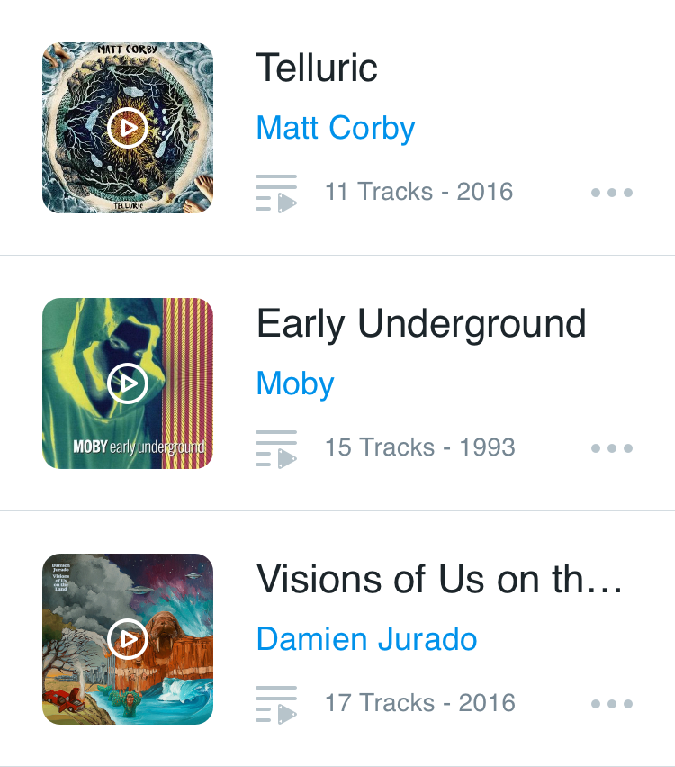
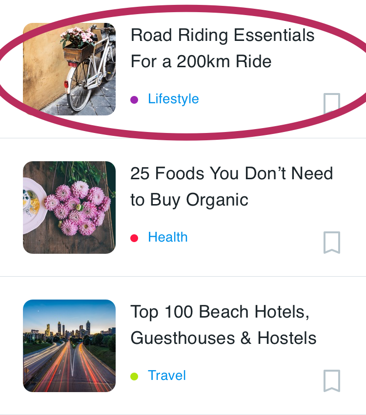
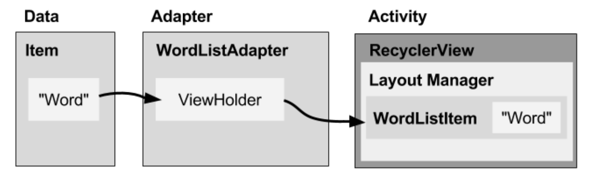

# Recycler View

Saat menampilkan banyak item dalam daftar (list) yang bisa digulir (scroll), sebagian besar item tidak terlihat. Misalnya, dalam daftar kata yang panjang atau banyak judul berita, user hanya melihat sedikit item daftar untuk setiap kalinya. **RecyclerView** digunakan untuk menampilkan daftar kata dari database.

Atau, jika memiliki kumpulan data yang akan berubah saat user berinteraksi dengannya. Jika membuat tampilan baru setiap kali data berubah, maka harus membuat banyak tampilan, bahkan untuk kumpulan data yang kecil.

**RecyclerView** adalah versi **ListView** yang lebih canggih dan fleksibel. Widget ini adalah kontainer untuk menampilkan rangkaian data besar yang bisa digulir secara sangat efisien dengan mempertahankan tampilan dalam jumlah terbatas.

<p align="center"></p>

## Komponen Recycle View

Untuk menampilkan data pada RecyclerView lakukanlah langkah langkah berikut secara berurutan.

### RecyclerView

Recyclerview di instansiasi pada activity yang menggunakan recyclerview. Proses pemanggilan data di lakukan di activity ini

Scroll list yang berisi **item**.
Instance RecyclerView sebagaimana didefinisikan dalam file layout **activity**, bertindak sebagai kontainer tampilan.

Recyclerview dibuat pada layout yang di gunakan pada activity ini.

### Data

Untuk membuat recyclerview diperlukan data, data ini dapat berasal dari :

1. Lokal dari variabel atau dari database lokal device android yang digunakan.
2. Internet dari server yang di request melalu REST atau dengan cara lain.

Data ini akan di representasikan sebagai sebuah file `models` dalam project android. Models di desain sesuai dengan kebutuhan dari data yang ditampilkan pada `recyclerview`, data dapat berupa tulisan, gambar, atau angka yang muncul pada desain recyclerview.

## Latihan mendesain models

Contoh desain layout dan class model yang dibuat :



```java
package polinema.ac.id.recyclerview.models;

public class Berita {
    public String judul;
    public String kategori;
    public String image;

    public Berita(String judul, String kategori, String image) {
        this.judul = judul;
        this.kategori = kategori;
        this.image = image;
    }

    public String getJudul() {
        return judul;
    }

    public void setJudul(String judul) {
        this.judul = judul;
    }

    public String getKategori() {
        return kategori;
    }

    public void setKategori(String kategori) {
        this.kategori = kategori;
    }

    public String getImage() {
        return image;
    }

    public void setImage(String image) {
        this.image = image;
    }
}

```

Berdasarkan layout diatas dapat dilihat bahwa ada 3 data yang sering berubah yaitu judul, kategori, dan gambar berita maka dibuatlah sebuah class `Berita` yang memiliki 3 variabel bertipe data string yaitu judul, kategori, dan gambar.

> Perhatikan pemilihan tipe data ini disesuaikan dengan kondisi dari asal data yang digunakan terutama untuk data gambar jika gabar yang diambil menggunakan data dari internet yang digunakan adalah string karena menggunakan url namun jika data berasal dari device maka digunakan integer karena pada device resource berupa gambar di setting menggunakan `resource id`

> Perhatikan kembali gambar desain recycler view diatas kemudian coba jelaskan apa strategi anda untuk membuat `warna` yang berbeda pada masing masing kategori.

## Latihan Mandiri

Perhatikan layout dibawah ini kemudian perkirakan ada berapa jenis data yang harus disiapkan pada file modelnya.

Latihan layout news


Latihan Layout music


### Layout item

Semua list item akan tampak sama, sehingga layout yang sama bisa digunakan untuk semuanya. Layout item harus dibuat secara terpisah dari layout **activity**, sehingga satu per satu tampilan item bisa dibuat dan diisi data.


Perhatikan pada saat mendesain layout item kita hanya mendesain untuk satu baris recyclerview saja, karena yang akan memperbanyak dan mengulang layout adalah recyclerview nya.

Contoh kode program layout :

```xml
<?xml version="1.0" encoding="utf-8"?>
<LinearLayout xmlns:android="http://schemas.android.com/apk/res/android"
    android:orientation="vertical" android:layout_width="match_parent"
    android:layout_height="100dp">
    <TextView
        android:id="@+id/txtNama"
        android:text="Hello"
        android:layout_width="match_parent"
        android:layout_height="wrap_content" />

</LinearLayout>
```

### Adapter

Adapter menghubungkan data Anda dengan **RecyclerView**. Adapter menyiapkan data dan cara menampilkan data dalam **view holder**. Bila data berubah, adapter akan memperbarui materi tampilan item daftar terkait dalam RecyclerView.

Adapter juga merupakan ekstensi dari RecyclerView.Adapter. Adapter menggunakan ViewHolder untuk menampung tampilan yang menyusun setiap item dalam RecyclerView, dan mengikat data untuk ditampilkan dalam tampilan yang menampilkannya.

Kode program pada adapter inilah yang menjadi bagian paling penting pada Recyclerview. Pada umumnya Adapter menerima dua input yaitu data dan layout item yang digunakan pada adapter inilah data dan layout di hubungkan(`binding`)

```java
public class ContactAdapter extends
        RecyclerView.Adapter<ContactAdapter.ContactViewHolder>{
    //1 dataset
    private List<Contact> listContact = new ArrayList<>();

    //2 constructor
    public ContactAdapter(List<Contact> listContact) {
        this.listContact = listContact;
    }

    private OnContactClickListener listener;

    public interface OnContactClickListener {
        public void onClick(View view, int position);
    }

    public void setListener(OnContactClickListener listener) {
        this.listener = listener;
    }

    //3 menghubungkan layout item contact ke adapter
    @NonNull
    @Override
    public ContactViewHolder onCreateViewHolder(@NonNull ViewGroup viewGroup, int i) {
        View vh = LayoutInflater.
                from(viewGroup.getContext()).
                inflate(R.layout.item_contact,viewGroup,false);

        //4 membuat view holder
        ContactViewHolder viewHolder = new ContactViewHolder(vh);
        return viewHolder;
    }

    @Override
    public void onBindViewHolder(@NonNull ContactViewHolder contactViewHolder, int i) {
        //7 menghubungkan id ke data
        Contact item = listContact.get(i);
        contactViewHolder.txtPhone.setText(item.getPhone());
        contactViewHolder.txtName.setText(item.getName());
        Picasso.get().load(item.getImageUrl())
                .placeholder(R.drawable.ic_launcher_background)
                .into(contactViewHolder.imageContact);
    }

    @Override
    public int getItemCount() {
        return listContact.size();
    }

    public class ContactViewHolder extends RecyclerView.ViewHolder {
        //5 membuat variabel di view holder
        public ImageView imageContact;
        public TextView txtName,txtPhone;

        public ContactViewHolder(@NonNull View itemView) {
            super(itemView);
            //6 menghubungkan id di layout ke view holder
            imageContact = itemView.findViewById(R.id.imageContact);
            txtName = itemView.findViewById(R.id.txtName);
            txtPhone = itemView.findViewById(R.id.txtPhone);
            itemView.setOnClickListener(new View.OnClickListener() {
                @Override
                public void onClick(View v) {
                    listener.onClick(v, getAdapterPosition());
                }
            });
        }
    }
}
```

### View Holder

View holder adalah bagian dari adapter yang berisi tampilan informasi untuk menampilkan satu item dari layout item.

Diagram di bawah ini menampilkan hubungan antara komponen-komponen tersebut.

 <p align="center"></p>

Pada bab ini akan dibahas cara untuk membuat **RecyclerView** sederhana dengan layout custom. Recycler yang akan dibuat adalah daftar kontak.

### Layout Manager

Pengelola layout menangani penyusunan (layout) komponen antarmuka pengguna dalam suatu tampilan. Semua grup tampilan memiliki pengelola layout. Untuk LinearLayout, sistem Android menangani layout untuk Anda. RecyclerView memerlukan pengelola layout eksplisit untuk mengelola susunan list item yang terdapat di dalamnya. Layout ini bisa vertikal, horizontal, atau berupa grid.

Contoh RecyclerView dengan LayoutManager Linear :


Contoh RecyclerView dengan LayoutManager Grid :


