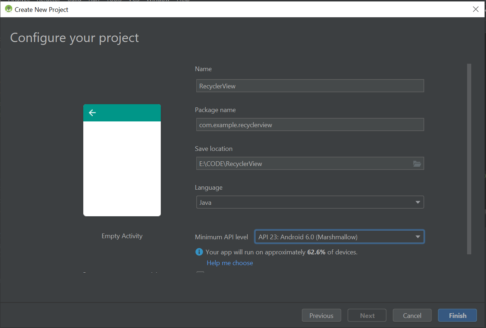
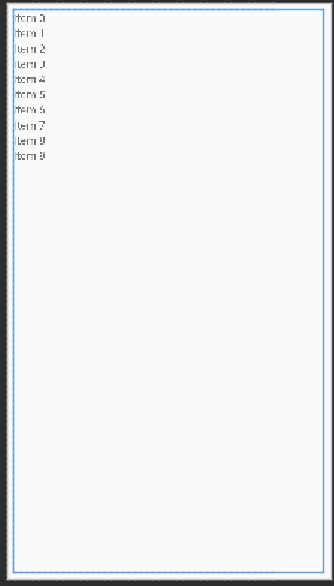
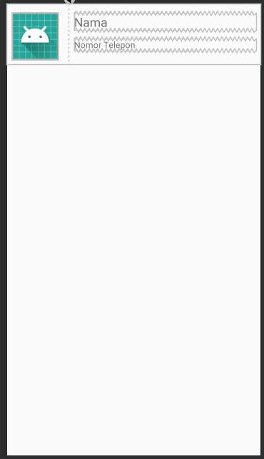
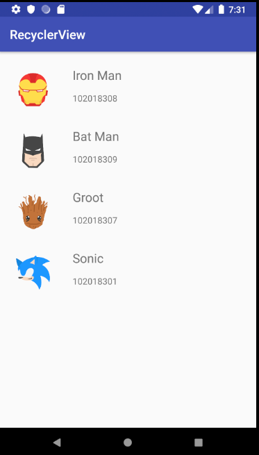

# Membuat Recyclerview Sederhana

## New Project

Buat new project dengan nama **recyclerview**.

 <p align="center"> </p>

## Dependency Gradle

Agar kita bisa menggunakan recycler view maka kita perlu menambahkan dependency pada **build.gradle**  

tambahkan dependency
_butterknife_ untuk memudahkan kita untuk _binding wiew_

`implementation 'com.jakewharton:butterknife:8.8.1'`
`annotationProcessor 'com.jakewharton:butterknife-compiler:8.8.1'`

dan _recycle view_

`implementation 'com.android.support:recyclerview-v7:28.0.0'`

```gradle
dependencies {
    implementation fileTree(dir: 'libs', include: ['*.jar'])
    //noinspection GradleCompatible
    implementation 'com.android.support:appcompat-v7:28.0.0'
    implementation 'com.android.support:recyclerview-v7:28.0.0'
    implementation 'com.android.support.constraint:constraint-layout:1.1.3'
    implementation 'com.jakewharton:butterknife:8.8.1'
    implementation 'com.squareup.picasso:picasso:2.71828'
    annotationProcessor 'com.jakewharton:butterknife-compiler:8.8.1'
    testImplementation 'junit:junit:4.12'
    androidTestImplementation 'com.android.support.test:runner:1.0.2'
    androidTestImplementation 'com.android.support.test.espresso:espresso-core:3.0.2'
}
```

## Membuat Model

Setiap RecyclerView didukung oleh sumber data. Dalam hal ini, kita akan mendefinisikan kelas Contact yang merepresentasikan **model** data yang nantinya ditampilkan oleh RecyclerView:

Buat class baru bernama **Contact.java**

```java
public class Contact {

    private String name;
    private String phone;
    private String imageUrl;

    public Contact(String name, String phone, String imageUrl) {
        this.name = name;
        this.phone = phone;
        this.imageUrl = imageUrl;
    }

    public String getName() {
        return name;
    }

    public void setName(String name) {
        this.name = name;
    }

    public String getPhone() {
        return phone;
    }

    public void setPhone(String phone) {
        this.phone = phone;
    }

    public String getImageUrl() {
        return imageUrl;
    }

    public void setImageUrl(String imageUrl) {
        this.imageUrl = imageUrl;
    }
}

```

## Membuat Layout Pada Main activity

Setelah membuat model, maka kita bisa buat layout untuk pada main activity sebagai _layout manager_ dari recycle view kita, yaitu **activity_main.xml** tambahkan _RecyclerView_ dari _support library_:

```java

<android.support.v7.widget.RecyclerView
    android:id="@+id/rvContact"
    android:layout_width="match_parent"
    android:layout_height="match_parent"
    android:layout_marginBottom="8dp"
    android:layout_marginEnd="8dp"
    android:layout_marginStart="8dp"
    android:layout_marginTop="8dp"
    app:layout_constraintBottom_toBottomOf="parent"
    app:layout_constraintEnd_toEndOf="parent"
    app:layout_constraintStart_toStartOf="parent"
    app:layout_constraintTop_toTopOf="parent"></android.support.v7.widget.RecyclerView>

```

Sekarang RecyclerView telah tertanam dalam file layout. Selanjutnya, kita dapat menentukan layout untuk setiap item dalam contact list.

<p align="center"> </p>

## Membuat Layout Khusus Recyclerview

Buat layout khusus untuk recycler view untuk menampilkan data sesuai model yang telah kita buat. yaitu **item_contact.xml**

```java
<ImageView
        android:id="@+id/imageContact"
        android:layout_width="75dp"
        android:layout_height="74dp"
        android:layout_marginBottom="8dp"
        android:layout_marginStart="8dp"
        android:layout_marginTop="8dp"
        android:src="@mipmap/ic_launcher"
        app:layout_constraintBottom_toBottomOf="parent"
        app:layout_constraintStart_toStartOf="parent"
        app:layout_constraintTop_toTopOf="parent"
        android:layout_marginLeft="8dp" />

    <TextView
        android:id="@+id/txtName"
        android:layout_width="0dp"
        android:layout_height="wrap_content"
        android:layout_marginEnd="8dp"
        android:layout_marginStart="8dp"
        android:layout_marginTop="8dp"
        android:text="Nama"
        android:textSize="20dp"
        app:layout_constraintEnd_toEndOf="parent"
        app:layout_constraintStart_toStartOf="@+id/guideline3"
        app:layout_constraintTop_toTopOf="parent" />

    <TextView
        android:id="@+id/txtPhone"
        android:layout_width="0dp"
        android:layout_height="wrap_content"
        android:layout_marginBottom="8dp"
        android:layout_marginEnd="8dp"
        android:layout_marginStart="8dp"
        android:text="Nomor Telepon"
        app:layout_constraintBottom_toBottomOf="parent"
        app:layout_constraintEnd_toEndOf="parent"
        app:layout_constraintStart_toStartOf="@+id/guideline3"
        app:layout_constraintTop_toBottomOf="@+id/txtName" />
    <android.support.constraint.Guideline
        android:id="@+id/guideline3"
        android:layout_width="wrap_content"
        android:layout_height="wrap_content"
        android:orientation="vertical"
        app:layout_constraintGuide_percent="0.3" />
```

<p align="center"> </p>

Setelah layout item selesai, sekarang kita perlu membuat adapter untuk mengisi data ke tampilan recycle view.

## Membuat Adapter Recyclerview

Buat kelas baru **Contact Adapter.java**

```xml
public class ContactAdapter extends
        RecyclerView.Adapter<ContactAdapter.ContactViewHolder>{
```

Buat **dataset** berupa array list

```java
    private List<Contact> listContact = new ArrayList<>();
```

Buat konstruktor 

```java
    public ContactAdapter(List<Contact> listContact) {
        this.listContact = listContact;
    }

    private OnContactClickListener listener;

    public interface OnContactClickListener {
        public void onClick(View view, int position);
    }

    public void setListener(OnContactClickListener listener) {
        this.listener = listener;
    }
```

Hubungkan layout item contact ke adapter dan  view holder

```java
    @NonNull
    @Override
    public ContactViewHolder onCreateViewHolder(@NonNull ViewGroup viewGroup, int i) {
        View vh = LayoutInflater.
                from(viewGroup.getContext()).
                inflate(R.layout.item_contact,viewGroup,false);
        ContactViewHolder viewHolder = new ContactViewHolder(vh);
        return viewHolder;
    }
```

Hubungkan _id_ ke data
```java

    @Override
    public void onBindViewHolder(@NonNull ContactViewHolder contactViewHolder, int i) {

        Contact item = listContact.get(i);
        contactViewHolder.txtPhone.setText(item.getPhone());
        contactViewHolder.txtName.setText(item.getName());
        Picasso.get().load(item.getImageUrl())
                .placeholder(R.drawable.ic_launcher_background)
                .into(contactViewHolder.imageContact);
    }

    @Override
    public int getItemCount() {
        return listContact.size();
    }
```

Buat variabel di view holder, dan hubungkan _id_ di layout view holder

```java
    public class ContactViewHolder extends RecyclerView.ViewHolder {
        public ImageView imageContact;
        public TextView txtName,txtPhone;

        public ContactViewHolder(@NonNull View itemView) {
            super(itemView);
            imageContact = itemView.findViewById(R.id.imageContact);
            txtName = itemView.findViewById(R.id.txtName);
            txtPhone = itemView.findViewById(R.id.txtPhone);
            itemView.setOnClickListener(new View.OnClickListener() {
                @Override
                public void onClick(View v) {
                    listener.onClick(v, getAdapterPosition());
                }
            });
        }
    }
}
```

## Menyambungkan Adapter ke Recyclerview

Untuk menyambungkan adapter ke recycle view dan mengisi beberapa data kontak yang akan kita tampilkan maka kita perlu mengedit **MainActivity.java**

```java
public class MainActivity extends AppCompatActivity implements ContactAdapter.OnContactClickListener {

    public RecyclerView rv;
    public ContactAdapter contactAdapter;
    public RecyclerView.LayoutManager layoutManager;
    public List<Contact> listContact = new ArrayList<>();

    @Override
    protected void onCreate(Bundle savedInstanceState) {
        super.onCreate(savedInstanceState);
        setContentView(R.layout.activity_main);

        rv = findViewById(R.id.rvContact);

        listContact.add(new Contact("Iron Man",
                "102018308",
                "https://cdn4.iconfinder.com/data/icons/famous-characters-add-on-vol-1-flat/48/Famous_Character_-_Add_On_1-14-512.png"));

        listContact.add(new Contact("Bat Man",
                "102018309",
                "https://cdn4.iconfinder.com/data/icons/famous-characters-add-on-vol-1-flat/48/Famous_Character_-_Add_On_1-22-512.png"));

        listContact.add(new Contact("Groot",
                "102018307",
                "https://cdn4.iconfinder.com/data/icons/famous-characters-add-on-vol-1-flat/48/Famous_Character_-_Add_On_1-21-512.png"));

        listContact.add(new Contact("Sonic",
                "102018301",
                "https://cdn4.iconfinder.com/data/icons/famous-characters-add-on-vol-1-flat/48/Famous_Character_-_Add_On_1-26-512.png"));


        contactAdapter = new ContactAdapter(listContact);
        contactAdapter.setListener(this);
        layoutManager = new LinearLayoutManager(getApplicationContext());
        rv.setAdapter(contactAdapter);
        rv.setLayoutManager(layoutManager);

    }

    @Override
    public void onClick(View view, int position) {
        Contact contact = listContact.get(position);
        Toast.makeText(this, contact.getName(), Toast.LENGTH_LONG)
                .show();
    }
}
```

Hasil akhir dari aplikasi ini adalah sebagi berikut:

<p align="center"> </p>
