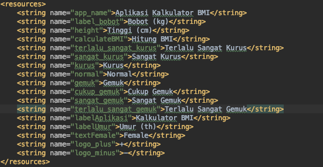

# Praktikum  1: Aplikasi BMI Sederhana
Aplikasi yang hendak dibuat pada kegiatan kali ini adalah aplikasi penghitung indeks bobot tubuh atau dikenal dengan istilah *body mass index* (BMI).

Secara ringkas, urutan perjalanan aplikasi yang dibuat berawal dari kemunculan sebuah *splash screen* dan dilanjutkan dengan antarmuka utama yaitu kalkulator BMI dengan aturan pengguna harus memasukkan beberapa data antara lain:
1. Jenis kelamin (*Radio Group*), 
2. Berat badan (*Edit Text*),
3. Tinggi badan (*Edit Text*), dan
4. Umur (*Edit Text*).

Hasil ditampilkan melalui *dialog box* berisi informasi dari masukan yang telah diberikan oleh pengguna.

Pada bagian ini, template yang digunakan adalah template asli yang disediakan oleh Android Studio.

## Pembuatan project 
1. Buka aplikasi Android Studio, pilih `Start a new Android Studio Project`. 
2. Jenis project yang dipilih adalah `empty activity`.
3. Beri nama project (contoh: Aplikasi Kalkulator BMI) dan nama packagenya (contoh: polinema.ac.id.aplikasikalkulatorbmi) yang sesuai.
4. Project awal selesai dibuat.
## Penataan Layout
Layout yang dibuat meliputi beberapa komponen yaitu `RadioGroup`, `TextView`, `EditText`, dan `Button`. Layout yang akan dibuat akan berbentuk seperti berikut.

1. Buka **activity_main.xml** yang terletak di **app -> res -> layout -> activity_main.xml**. 
2. Buat layout dengan jenis `Constraint Layout`. tambahkan id dengan nama `activity_main`.
3. Tambahkan sebuah komponen `radio group`. Perhatikan bahwa constraint yang berlaku pada komponen radio grup ini antara lain:
`app:layout_constraintEnd_toEndOf="parent"`,
`app:layout_constraintStart_toStartOf="parent"`, dan
`app:layout_constraintTop_toTopOf="parent"`.
4. Item-item pada `radio group` diwujudkan sebagai `radio button`, tambahkan properti-properti berikut di `radio button`, abaikan sementara tanda merah di kode program.
5. Tambahkan tiga buah TextView, berikan nama masing-masing **Bobot(kg)**, **Tinggi(cm)**, **Umur(th)**.
6. Tambahkan dua buah `Button` dan sebuah `EditText` dengan posisi setelah `TextView` yang telah dibuat. Perhatikan bahwa `Button` dan `EditText` memiliki id yang berbeda.

    a. `Button` dan `EditText` pada bobot.
    
    

    b. `Button` dan `EditText` pada tinggi.
    
    

    c. `Button` dan `EditText` pada umur.
    
    
7. Tambahkan sebuah `Button` di bagian layout paling bawah untuk tombol proses hitung BMI. 
8. Tanda merah yang terdapat di kode program diatasi dengan memperhatikan posisi `value` yang seharusnya diletakkan, seperti **@string/** berarti terletak di **app -> res -> values -> string**.

    a. string.xml

    

    b. dimen.xml

    

    c. drawable

## Fitur BMI

### Fungsi Dasar

### Menu Pilih Gender (RadioGrup)

### Hitung BMI 

### Tampil Hasil (Dialog Box)

## Fitur Splash Screen

### Layout splash screen

### Fungsi splash screen

### Konfigurasi Android Manifest

