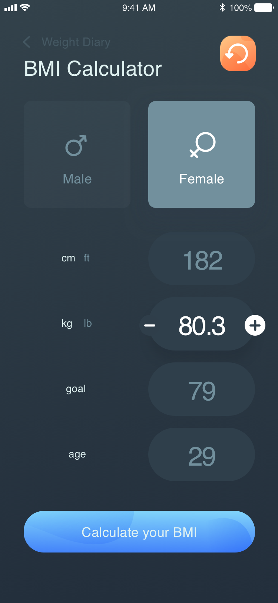

# Praktikum 2 : Aplikasi BMI Sederhana (2)
Setelah membuat aplikasi kalkulator BMI Sederhana pada praktikum 1, tugas anda adalah membuat aplikasi kalkulator BMI yang memiliki tampilan seperti dibawah ini.

Starter code untuk tugas ini dapat anda clone atau download pada folder BMI Calculator di [Starter Code Chapter 6](https://github.com/polinema-mobile/dtschapter06-starter)
