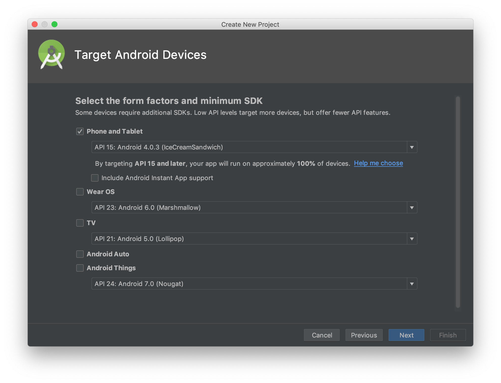
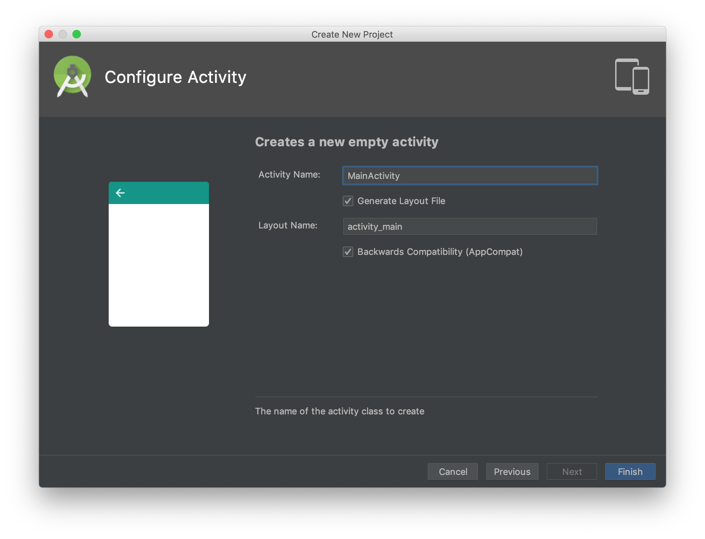

# Hello World Android
- Bukalah aplikasi Android Studio.
- Buatlah sebuah project baru dengan konfigurasi seperti pada gambar di bawah ini

  

  Nama aplikasi silakan disesuaikan dengan keinginan anda, perhatikan ada warning mengenai path project, sebaiknya path project tidak memiliki spasi.

  
  Targetkan phone dan pilihlah minimum sdk sesuai kebutuhan, semakin tinggi minimum sdk semakin sedikit device yang dapat menggunakan aplikasi yang anda buat.
  
  Pilihlah empty activity sebagai template starter project anda.
  

* Bukalah file MainActivity.java

  
  
* Jalankan aplikasi hello world ini ke mobile device anda