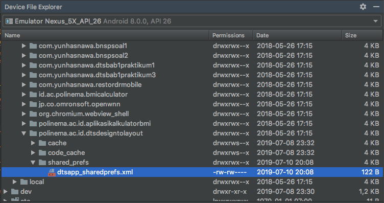

# SharedPreferences

## Teori

Android menyediakan beberapa cara untuk menyimpan data pada suatu aplikasi. Salah satu cara tersebut adalah dengan memanfaatkan SharedPreferences. SharedPreferences memungkinkan Anda menyimpan dan mengambil data dalam bentuk pasangan kunci-nilai (key-value pairs). Namun dengan catatan, data yang dapat disimpan hanyalah data yang tipe datanya sederhana seperti:
- String
- int/long/float
- boolean
- DateTime

Untuk menggunakan SharedPreferences, Anda harus memanggil metode getSharedPreferences() yang sudah ada di setiap class turunan AppCompatActivity. Method tersebut akan mengembalikan instance SharedPreference yang merujuk ke file xml yang berisi nilai preferensi, yang terdapat pada penyimpanan device.



Contoh:

```java
SharedPreferences sharedpreferences = this.getSharedPreferences(MyPREFERENCES, Context.MODE_PRIVATE);
```

Parameter pertama adalah nama SharedPreferences yang kita tentukan sendiri dan parameter kedua adalah MODE. Selain selain MODE_PRIVATE ada beberapa mode lain yang tersedia yaitu:

- __MODE_APPEND__
	
	Menumpuk/menggabungkan data yang ada di SharedPreference yang sudah ada ke SharedPreference yang baru dibuat

- __MODE_ENABLE_WRITE_AHEAD_LOGGING__
	
	Mengatur agar penulisan data menggunakan metode write ahead loggin, adalah sebuah metode khusus pada database. Jika ingin tahu lebih lanjut mengenai write ahead logging, silahkan pelajari materi tentang basis data lanjut dari referensi-referensi yang Anda miliki.

- __MODE_MULTI_PROCESS__
	
	Memungkinkan SharedPreferences diakses oleh banyak proses.

- __MODE_PRIVATE__
	
	Dengan mengatur mode ini, file hanya dapat diakses oleh aplikasi saat ini (yang membuat SharedPreferences itu sendiri)

- __MODE_WORLD_READABLE__
	
	Mode ini memungkinkan aplikasi lain dapat membaca data pada SharedPreference yang dibuat oleh aplikasi saat ini.

- __MODE_WORLD_WRITEABLE__
	
	Mode ini memungkinkan aplikasi lain dapat menulis data pada SharedPreference yang dibuat oleh aplikasi saat ini.
	
Untuk menulis/menyimpan sesuatu di SharedPreferences dilakukan dengan menggunakan kelas SharedPreferences.Editor. Kemudian dari instance class tersebut dipanggil method edit() yang akan mengembalikan objek dari class Editor. Setelah mendapatkan objek editor tersebut, dapat dipanggil mehod-method putXXX(key, value) dimana XXX adalah tipe data yang ingin ditulis. Setelah selesai menulis tipe data, harus dipanggil apply()/commit() sehingga perubahan dapat disimpan secara permanen.

Contoh sintaksisnya adalah sebagai berikut.

```java
Editor editor = sharedpreferences.edit();
editor.putString("key", "value");
editor.commit(); // Atau editor.apply()
```

Pada snippet kode diatas, "key" adalah semacam index yang digunakan untuk mengambil nilai "value" yang Anda simpan. Selain putString() & commit() ada method-method lain dari class Editor yang layak untuk Anda ketahui yaitu:

- __apply()__

	Menerapkan perubahan yang telah dilakukan pada Editor sehingga menjadi permanen

- __clear()__

	Menghapus semua nilai yang ditulis pada Editor.

- __remove(String key)__

	Menghapus suatu nilai dengan key yang diberikan di parameter method.

- __putLong(String key, long value)__
	
	Menyimpan nilai dengan tipe data long

- __putInt(String key, int value)__
	
	Menyimpan nilai dengan tipe data int

- __putFloat(String key, float value)__
	
	Menyimpan nilai dengan tipe data float
	
Sedangkan untuk membaca nilai dari SharedPreferences cukup dengan sintaksis berikut:

```java
SharedPreferences sharedPrefs = this.getSharedPreferences("shared_preferences_name", Context.MODE_PRIVATE);
String valueToRead = sharedPrefs.getString(KEY, null);
```

Catatan: null pada method getString() adalah nilai default yang dikembalikan jika tidak ditemukan data dengan KEY yang diminta.