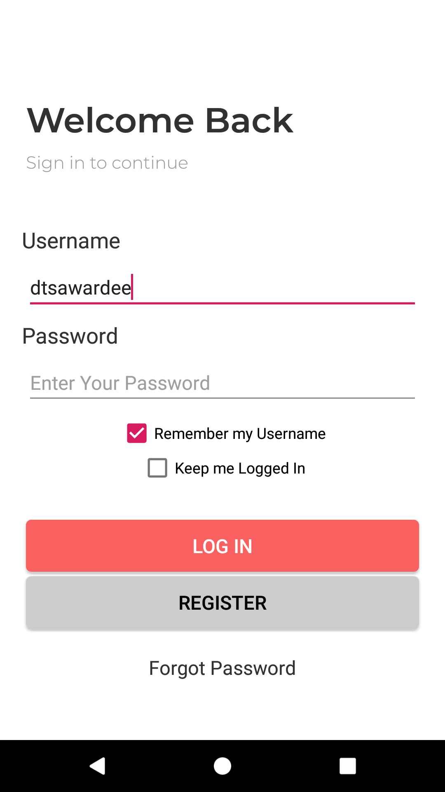

# Praktikum-1 

## Menyimpan dan Membaca Data dengan SharedPreferences

1.	Clone atau download starter project yang ada di repo [Starter Code Chapter 9](https://github.com/polinema-mobile/dtschapter09-starter). Jalankan projectnya, pastikan aplikasi dapat muncul pada ponsel Android Anda. Aplikasi tersebut adalah pengembangan dari aplikasi yang pernah Anda buat sebelumnya di pertemuan 3. Apabila dijalankan aplikasi tersebut hanya dapat berpindah-pindah halaman saja. Cobalah untuk membuka halaman Login, Register, dan Profile. Pada pertemuan kali ini, kita akan bekerja pada halaman-halaman tersebut.
	
	Bukalah file WelcomeBackActivity.java yang ada pada project starter pertemuan 9 yang telah didownload sebelumnya. Diatas method onCreate() pada Activity tersebut, tambahkan property dan konstanta-konstanta berikut.

	```java
	// SharedPreferences yang akan digunakan untuk menulis dan membaca data
	private SharedPreferences sharedPrefs;

	// Key-key untuk data yang disimpan di SharedPrefernces
	private static final String USERNAME_KEY = "key_username";
	private static final String KEEP_LOGIN_KEY = "key_keep_login";
	```

2.	Kemudian tambahkan baris berikut pada method onCreate(), setelah pemanggilan setContentView() untuk menginisiasi SharedPreferences yang akan kita gunakan nantinya.

	```java
	// Inisialisasi SharedPreferences
	this.sharedPrefs = this.getSharedPreferences("dtsapp_sharedprefs", Context.MODE_PRIVATE);
	```

3.	Selanjutnya, masih pada file class yang sama, perhatikan dibagian bawah, pada barisan method-method kosong seperti dibawah ini.

	```java
	private void saveUsername()
	{
	    // Menyimpan username bila diperlukan
	}

	private void loadSavedUsername()
	{
	    // Memeriksa apakah sebelumnya ada username yang tersimpan?
	    // Jika ya, maka tampilkan username tersebut di EditText username.

	}

	private void makeAutoLogin()
	{
	    // Mengatur agar selanjutnya pada saat aplikasi dibuka menjadi otomatis login
	}

	// QUIZ!
	private void autoLogin()
	{
	    // Cek apakah sebelumnya aplikasi diatur agar bypass login?
	    // Jika ya maka langsung buka activity berikutnya
	}
	```
	Method-method tersebut nantinya yang akan kita selesaikan sehingga aplikasi ini nantinya bisa menampilkan otomatis username di halaman login apabila CheckBox ‘Remember my Username’ dikilik, dan bisa otomatis melewati halaman login (langsung masuk ke halaman Home) apabila CheckBox  ‘Keep Login’ diklik.

4.	Pertama-tama, untuk menyimpan username ke SharedPreferences, modifikasilah method saveUsername(), sehingga menjadi seperti berikut:

	```java
	private void saveUsername()
	{
	    // Menyimpan username bila diperlukan

	    SharedPreferences.Editor editor = this.sharedPrefs.edit();

	    if(this.chkRememberUsername.isChecked())
	        editor.putString(USERNAME_KEY, this.edtUsername.getText().toString());
	    else
	        editor.remove(USERNAME_KEY);

	    editor.apply();
	}
```

5.	Selanjutnya pada method loadSavedUsername(), modifikasilah juga sehingga menjadi seperti dibawah ini:

	```java
	private void loadSavedUsername()
	{
	    // Memeriksa apakah sebelumnya ada username yang tersimpan?
	    // Jika ya, maka tampilkan username tersebut di EditText username.

	    String savedUsername = this.sharedPrefs.getString(USERNAME_KEY, null);

	    if(savedUsername != null)
	    {
	        this.edtUsername.setText(savedUsername);

	        this.chkRememberUsername.setChecked(true);
	    }
	}
	```

6.	Panggil autoLogin() dan loadSaveUsername() pada method onCreate(), sehingga apabila user ke halaman login kembali, usernamenya akan otomatis tertera pada EditText username. Dengan catatan, ketika login user telah men-centang CheckBox ‘Remember my Username’. Pastikan isi dari method onCreate() Anda sekarang seperti berikut:

	```java
	@Override
	protected void onCreate(Bundle savedInstanceState) {
	    super.onCreate(savedInstanceState);
	    setContentView(R.layout.activity_welcome_back);

	    // Inisialisasi SharedPreferences
	    this.sharedPrefs = this.getSharedPreferences("dtsapp_sharedprefs", Context.MODE_PRIVATE);

	    this.initComponents();

	    this.autoLogin();
	    this.loadSavedUsername();
	}
	```

7.	Selanjutnya tambahkan method baru masih pada class yang sama, denga kode seperti berikut.

	```java
	private boolean validateCredential()
	{
	    String currentUsername = this.edtUsername.getText().toString();
	    String currentPassword = this.edtPassword.getText().toString();

	    return (Objects.equals(currentUsername, DUMMY_USERNAME)
	            && Objects.equals(currentPassword, DUMMY_PASSWORD));
	}
	```
	Method ini berfungsi untuk mencocokkan kredensial yang dientrykan user di UI. Apabila username dan password yang dientrykan tadi sama dengan konstanta DUMMY_PASSWORD & DUMMY_USERNAME, maka validasi berhasil dan akan dikembalikan nilai true. Apabila tidak sesuai, maka false yang akan dikembalikan.
	
	__Catatan__: Konstanta DUMMY_PASSWORD & DUMMY_USERNAME sudah dideklarasikan sebelumnya di bagian awal class WelcomeBackActivity.
	```java
	public class WelcomeBackActivity extends AppCompatActivity 
	{
	    private static final String DUMMY_USERNAME = "dtsawardee";
	    private static final String DUMMY_PASSWORD = "dtsrocks";
	```

8.	Beriktunya, modifikasilah method action Button Login onBtnLogin_Click(), tambahkan kode-kode dibawah ini untuk menjalankan validasi ketika Button tersebut diklik oleh user.

	```java
	public void onBtnLogin_Click(View view)
	{
	    boolean valid = this.validateCredential();

	    if(valid)
	    {
	        Intent i = new Intent(WelcomeBackActivity.this, HomeActivity.class);
	        startActivity(i);

	        this.saveUsername();
	        this.makeAutoLogin();
	    }
	    else
	    {
	        Toast.makeText(this, "Invalid username and/or password!", Toast.LENGTH_LONG).show();
	    }
	}
	```
	Setelah mengimplementasikan method action ini, cobalah jalankan kembali aplikasinya dan ujicobalah login menggunakan username dan password dummy seperti pada deklarasi konstantanya diatas.

9.	Selanjutnya kita buat sebuah method yang akan menyimpan nilai Boolean ke SharedPreferences untuk menentukan apakah pada kesempatan berikutnya, aplikasi akan otomatis login atau tidak (sesuai dengan centangan CheckBox ‘Keep Login’. Modifikasilah method makeAutoLogin() sehingga menjadi seperti berikut:

	```java
	private void makeAutoLogin()
	{
	    // Mengatur agar selanjutnya pada saat aplikasi dibuka menjadi otomatis login
	    SharedPreferences.Editor editor = this.sharedPrefs.edit();

	    if(this.chkKeepLogin.isChecked())
	        editor.putBoolean(KEEP_LOGIN_KEY, true);
	    else
	        editor.remove(KEEP_LOGIN_KEY);

	    editor.apply();
	}
	```

10.	Sampai disini, jalankan aplikasi Anda, seharusnya ketika Anda login dengan username dan password Dummy, Anda dapat masuk ke halaman Home. Dan ketika ChekBox ‘Remember my Username’ tercentang, saat menutup dan membuka aplikasi ini kembali, username-nya sudah otomatis tertera di EditText username.
	

11.	Apabila aplikasi tidak dapat berjalan, maka periksalah kembali statement-statement import Anda di bagaian awal class.
	```java
	import android.content.Context;
	import android.content.Intent;
	import android.content.SharedPreferences;
	import android.support.v7.app.AppCompatActivity;
	import android.os.Bundle;
	import android.view.View;
	import android.widget.CheckBox;
	import android.widget.EditText;
	import android.widget.Toast;

	import java.util.Objects;
	```

12.	__LATIHAN__: Bagimana dengan auto login? Apakah aplikasi dapat otomatis melewati halaman login ketika ia dimatikan dan dihidupkan kembali? Tentunya masih belum bisa. Untuk memungkinkan hal tersebut, Anda perlu mengisi method loadSavedUsername() yang memang belum diisi. Dengan cara yang serupa, isilah method tersebut sehingga aplikasi bisa auto login ketika user sudah mencentang CheckBox ‘Keep Login’!
	
	__PETUNJUK__: Caranya hampir sama dengan yang ada pada method loadSavedUsername(), tinggal menyesuaikan saja KEY untuk mengambil SharedPreferences yang tipenya Boolean.
	```java
	// QUIZ!
	private void autoLogin()
	{
	    // Cek apakah sebelumnya aplikasi diatur agar bypass login?
	    // Jika ya maka langsung buka activity berikutnya

	    boolean keepLogin = this.sharedPrefs.getBoolean(???, false);

	    // Teruskan sendiri...
	}
	```


