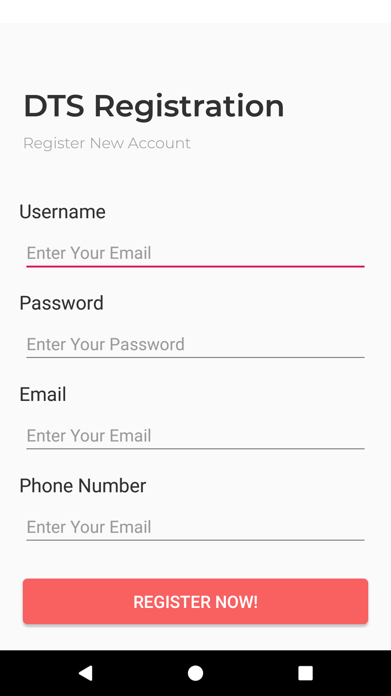
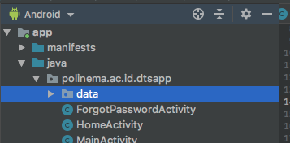
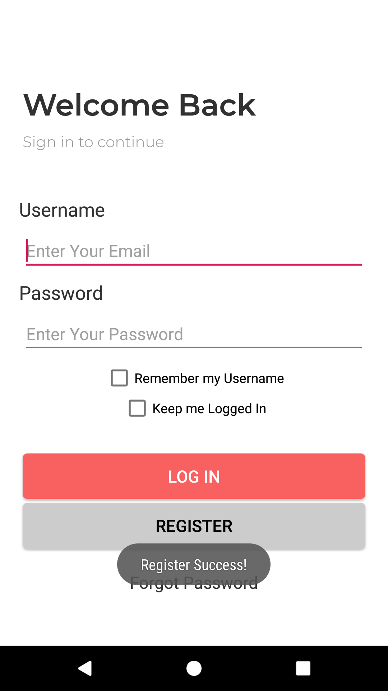

# Praktikum-2

## Menyiapkan AppDatabase & Menjalankan Operasi INSERT


1.	Jalankan lagi aplikasi DTS yang kita buat di langkah sebelumnya, kliklah Button ‘Register’. Perhatikan tampilan yang muncul seperti berikut. 
	
	Misi kita berikutnya adalah menyimpan registrasi pengguna ke database local yang terdapat pada ponsel dengan menggunakan bantuan library Room.

2.	Bukalah source code RegisterActivity.java yang ada pada project tersebut. Perhatikan disana masih kosong, hanya terdapat beberapa baris kode untuk menginisiasi komponen-komponen dari layout. Pada Actovity ini nantinya kita akan menambahkan kode untuk menyimpan data-data yang diinputkan oleh user di halaman registrasi.
	```java
	package polinema.ac.id.dtsapp;

	import android.support.v7.app.AppCompatActivity;
	import android.os.Bundle;
	import android.view.View;
	import android.widget.EditText;
	import android.widget.Toast;

	public class RegisterActivity extends AppCompatActivity
	{
	    private EditText edtUsername;
	    private EditText edtPassword;
	    private EditText edtEmail;
	    private EditText edtPhoneNumber;

	    @Override
	    protected void onCreate(Bundle savedInstanceState)
	    {
	        super.onCreate(savedInstanceState);
	        setContentView(R.layout.activity_register);

	        this.initComponents();
	    }

	    private void initComponents()
	    {
	        this.edtUsername = this.findViewById(R.id.edt_username);
	        this.edtPassword = this.findViewById(R.id.edt_password);
	        this.edtEmail = this.findViewById(R.id.edt_email);
	        this.edtPhoneNumber = this.findViewById(R.id.edt_phone_number);
	    }

	    public void onBtnRegisterNow_Click(View view)
	    {
	        // Tampilkan pesan konfirmasi
	        Toast.makeText(this, "Register Success!", Toast.LENGTH_SHORT).show();

	        // Kembali ke halaman login
	        this.finish();
	    }
	}
	```

3.	Pertama-tama bukalah file gradle Anda ‘build.gradle (Module:app)’. Pada bagian dependencies, tambahkan dua baris kode berikut, dan kemudian sync project Anda.
	```gradle
	dependencies {
	    // Dependensi Anda yang lainnya...

	    implementation 'android.arch.persistence.room:runtime:1.1.1'
	    annotationProcessor 'android.arch.persistence.room:compiler:1.1.1'
	}
	```

4.	Buatlah package baru dengan nama ‘data’ di dalam package ‘polinema.ac.id.dtsapp’
	

5.	Pada package ‘data’ tersebut, tambahkan class Entity baru dengan nama ‘User’. pada class tersebut isikan kode sebagai berikut.
	```java
	package polinema.ac.id.dtsapp.data;

	import android.arch.persistence.room.ColumnInfo;
	import android.arch.persistence.room.Entity;
	import android.arch.persistence.room.PrimaryKey;
	import android.support.annotation.NonNull;

	@Entity
	public class User
	{
	    @PrimaryKey
	    @NonNull
	    public String username;

	    @ColumnInfo(name = "password")
	    public String password;

	    @ColumnInfo(name = "email")
	    public String email;

	    @ColumnInfo(name = "phone_number")
	    public String phoneNumber;
	}
	```

6.	Lalu tambahkan lagi sebuah interface dengan nama ‘UserDao.java’. Interface ini adalah sebuah template Data Access Object dimana dengan bantuan interface ini nantinya kita dapat melakukan operasi-operasi SQL yang kita inginkan. Pada file tersebut, tambahkan baris-baris kode berikut.
	```java
	package polinema.ac.id.dtsapp.data;

	import android.arch.persistence.room.Dao;
	import android.arch.persistence.room.Delete;
	import android.arch.persistence.room.Insert;
	import android.arch.persistence.room.Query;
	import android.arch.persistence.room.Update;

	import java.util.List;

	@Dao
	public interface UserDao
	{
	    @Query("SELECT * FROM user")
	    List<User> getAll();

	    @Query("SELECT * FROM user WHERE username IN (:usernameList)")
	    List<User> loadAllByIds(String[] usernameList);

	    @Query("SELECT * FROM user LIMIT 1")
	    User selectOne();

	    @Query("SELECT * FROM user WHERE username = :username AND password = :password LIMIT 1")
	    User findByUsernameAndPassword(String username, String password);

	    @Insert
	    void insertAll(User... users);

	    @Delete
	    void delete(User user);

	    @Update
	    void update(User user);
	}
	```

7.	Kemudian buat sebuah file abstract class baru bernama DTSAppDatabase.java. Class ini adalah class yang bertugas mengatur segala urusan dengan database yang ada pada aplikasi kita. Didalamnya, tambahkan baris kode berikut. 
	```java
	package polinema.ac.id.dtsapp.data;

	import android.arch.persistence.room.Database;
	import android.arch.persistence.room.RoomDatabase;

	@Database(entities = {User.class}, version = 1, exportSchema = false)
	public abstract class DTSAppDatabase extends RoomDatabase
	{
	    public abstract UserDao userDao();
	}
	```

8.	Sekali lagi, tambahkan class baru bernama AppDbProvider.java. Class ini hanyalah class pembantu saja yang nantinya dapat memudahkan kita untuk mendapatkan instance dari class DTSAppDatabase yang telah kita buat sebelumnya. 
	```java
	package polinema.ac.id.dtsapp.data;

	import android.arch.persistence.room.Room;
	import android.content.Context;

	public class AppDbProvider 
	{
	    private static DTSAppDatabase instance;

	    public static DTSAppDatabase getInstance(Context context)
	    {
	        if(AppDbProvider.instance == null)
	        {
	            AppDbProvider.instance = Room.databaseBuilder(
	                    context, DTSAppDatabase.class, "dtsapp.db").allowMainThreadQueries().build();
	        }

	        return AppDbProvider.instance;
	    }
	}
	```

9.	Kembali lagi ke ‘RegisterActivity.java’, pada class tersebut, tambahkan method baru untuk membuat class entitas User berdasarkan input yang diketikkan oleh pengguna aplikasi di halama Register seperti berikut.
	```java
	// Membuat Entity class User baru berdasarkan isian user pada EditText-EditText 
	private User makeUser()
	{
	    User u = new User();
	    u.username = this.edtUsername.getText().toString();
	    u.password = this.edtPassword.getText().toString();
	    u.email = this.edtEmail.getText().toString();
	    u.phoneNumber = this.edtPhoneNumber.getText().toString();

	    return u;
	}
	```

10.	Kemudian modifikasilah method action ‘onBtnRegister_Click()’ sehingga isinya menjadi seperti berikut:
	```java
	public void onBtnRegisterNow_Click(View view)
	{
	    // Mendapatkan DAO dari DTSAppDatabase
	    UserDao daoUser = AppDbProvider.getInstance(this.getApplicationContext()).userDao();

	    // Menggunakan DAO untuk melakukan INSERT data dalam objek dari class Entity User
	    daoUser.insertAll(this.makeUser());

	    // Tampilkan pesan konfirmasi
	    Toast.makeText(this, "Register Success!", Toast.LENGTH_SHORT).show();

	    // Kembali ke halaman login
	    this.finish();
	}
	```

11.	Sampai disini seharusnya Anda sudah dapat mengisikan data di halaman Register dan ketika data selesai disimpan, tampilan akan diarahkan kembali ke halaman login.
	

