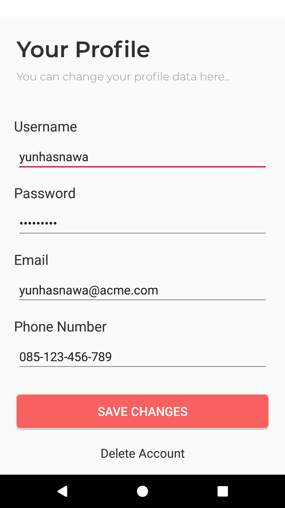

# Praktikum-3

## Menjalankan Operasi SELECT

1.	Untuk melihat data yang telah disimpan dari langkah sebelumnya, kita dapat menggunakan SQL SELECT. Untuk melakukannya, kita cukup memanggil method selectOne() di class DAO ‘UserDao’. Namun sebelumnya, jalankan aplikasi dan loginlah menggunakan DUMMY_USERNAME & DUMMY PASSWORD seperti sebelumnya. 

	Bukalah halaman profil pengguna seperti terlihat dibawah ini. Disana sudah disediakan tampilan yang mirip dengan tampilan dihalaman Register. Bedanya hanya pada EditText username yang tidak dapat diedit, dan dibawah ada Button untuk menyimpan perubahan dan untuk menghapus akun.
	

2.	Berikutnya, bukalah source code dari halaman tersebut yaitu file ‘ProfileActivity.java’. Di awal class tersebut, tambahkan property baru berupa Entity class User yang nantinya digunakan untuk menampung data yang akan disimpan/ditampilkan dari/ke database.
	```java
	public class ProfileActivity extends AppCompatActivity
	{
	    // Data yang nanti disimpan/ditampilkan, berupa property berupa objek dari Entity class User
	    private User currentUser;

	    // Kode-kode yang lain dibawah biarkan saja dulu....
	```

3.	Modifikasilah method loadData() yang tadinya kosong menjadi seperti berikut.
	```java
	private void loadData()
	{
	    // Mendatapatkan DAO dari DTSAppDatabase
	    UserDao daoUser = AppDbProvider.getInstance(this).userDao();

	    // Melakukan SELECT terhadap 1 user yang paling awal, dan mengembalikan hasilnya ke property currentUser
	    this.currentUser = daoUser.selectOne();
	}
	```

4.	Kemudian setelah data di property currentUser didapatkan, selanjutnya kita membuat agar pada saat halaman ditampilkan, data-data yang ada di property tersebut otomatis tampil pada semua EditText yang sesuai di halaman Profil ini. Untuk melakukannya, modifikasilah method initComponents() yang ada pada Activity tersebut menjadi seperti berikut:
	```java
	private void initComponents()
	{
	    this.edtUsername = this.findViewById(R.id.edt_username);
	    this.edtPassword = this.findViewById(R.id.edt_password);
	    this.edtEmail = this.findViewById(R.id.edt_email);
	    this.edtPhoneNumber = this.findViewById(R.id.edt_phone_number);
	    this.btnSave = this.findViewById(R.id.btn_save);

	    // Jika tidak ada data registrasi sebelumnya, tidak perlu melakukan apa-apa, dan matikan Button Save agar user tidak menyimpan data kosong.
	    if(this.currentUser == null)
	    {
	        this.btnSave.setEnabled(false);
	        return;
	    }

	    // Menyalin data dari property currentUser ke semua komponen yang sesuai
	    this.edtUsername.setText(this.currentUser.username);
	    this.edtPassword.setText(this.currentUser.password);
	    this.edtEmail.setText(this.currentUser.email);
	    this.edtPhoneNumber.setText(this.currentUser.phoneNumber);
	}
	```

5.	Sampai disini apabila aplikasi dijalankan, seharusnya di halaman Profile akan tampil secara otomatis data-data yang __pertama kali__ Anda inputkan di halaman Register.
	
