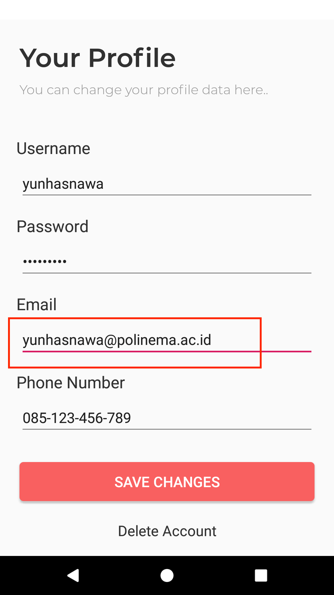

# Praktikum-4

## Menjalankan Operasi UPDATE

1.	Dalam suatu aplikasi tentu saja seringkali pengguna harus dapat melakukan pengubahan (pembaruan) data yang sebelumnya telah disimpan. Pada contoh kali ini, kita simulasikan pengubahan data profil pengguna aplikasi DTSApp melalui klik pada tombol ‘Save’.

	Untuk mengimplementasikan fitur update profile tadi, caranya sangat mudah. Seperti biasa, kita hanya perlu memanggil class DAO dari DTSAppDatabase dengan menggunakan AppDbProvider. Kemudian tinggal menjalankan method update yang sudah disediakan sebelumnya di class DAO tersebut. 
	
	Untuk melakukannya, pertma-tama tambahkan method berikut ke ProfileActivity.
	```java
	// Menangkap data dari semua EditText dan menyalinnya ke Entity currentUser
	private void syncData()
	{
	    this.currentUser.password = this.edtPassword.getText().toString();
	    this.currentUser.email = this.edtEmail.getText().toString();
	    this.currentUser.phoneNumber = this.edtPhoneNumber.getText().toString();
	}
	```
	Method tersebut hanyalah method sederhana yang berguna untuk memperbarui data yang disimpan pada property currentUser agar sesuai dengan input terakhir yang diketikkan pengguna di control-kontrol yang ada pada tampilan.

2.	Kemudian tambahkan baris-bariks kode berikut ini di method action onBtnSave_Click(), sehingga method tersebut menjadi seperti dibawah.
	```java
	public void onBtnSave_Click(View view)
	{
	    // Memperbarui data di propery currentUser sehingga sesuai dengan nilai-nilai terakhir yang dientrykan oleh pengguna
	    this.syncData();

	    // Mendapatkan class DAO dari DTSAppDatabase
	    UserDao daoUser = AppDbProvider.getInstance(this).userDao();

	    // Menggunakan DAO untuk menyimpan data user saat ini yang sudah tersedia di property currentUser.
	    daoUser.update(this.currentUser);

	    Toast.makeText(this, "Your data has been updated!", Toast.LENGTH_SHORT).show();
	}
	```

3.	Jalankan lagi aplikasi, ubah-ubahlah nilai yang terdapat pada halaman Profile, lalu klik Button Save. Jika langkah-langkah sebelumnya benar, maka ketika anda membuka kembali halaman Profile, data yang ada disana akan sesuai dengan perubahan yang terkahir Anda lakukan. Seperti pada gambar berikut, contohnya pada field email, datanya telah diupdate.
	
