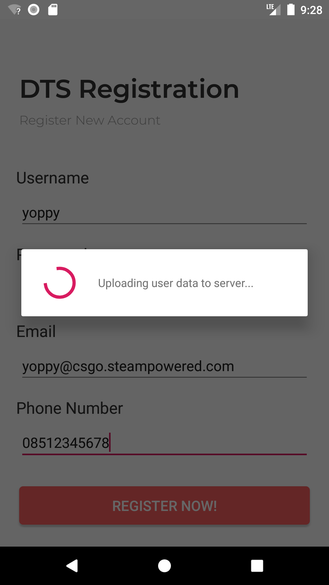
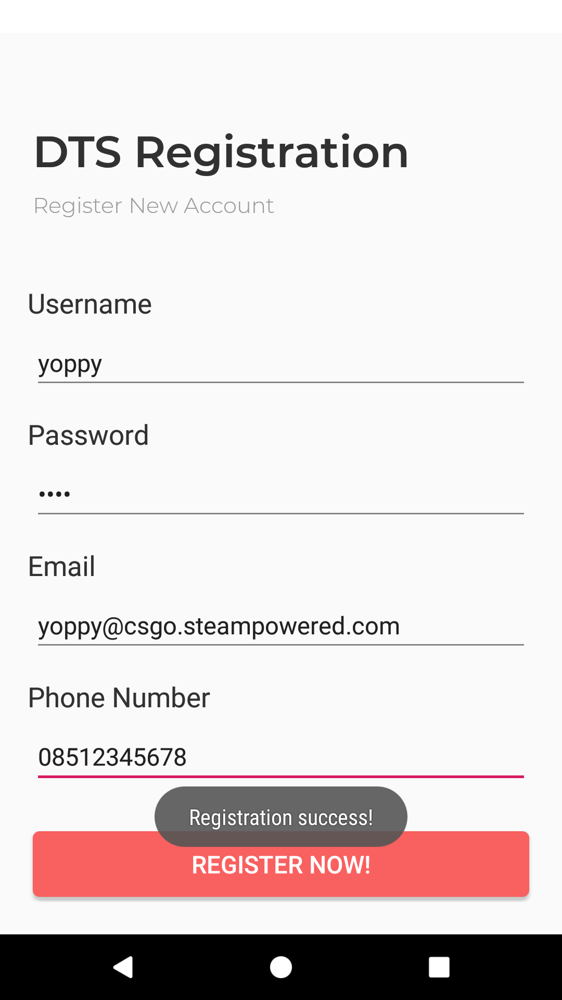
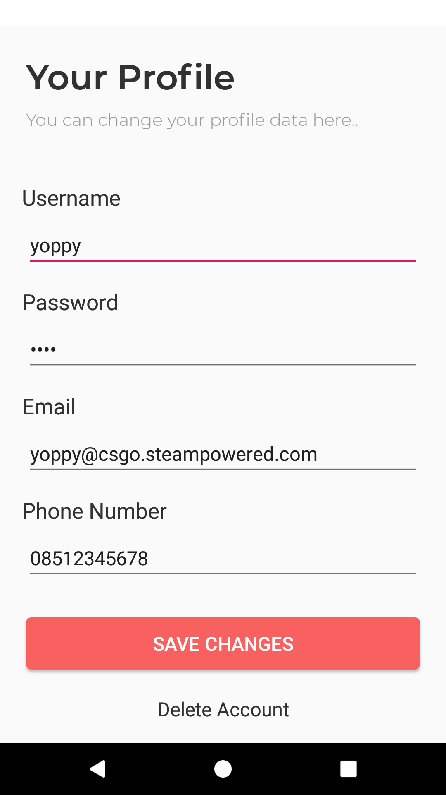

# Praktikum-6

## Operasi Database Asynchronous

1.	Pada contoh-contoh sebelumnya, kita melakukan operasi databse secara synchronous, yaitu dalam thread tunggal. Hal ini bukanlah hal yang dianjurkan (not a best practice) karena seringkali, operasi database merupakan operasi yang menghabiskan waktu relatif lama sehingga dapat mengakibatkan UI aplikasi kita menjadi hang (not responding). 

	Untuk mencegah hal tersebut, kita dapat mengeksekusi setiap operasi database secara Asynchronous atau dengan kata lain, mengeksekusi operasi di background. Di Android kita dapat melakukan operasi asynchronous dengan bantuan class AsyncTask.

	Pada praktikum kali ini, kita akan membuat proses Registrasi menjadi Asynchronous. Kita akan mensimulasikan proses registrasi pada aplikasi dunia nyata, yang biasanya melibatkan waktu yang lama. Bila sebelumnya, setelah registrasi langsung seketika muncul Toast, maka kali ini kita akan membuat setelah user mengklik Button ‘Register’ maka akan muncul indicator loading yang akan hilang 5 detik setelah proses penyimpanan data selesai.

	Untuk melakukannya, pertama-tama modifikasilah class AppDbProvider.java yang terdapat pada package polinema.ac.id.dtsapp.data dengan menambahkan property static baru yang akan menyimpan instance database asynchronous.
	```java
	private static DTSAppDatabase asynchronousInstance;
	```

2.	Kemudian tambahkan method factory baru seperti sebelumnya, untuk mendapatkan instance database asynchronous sebelumnya.
	```java
	public static DTSAppDatabase getAsynchronousInstance(Context context)
	{
	    if(AppDbProvider.asynchronousInstance == null)
	    {
	        AppDbProvider.asynchronousInstance = Room.databaseBuilder(
	                context, DTSAppDatabase.class, "dtsapp.db").build();
	    }

	    return AppDbProvider.asynchronousInstance;
	}
	```

3.	Kemudian tambahkan file baru pada package polinema.ac.id.dtsapp.data, yaitu sebuah interface yang akan digunakan untuk menangani event-event pada saat operasi database sedang dan telah selesai dilakukan. Berinama file tersebut DatabaseTaskEventListener.java. Pada file tersebut, isikan baris-baris kode berikut.
	```java
	package polinema.ac.id.dtsapp.data;

	import android.arch.persistence.room.RoomDatabase;

	public interface DatabaseTaskEventListener
	{
	    Object runDatabaseOperation(RoomDatabase database, Object... params);
	    void onDatabaseOperationFinished(Object... results);
	}
	```

4.	Selanjutnya adalah langkah yang paling penting yaitu membuat class baru bernama DatabaseTask.java yang merupakan turunan dari class AsyncTask. 

	Class ini berfungsi untuk membungkus operasi database agar dijalankan di latar belakang (background thread), alih-alih didalam thread utama. Pada class ini terdapat method-method override:
	-	__doInBackground()__ yang merupakan tempat bagi kita untuk meletakkan kode-kode yang ingin dieksekusi di latar belakang secara asynchronous.
	-	__onPostExecute()__ yang merupakan tempat bagi kita untuk meletakkan kode yang ingin dieksekusi ketika proses background selesai dikerjakan.

	Pada class tersebut, isikan baris-baris kode berikut.
	```java
	package polinema.ac.id.dtsapp.data;

	import android.arch.persistence.room.RoomDatabase;
	import android.content.Context;
	import android.os.AsyncTask;

	import java.lang.ref.WeakReference;

	public class DatabaseTask extends AsyncTask<Object, Void, Void>
	{
	    // Room database butuh Context
	    private WeakReference<Context> databaseContext; // Dimasukkan WeakReference<> untuk Mencegah kebocoran memory

	    // Activity yang ingin menjalankan operasi database di background secara asynchronous
	    private DatabaseTaskEventListener eventListener; 

	    // Hasil dari operasi yang selesai dilakukan
	    private Object operationResult;

	    public DatabaseTask(Context databaseContext, DatabaseTaskEventListener eventListener)
	    {
	        this.databaseContext = new WeakReference<>(databaseContext);
	        this.eventListener = eventListener;
	    }

	    // Operasi yang dijalankan di background secara Asynchronous
	    @Override
	    protected Void doInBackground(Object... objects)
	    {
	        // Mendapatkan instance database asynchronous dari AppDbProvider
	        RoomDatabase database = AppDbProvider.getAsynchronousInstance(this.databaseContext.get());

	        // Melemparkan instance database tadi ke event listener untuk diambil DAO-nya nanti
	        this.operationResult = this.eventListener.runDatabaseOperation(database, objects);

	        return null;
	    }

	    @Override
	    protected void onPostExecute(Void aVoid)
	    {
	        super.onPostExecute(aVoid);
        
	        // Memberitahukan ke event listener bahwasanya operasi yang dilakukan di-background telah selesai 
	        this.eventListener.onDatabaseOperationFinished(this.operationResult);
	    }
	}
	```

5.	Setelah kedua class dan interface di package data tersebut beres, maka sekarang bukalah file RegisterActivity.java. Pada class tersebut tambahkan property baru untuk menampung indicator loading yang akan dimunculkan nanti saat pengguna mengklik Button ‘Register’
	```java
	// Loading indicator untuk ditampilkan saat menyimpan data
	ProgressDialog loadingIndicator;
	```

6.	Selanjutnya tambahkan method baru untuk menampilkan loading indicator.
	```java
	private void showLoadingIndicator()
	{
	    loadingIndicator = new ProgressDialog(this);
	    loadingIndicator.setMessage("Uploading user data to server...");
	    loadingIndicator.setIndeterminate(false);
	    loadingIndicator.setCancelable(false);
	    loadingIndicator.show();
	}
	```

7.	Comment-lah, atau gantilah nama method action onBtnRegisterNow_Click() agar tidak perlu menghapusnya supaya bisa dipelajari nanti jika diperlukan
	```java
	public void onBtnRegisterNow_Click_Old(View view)
	```

8.	Buatlah method onBtnRegisterNow_Click() baru dan isikan didalamnya baris-baris kode berikut.
	```java
	public void onBtnRegisterNow_Click(View view)
	{
	    // Tampilkan loading indicator
	    this.showLoadingIndicator();

	    new DatabaseTask(this, new DatabaseTaskEventListener() {

	        @Override
	        public Object runDatabaseOperation(RoomDatabase database, Object... params) {

	            // Mengambil Entity dari params
	            User user = (User) params[0];

	            // Mendapatkan DAO dari object database, dan memanggil method operasi INSERT
	            ((DTSAppDatabase)database).userDao().insertAll(user);

	            return null;
	        }

	        @Override
	        public void onDatabaseOperationFinished(Object... results)
	        {
	            // Delay eksekusi program agar nampak agak lama seolah-olah datanya sedang diunggah
	            new Handler().postDelayed(new Runnable(){
	                @Override
	                public void run(){
	                    // Tutup loading indicator & tampilkan Toast
	                    loadingIndicator.dismiss();
	                    Toast.makeText(getApplicationContext(), "Registration success!", Toast.LENGTH_SHORT).show();
	                }
	            }, 5000);
	        }
	    }).execute(this.makeUser());
	}
	```
	Secara umum kode yang ada pada action onBtnRegisterNow_Click() ini dibagi menjadi 2 yaitu:
	-	Kode pada method anonymous interface runDatabaseOperation() dimana kode pada bagian ini yang menjalankan operasi INSERT dari DAO yang didapat melalui instance Database pada parameternya.
	-	Kode pada method anonymous interface onDatabaseOperationFinished() dimana kode pada bagian tersebut hanya menghilangkan loading indicator setelah delay selama 5 detik.

9.	Akhirnya, jalankan kembali aplikasi Anda, apabila tidak ada masalah, maka seharusnya loading indicator akan muncul saat data registrasi disimpan.
	

10.	Dan Toast akan dimunculkan saat 5 detik sudah terlewati
	

11.	Juga, ketika halaman profile dibuka, tetap akan tersimpan data yang tadi diinputkan di halaman Register ASALKAN: data yang sebelumnya sudah dihapus. Jika tidak muncul, HAPUS dulu aplikasi dari emulator/ponsel Anda, kemudian build and run lagi dari Android Studio.
	

12.	Apabila terdapat error, seperti biasa, cek blok import Anda.
	```java
	package polinema.ac.id.dtsapp;

	import android.app.ProgressDialog;
	import android.arch.persistence.room.RoomDatabase;
	import android.os.Handler;
	import android.support.v7.app.AppCompatActivity;
	import android.os.Bundle;
	import android.view.View;
	import android.widget.EditText;
	import android.widget.Toast;

	import polinema.ac.id.dtsapp.data.AppDbProvider;
	import polinema.ac.id.dtsapp.data.DTSAppDatabase;
	import polinema.ac.id.dtsapp.data.DatabaseTask;
	import polinema.ac.id.dtsapp.data.DatabaseTaskEventListener;
	import polinema.ac.id.dtsapp.data.User;
	import polinema.ac.id.dtsapp.data.UserDao;

	public class RegisterActivity extends AppCompatActivity
	{
	```

