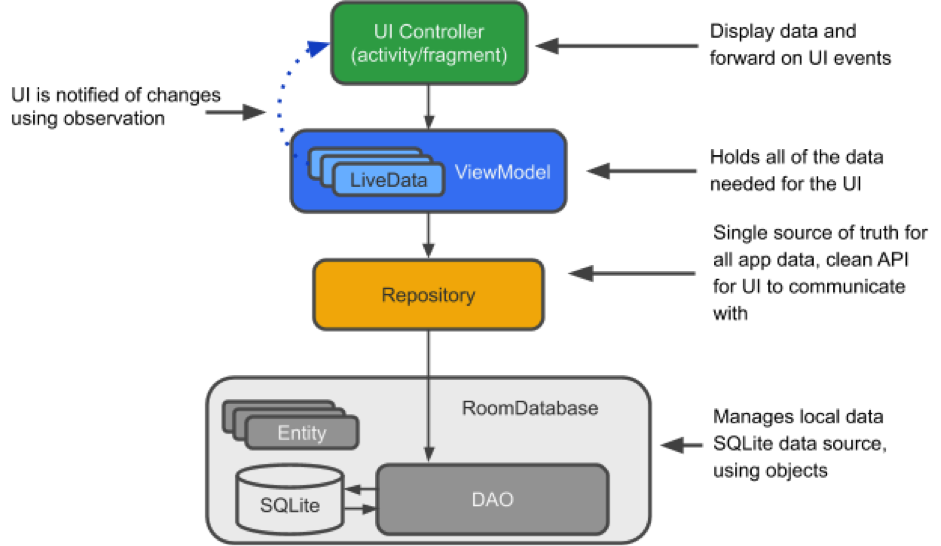
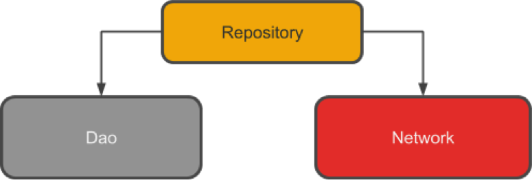

# Teori Komponen Arsitektur (Architecture Components)

Tujuan dari komponen arsitektur adalah memberikan panduan tentang arsitektur aplikasi dengan library untuk tasks yang umum, seperti manajemen lifecycle dan data presistance. Komponen arsitektur dapat membantu dalam menyusun aplikasi dengan cara yang robust, dapat diuji (testable), dan dapat dikelola dengan kode yang lebih sederhana. Diagram berikut ini menunjukkan bentuk dasar dari Komponen Arsitektur.


1. __Entity__ : merupakan kelas beranotasi yang menggambarkan tabel pada database
2. __SQLite database__ : merupakan tempat penyimpanan data di dalam perangkat
3. __Data Access Object (DAO)__ : merupakan pemetaan query SQL ke dalam sebuah fungsi.
4. __Room database__ : merupakan lapisan (layer) basis data di atas SQLite database yang menangani tasks di SQLiteOpenHelper. Room database berfungsi sebagai titik akses ke database SQLite dengan memanfaatkan DAO.
5. __Repository__ : merupakan kelas yang dibuat, misalnya kelas WordRepository. Repository digunakan untuk mengelola sumber data yang bermacam-macam.
6. __ViewModel__: merupakan penyedia data ke User Interface (UI). ViewModel bertindak sebagai pusat komunikasi antara Repository dan UI, serta menyembunyikan asal mula data.
7. __LiveData__: merupakan kelas data yag dapat diamati, dan selalu menyimpan data versi terbaru. LiveData akan menginformasikan ketika terjadi perubahan data


## PRAKTIKUM

Hasil Akhir Dari Chapter 10 adalah membuat Aplikasi yang Mencatat Kalori Seseorang Setiap Hari. Pada starter code telah disediakan aplikasi yang dapat menghitung Body Mass Ratio (BMR) berdasarkan literatur [HelloSehat](https://hellosehat.com/hidup-sehat/nutrisi/cara-menghitung-bmr-kebutuhan-kalori/).
Hasil Akhir Dari Aplikasi ini adalah :


-  __1 Membuat Entity__
    - Entity akan digenerate menjadi table.
    - StarterCode sudah menyediakan kelas LogCaloriesEntity, lengkapi code menjadi seperti pada code berikut:

    ```java
    @Entity(tableName = "log_calories")
    public class LogCaloriesEntity {
        @PrimaryKey(autoGenerate = true)
        @NonNull
        private int id;

        @ColumnInfo(name = "waktu_makan" )
        private String waktuMakan;

        @ColumnInfo(name = "makanan" )
        private String makanan;

        @ColumnInfo(name = "kalori_makanan" )
        private String kaloriMakanan;

        @ColumnInfo(name = "tanggal")
        private String tanggal;

        public LogCaloriesEntity(String waktuMakan, String makanan, String kaloriMakanan,  String tanggal) {
            this.waktuMakan = waktuMakan;
            this.makanan = makanan;
            this.kaloriMakanan = kaloriMakanan;
            this.tanggal = tanggal;
        }

        public int getId() {
            return id;
        }

        public void setId(int id) {
            this.id = id;
        }

        public String getWaktuMakan() {
            return waktuMakan;
        }

        public void setWaktuMakan(String waktuMakan) {
            this.waktuMakan = waktuMakan;
        }

        public String getMakanan() {
            return makanan;
        }

        public void setMakanan(String makanan) {
            this.makanan = makanan;
        }

        public String getKaloriMakanan() {
            return kaloriMakanan;
        }

        public void setKaloriMakanan(String kaloriMakanan) {
            this.kaloriMakanan = kaloriMakanan;
        }

        public String getTanggal() {
            return tanggal;
        }

        public void setTanggal(String tanggal) {
            this.tanggal = tanggal;
        }
    }
    ```

-  __2 Membuat DAO__
    - Di Data Access Object (DAO), kita akan menentukan query SQL dan menghubungkannya dengan pemanggilan metode. Compiler akan memeriksa SQL dan menghasilkan query dari anotasi untuk query umum, seperti @Insert. Secara default, semua query harus dijalankan pada thread yang terpisah. DAO harus berupa interface atau abstract class.
    - Sebagai tahap awal aplikasi kalori dapat menyimpan dan mendapatkan kalori berdasarkan tanggal.
    - Terdapat anotasi insert untuk melakukan inser data dan anotasi Query untuk melakukan Query

    ```java
    @Insert
    void InsertLogCalories(LogCaloriesEntity logCaloriesEntity);
    

    @Query("Select * from log_calories Where tanggal = :date")
    LiveData<List<LogCaloriesEntity>> GetAllLogCalories(String date);
    ```
-   __3 RoomDatabase__
    - Setelah memiliki Entity dan DAO pada tahap selanjutnya adalah membuat kelas yang mengextend RoomDatabase
    - Pada langkah ini kita dapat menggunakan kelas __CaloriesRoomDatabase__ untuk melakukan memanipuluasi SQlite dang mendapatkan data dari SQlite,
    akan tetapi tujuan dari praktikum ini adalah mengenalkan pada architecture component.
    - Dan untuk melakan manipulasi data sebaiknya dilakukan terpisah dengan main thread karena aplikasi yang dibuat akan sangat berisiko force close disebabkan terlalu lama 
    menghold Maint Thread.
    - Oleh karena itu dibuat satu lagi kelas dengan nama Repository yang menghubungkan dao dengan livedata

    ```java
    private  static  CaloriesRoomDatabase Instance;
    private static final String DATABASE_NAME = "CaloriesDatabase";

    public abstract LogCaloriesDao logCaloriesDao();

    public  static CaloriesRoomDatabase GetDatabase(Context context){
        if(Instance == null){
            synchronized (CaloriesRoomDatabase.class){
                if (Instance == null) {
                    Instance = Room.databaseBuilder(context, CaloriesRoomDatabase.class, DATABASE_NAME).build();
                }
            }
        }
        return Instance;
    }
    ```
- __4 Repository__
    - Repository merupakan sebuah kelas yang mengabstraksikan akses ke berbagai sumber data. Repository bukan bagian dari Architecture Component library, tetapi Repository merupakan best practice yang disarankan untuk pemisahan antara kode dan arsitektur. Kelas repository menangani operasi data. Hal ini dapat dilihat pada Gambar Berikut ini :
    
    ;

    - Repository mengelola query thread dan memungkinkan kita untuk menggunakan beberapa backend. Pada contoh yang sering digunakan, Repository mengimplementasikan logika untuk memutuskan apakah akan mengambil data dari jaringan atau menggunakan hasil yang tersimpan pada database lokal.
    Implementasi Repository
    1.	Buat kelas public
    2.	Tambahkan variabel untuk DAO
    3.	Tambahkan konstruktor yang menangani database dan menginisiasi varibel

    ```java
    private CaloriesRoomDatabase caloriesRoomDatabase;
    private  static  LogCaloriesDao logCaloriesDao;


    public CaloriesRepository(Context context) {
        caloriesRoomDatabase = CaloriesRoomDatabase.GetDatabase(context);
        logCaloriesDao = caloriesRoomDatabase.logCaloriesDao();
    }
    public void InsertCalories(LogCaloriesEntity logCaloriesEntity){
        new InsertCaloriesAsynTask().execute(logCaloriesEntity);
    }

    private  class  InsertCaloriesAsynTask extends AsyncTask<LogCaloriesEntity,Void,Void> {
        @Override
        protected Void doInBackground(LogCaloriesEntity... logCaloriesEntities) {
            logCaloriesDao.InsertLogCalories(logCaloriesEntities[0]);
            return null;
        }
    }

    public LiveData<List<LogCaloriesEntity>> GetAllCaloriesByDate(String date){
        return logCaloriesDao.GetAllLogCalories(date);
    }
    ```