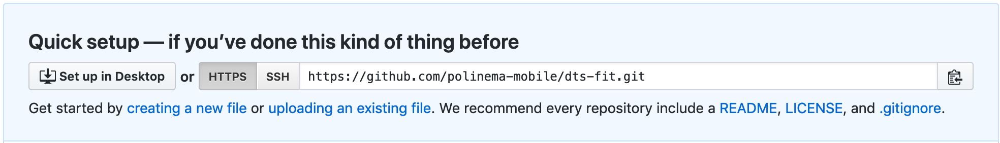

# REST API

REST API adalah sebuah program API (Application Program Interface) yang
menggunakan protokol HTTP (GET, POST, PUT, DELETE) untuk digunakan mengolah
data. Desain yang umum digunakan untuk REST API, berbentuk nouns (kata benda).
Silahkan perhatikan gambar berikut untuk lebih memahami desain REST API.


Sumber: Gambar diambil dari [RESTful API Design: nouns are good, verbs are bad](https://cloud.google.com/blog/products/api-management/restful-api-design-nouns-are-good-verbs-are-bad)

Pada gambar di atas, dapat didefinisikan dengan mudah untuk mengelolah data.
Menggunakan resource yang dikombinasikan dengan HTTP method (POST, GET, PUT,
DELETE). Contoh: untuk menambahkan data anjing baru, digunakan HTTP POST ke resource
/dogs

## Praktikum

- Bukalah [project dts-fit](https://github.com/polinema-mobile/dts-fit/) dengan menggunakan browser.

- Pada project tersebut terdapat file `db.json`. Bukalah, kemudian pahami sejenak.

- Pada file tersebut, terdapat array dengan key `calories` yang menyimpan kumpulan object calory.

- Pada praktikum ini, akan digunakan Fake online REST API, yang disediakan oleh
 [jsonplaceholder](jsonplaceholder.typicode.com). Untuk melihat hasil REST API
 yang telah dibuat, silahkan mengakses [REST Calory](http://my-json-server.typicode.com/polinema-mobile/dts-fit/calories).

**Catatan**:
- Jika anda ingin menggunakan data yang dibuat sendiri, anda dapat menyalin
struktur `db.json` kemudian memodifikasi isinya sesuai dengan keinginan.
Silahkan buatlah new repository pada situs Github.com (Jika anda belum mempunyai
akun, silahkan lakukan registrasi).

- Buatlah repository baru sehingga anda mendapatkan tampilan sebagai berikut!

  

- Tambahkan file `db.json` dengan menekan link `creating a new file`.

- Hasil REST akan dapat diakses dengan format berikut

    ```
  http://my-json-server.typicode.com/<username>/<repository>/calories
    ```

## Lebih lanjut

Jika anda ingin mendalami mengenai REST API, anda dapat menggunakan
framework-framework yang sudah diperuntukkan untuk membangun API. Pada modul ini
tidak dibahas tentang hal ini. Beberapa framework yang direkomendasikan untuk
membangun REST API antara lain:

- Laravel
- Lumen
- Phalcon
- CodeIgniter
- Express
- HapiJS
- Golang
- Spring
- .NET Core
