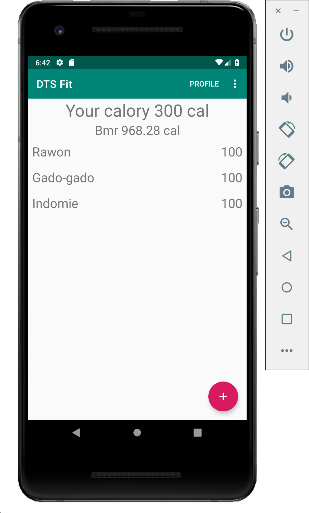

# Implementasi CaloryFragment

## Hasil yang diharapkan



## Praktikum

- Perhatikan pada hasil yang diharapkan pada tampilan `CaloryFragment`.

- Terdapat 3 buah interaksi yang dapat dilakukan pada tampilan tersebut;

- Perhatikan interface berikut yang mewakili kebutuhan tersebut.

  ```java
  public interface OnFragmentInteractionListener {
    void onCaloryFragmentCreated(final View view, final CaloriesAdapter adapter, final TextView caloryText);
    void onAddCaloryButtonClicked();
    void onCaloryClicked(Calory calory);
  }
  ```

- Bukalah `MainActivity.java`, kemudian lengkapi baris kode yang ditandai dengan
    tanda TODO.

- Definisikan atribut CaloryService.

  ```java
  private CaloryService caloryService;
  ```

- pada method `onCreate` lakukan inisiasi atribut caloryService dengan
    menggunakan `ServiceGenerator`.

  ```java
  caloryService = ServiceGenerator.createService(CaloryService.class);
  ```

- Untuk menampilkan data yang diambil dari REST API ke dalam RecyclerView,
    perhatikan method pada `onCaloryFragmentCreated`. Pada method tersebut
    tambahkan baris kode sehingga menjadi berikut:

    ```java
    Call<List<Calory>> caloriesCall = caloryService.getCalories();
		caloriesCall.enqueue(new Callback<List<Calory>>() {
			@Override
			public void onResponse(Call<List<Calory>> call, Response<List<Calory>> response) {
				List<Calory> calories = response.body();
				adapter.setCalories(calories);

        // Tambahkan logic di baris ini untuk mengkalkulasi total calory
			}

			@Override
			public void onFailure(Call<List<Calory>> call, Throwable t) {
        Snackbar.make(view, "Oops!", Snackbar.LENGTH_SHORT).show();
			}
		});

    ```
- Pada `CaloryFragment` terdapat `FloatingActionButton`, pada
    `MainActivity.java` method `onAddCaloryButtonClicked()` tambahkan kode
    untuk berpindah ke `SaveCaloryFragment`.

  ```java
  changeFragment(SaveCaloryFragment.newInstance(null));
  ```

- Sedangkan untuk menambahkan aksi mengubah data, tambahkan kode berpindah ke
    `SaveCaloryFragment` pada method `onCaloryClicked()`. Tetapi yang sedikit
    berbeda, pada langkah ini dikirimkan data calory yang akan diubah.

  ```java
  changeFragment(SaveCaloryFragment.newInstance(calory));
  ```

- Jalankan program, dan perhatikan apa yang terjadi!
