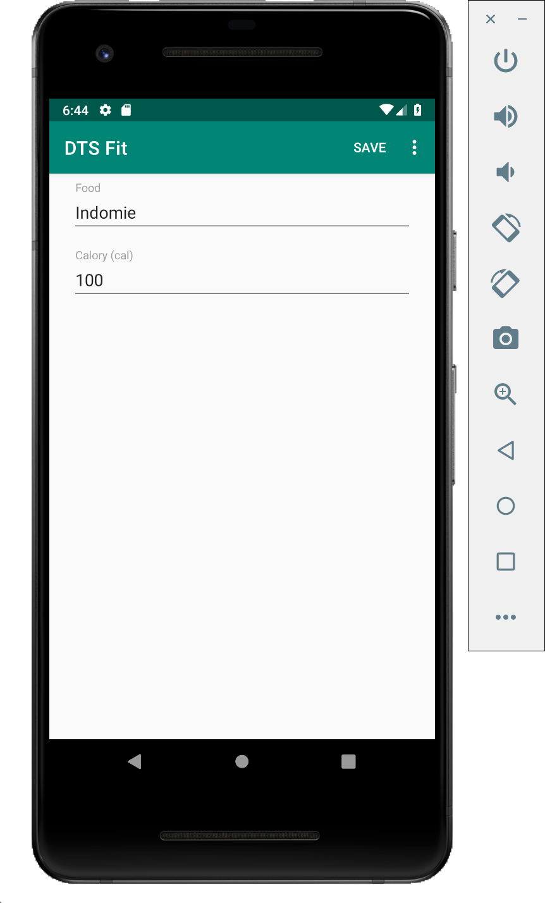

# Implementasi SaveCaloryFragment

## Hasil yang diharapkan



## Praktikum
- Perhatikan pada hasil yang diharapkan pada tampilan `SaveCaloryFragment`

- Pada tampilan ini terdapat `Fragment` yang berfungsi untuk menambahkan atau
 mengubah data calory.

- Jika anda menjalankan program, dan menekan data calory yang akan diubah. Pada
tampilan `SaveCaloryFragment` masih menampilkan data yang kosong. Hal ini
dikarenakan data yang dilempar ke Fragment masih belum ditampilkan.

- Perhatikan method `initComponents()` pada file `SaveCaloryFragment.java`
tambahkan baris kode berikut untuk menampilkan data calory yang telah
didapatkan.

```java
foodText.setText(calory.getFood());
caloryText.setText(String.valueOf(calory.getCalory()));
```

- Jalankan kembali program, dan amati apa yang terjadi!

- Pada file `SaveCaloryFragment.java` terdapat kode interface sebagai berikut

  ```java
  public interface OnFragmentInteractionListener {
    void onSaveMenuClicked(View view, Calory calory);
  }
  ```

- Interface tersebut akan dijalankan ketika menu **Save** ditekan.
- Bukalah file `MainActivity.java` kemudian carilah blok method
    `onSaveMenuClicked()`. Method ini merupakan implementasi aksi simpan pada
    `SaveCaloryFragment`. Tambahkan kode untuk melakukan penyimpanan data
    calory.

- Simpan data dapat berarti, tambahkan data jika merupakan data baru. Update
    data jika merupakan data lama. Untuk membedakan data baru dan data lama,
    dapat digunakan atribut `id` pada model `Calory`. Sehingga kode untuk
    melakukan penyimpanan menjadi:

```java
	@Override
	public void onSaveMenuClicked(final View view, Calory calory) {
		Call<Calory> caloryCall = (calory.getId() == null)
				? caloryService.addCalory(calory)
				: caloryService.editCalory(calory.getId(), calory);
		caloryCall.enqueue(new Callback<Calory>() {
			@Override
			public void onResponse(Call<Calory> call, Response<Calory> response) {
				Snackbar.make(view, "Save successfull", Snackbar.LENGTH_SHORT).show();
				changeFragment(CaloryFragment.newInstance());
			}

			@Override
			public void onFailure(Call<Calory> call, Throwable t) {
				Snackbar.make(view, "Error has occured!", Snackbar.LENGTH_SHORT).show();
			}
		});
	}

```
