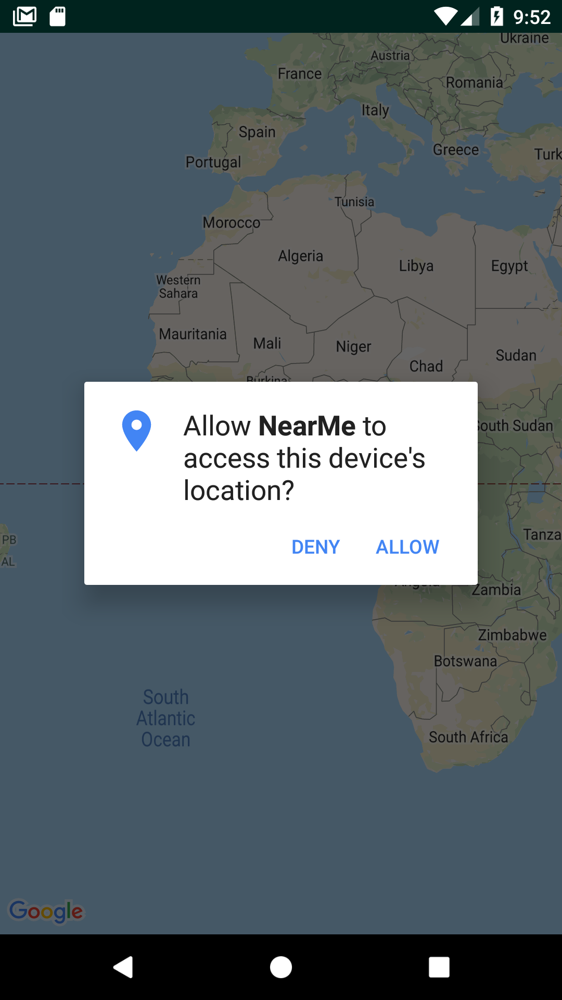

# Praktikum 2 : Menampilkan Current Location

Setelah menampilkan lokasi sesuai dengan koordinat yang kita tentukan, pada praktikum kedua ini kita akan mencoba mendapatkan lokasi pengguna saat mengakses aplikasi (*current location*)

## Menggunakan LocationRequest
LocationRequest digunakan untuk mendapatkan kualitas layanan untuk update lokasi pengguna. Misalnya jika aplikasi kita ingin mendapatkan lokasi pengguna dengan akurasi yang tinggi, maka harus dibuat *location request* dengan `SetsetPriority(int)` diset menjadi `PRIORITY_HIGH_ACCURACY` dan setInterval(long) diset menjadi 5 detik. Pengaturan ini akan sesuai untuk memetakan aplikasi yang menunjukkan lokasi pengguna secara real-time.
1. Buka `MapsActivity.java`
2. Instansiasi `LocationRequest` di bagian atas class: `LocationRequest mLocationRequest;`
3. Tambahkan potongan kode berikut pada fungsi `onMapReady`    
```java
    mLocationRequest = LocationRequest.create();
    mLocationRequest.setInterval(120000);
    mLocationRequest.setFastestInterval(120000);
    mLocationRequest.setPriority(LocationRequest.PRIORITY_HIGH_ACCURACY);
```

## Inisialisasi Google Play Service

Google Play Service menyediakan fungsionalitas inti seperti autentikasi akun Google, sinkronisasi kontak, dan termasuk layanan berbasis lokasi. Untuk itu Google Play Service perlu diinisialisasi di fungsi `onMapReady`, dengan cara tambahkan potongan kode berikut:
```java
    if (android.os.Build.VERSION.SDK_INT >= Build.VERSION_CODES.M) {
            if (ContextCompat.checkSelfPermission(this,
                    Manifest.permission.ACCESS_FINE_LOCATION)
                    == PackageManager.PERMISSION_GRANTED) {                
                mFusedLocationClient.requestLocationUpdates(mLocationRequest, mLocationCallback, Looper.myLooper());
                mMap.setMyLocationEnabled(true);
            } else {
                //Request Location Permission
                checkLocationPermission();
            }
        }
        else {
            mFusedLocationClient.requestLocationUpdates(mLocationRequest, mLocationCallback, Looper.myLooper());
            mMap.setMyLocationEnabled(true);
        }
```

Pada saat inisialisasi Google Play Service kita memanggil fungsi requestLocationUpdates() yang dimiliki oleh FusedLocationClient untuk mendapatkan lokasi terbaru dari pengguna. Maka dari, mFusedLocationClient perlu diinisiasi di bagian awal kelas menggunakan: `protected FusedLocationProviderClient mFusedLocationClient;`

## Menghentikan layanan FusedLocationProviderClient

Tambahkan potongan kode berikut di fungsi `onPause` untuk menghentikan pembaruan lokasi ketika Activity sudah tidak aktif:
```java
    super.onPause();

    //stop location updates
    if (mFusedLocationClient != null) {
        mFusedLocationClient.removeLocationUpdates(mLocationCallback);
    }
```

## Membuat fungsi callback *LocationCallback*
`LocationCallback` digunakan untuk menerima pemberitahuan dari FusedLocationProviderApi ketika lokasi perangkat telah berubah atau tidak lagi dapat ditentukan. Fungsi ini dipanggil jika `LocationCallback` telah terdaftar dengan lokasi pengguna menggunakan metode `requestLocationUpdates (GoogleApiClient, LocationRequest, LocationCallback, Looper)`. Di dalam fungsi callback ini, kita juga akan membuat *marker* dan set nilai perbesaran (zoom) pada saat peta tampil. Tambahkan potongan kode berikut pada file `MapsActivity.java`

```java
    LocationCallback mLocationCallback = new LocationCallback() {
        @Override
        public void onLocationResult(LocationResult locationResult) {
            List<Location> locationList = locationResult.getLocations();
            if (locationList.size() > 0) {                
                Location location = locationList.get(locationList.size() - 1);
                Log.i("MapsActivity", "Location: " + location.getLatitude() + " " + location.getLongitude());
                mLastLocation = location;
                if (mCurrLocationMarker != null) {
                    mCurrLocationMarker.remove();
                }

                //Place current location marker
                LatLng latLng = new LatLng(location.getLatitude(), location.getLongitude());
                MarkerOptions markerOptions = new MarkerOptions();
                markerOptions.position(latLng);
                markerOptions.title("Current Position");
                markerOptions.icon(BitmapDescriptorFactory.defaultMarker(BitmapDescriptorFactory.HUE_MAGENTA));
                mCurrLocationMarker = mMap.addMarker(markerOptions);
                
                mMap.moveCamera(CameraUpdateFactory.newLatLngZoom(latLng, 11));
            }
        }
    };
```
## Setting Permission
1. *Requesting Location Permission*
    Sejak Android 6.0 Marshmallow, aplikasi tidak akan diberikan izin apapun pada saat instalasi. Sebaliknya, aplikasi harus meminta izin kepada pengguna satu per satu pada saat runtime. Jadi tambahkan kode berikut di fungsi `checkLocationPermission` untuk meminta izin akses lokasi pada pengguna:
    ```java
    if (ContextCompat.checkSelfPermission(this, Manifest.permission.ACCESS_FINE_LOCATION)
        != PackageManager.PERMISSION_GRANTED) {
            
        if (ActivityCompat.shouldShowRequestPermissionRationale(this,
                Manifest.permission.ACCESS_FINE_LOCATION)) {

                new AlertDialog.Builder(this)
                    .setTitle("Location Permission Needed")
                    .setMessage("This app needs the Location permission, please accept to use location functionality")
                    .setPositiveButton("OK", new DialogInterface.OnClickListener() {
                    @Override
                    public void onClick(DialogInterface dialogInterface, int i) {                        
                        ActivityCompat.requestPermissions(MapsActivity.this,
                            new String[]{Manifest.permission.ACCESS_FINE_LOCATION},
                            MY_PERMISSIONS_REQUEST_LOCATION );
                        }
                    })
                    .create()
                    .show();
    } else {                
        ActivityCompat.requestPermissions(this,
        new String[]{Manifest.permission.ACCESS_FINE_LOCATION},
                    MY_PERMISSIONS_REQUEST_LOCATION );
    }
    ```

    Jadi ketika aplikasi pertama dijalankan, akan muncul kotak dialog untuk meminta izin pada pengguna utntuk mengakses lokasinya.
    <div style="text-align:center"></div>

2. Handle respon dari *permission request*
*Dialog box* akan muncul setiap kali Aplikasi meminta izin. Saat pengguna merespons, sistem memanggil metode `onRequestPermissionsResult()` dan aplikasi meneruskannya sebagai respons pengguna. Metode ini digunakan untuk mengetahui apakah izin itu diberikan. Tambahkan kode di bawah ini pada fungsi `onRequestPermissionsResult`

```java
    switch (requestCode) {
        case MY_PERMISSIONS_REQUEST_LOCATION: {            
            if (grantResults.length > 0
                    && grantResults[0] == PackageManager.PERMISSION_GRANTED) {

                // permission granted
                if (ContextCompat.checkSelfPermission(this, Manifest.permission.ACCESS_FINE_LOCATION) == PackageManager.PERMISSION_GRANTED) {
                        mFusedLocationClient.requestLocationUpdates(mLocationRequest, mLocationCallback, Looper.myLooper());
                        mMap.setMyLocationEnabled(true);
                }

            } else {
                // permission denied
                Toast.makeText(this, "permission denied", Toast.LENGTH_LONG).show();}
                return;
        }
    }
```