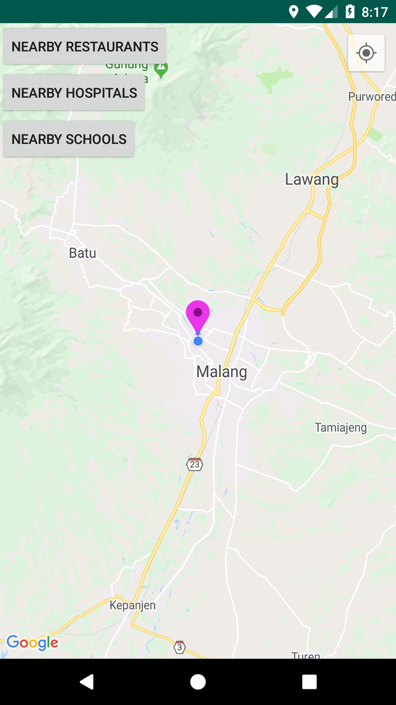

# Praktikum 3 : Menampilkan Fasilitas Umum Terdekat

Setelah menampilkan lokasi sesuai dengan koordinat pengguna, pada praktikum ketiga ini kita akan mencoba mendapatkan lokasi fasilitas umum yang terdekat dari pengguna.

## Cek Google Play Service
Periksa apakah Google Play Services tersedia atau tidak pada fungsi onCreate() di `MainActivity.java`. Untuk itu kita akan menggunakan fungsi CheckGooglePlayServices(). Tambahkan potongan kode berikut:
```java
    private boolean CheckGooglePlayServices() {
        GoogleApiAvailability googleAPI = GoogleApiAvailability.getInstance();
        int result = googleAPI.isGooglePlayServicesAvailable(this);
        if(result != ConnectionResult.SUCCESS) {
            if(googleAPI.isUserResolvableError(result)) {
                googleAPI.getErrorDialog(this, result,
                        0).show();
            }
            return false;
        }
        return true;
    }
```

## Mencari Tempat Makan Terdekat

1. Ubah activity_maps.xml dengan kode berikut:

    ```java
        <?xml version="1.0" encoding="utf-8"?>
        <FrameLayout
        xmlns:android="http://schemas.android.com/apk/res/android"
        xmlns:tools="http://schemas.android.com/tools"
        android:layout_height="match_parent"
        android:layout_width="match_parent">


        <fragment
            android:id="@+id/map"
            android:layout_height="match_parent"
            android:layout_width="match_parent"
            xmlns:map="http://schemas.android.com/apk/res-auto"
            android:name="com.google.android.gms.maps.SupportMapFragment"
            tools:context=".MapsActivity"/>

        <LinearLayout
            android:layout_height="wrap_content"
            android:layout_width="match_parent"
            android:orientation="vertical">

        <Button
            android:id="@+id/btnRestaurant"
            android:layout_height="wrap_content"
            android:layout_width="wrap_content"
            android:text="Nearby Restaurants" />

        <Button
            android:id="@+id/btnHospital"
            android:layout_height="wrap_content"
            android:layout_width="wrap_content"
            android:text="Nearby Hospitals" />

        <Button
            android:id="@+id/btnSchool"
            android:layout_height="wrap_content"
            android:layout_width="wrap_content"
            android:text="Nearby Schools" />

        </LinearLayout>
        </FrameLayout>
    ```
2. Kita akan memulai implementasinya dengan mengatur `setOnClickListener()` sehingga ketika pengguna memilihnya, kode di dalam `onClick(View v)` akan dieksekusi. Tambahkan potongan kode berikut pada fungsi `onMapReady`
    ```java
        Button btnRestaurant = (Button) findViewById(R.id.btnRestaurant);
        btnRestaurant.setOnClickListener(new View.OnClickListener() {
            String Restaurant = "restaurant";
            @Override
            public void onClick(View v) {
                Log.d("onClick", "Button is Clicked");
                mMap.clear();
                String url = getUrl(latitude, longitude, Restaurant);
                Object[] DataTransfer = new Object[2];
                DataTransfer[0] = mMap;
                DataTransfer[1] = url;
                Log.d("onClick", url);
                GetNearbyPlacesData getNearbyPlacesData = new GetNearbyPlacesData();
                getNearbyPlacesData.execute(DataTransfer);
                Toast.makeText(MapsActivity.this,"Nearby Restaurants", Toast.LENGTH_LONG).show();
            }
        });
    ```

    Pada kode di atas pertama-tama Google Map dihapus menggunakan `mMap.clear()` sehingga marker yang disimpan sebelumnya dihapus. Kemudian dibuat URL menggunakan fungsi `getUrl()`. Fungsi ini akan digunakan untuk mendapatkan informasi tentang restoran terdekat di google maps. URL ini dibuat sesuai dengan [Google Developer Guide](https://developers.google.com/places/web-service/search). Kemudian marker ditambahkan di restoran terdekat menggunakan `getNearbyPlacesData.execute(DataTransfer)`.

3. Menambah Class GetNearbyPlacesData
    - Buat class baru dengan nama GetNearbyPlacesData.java, dan isi dengan potongan kode berikut:
    ```java
        public class GetNearbyPlacesData extends AsyncTask<Object, String, String> {
 
        String googlePlacesData;
        GoogleMap mMap;
        String url;
 
        @Override
        protected String doInBackground(Object... params) {
        try {
            Log.d("GetNearbyPlacesData", "doInBackground entered");
            mMap = (GoogleMap) params[0];
            url = (String) params[1];
            DownloadUrl downloadUrl = new DownloadUrl();
            googlePlacesData = downloadUrl.readUrl(url);
            Log.d("GooglePlacesReadTask", "doInBackground Exit");
        } catch (Exception e) {
            Log.d("GooglePlacesReadTask", e.toString());
        }
        return googlePlacesData;
        }
 
        @Override
        protected void onPostExecute(String result) {
            Log.d("GooglePlacesReadTask", "onPostExecute Entered");
            List<HashMap<String, String>> nearbyPlacesList = null;
            DataParser dataParser = new DataParser();
            nearbyPlacesList =  dataParser.parse(result);
            ShowNearbyPlaces(nearbyPlacesList);
            Log.d("GooglePlacesReadTask", "onPostExecute Exit");
        }
 
        private void ShowNearbyPlaces(List<HashMap<String, String>> nearbyPlacesList) {
        for (int i = 0; i < nearbyPlacesList.size(); i++) {
            Log.d("onPostExecute","Entered into showing locations");
            MarkerOptions markerOptions = new MarkerOptions();
            HashMap<String, String> googlePlace = nearbyPlacesList.get(i);
            double lat = Double.parseDouble(googlePlace.get("lat"));
            double lng = Double.parseDouble(googlePlace.get("lng"));
            String placeName = googlePlace.get("place_name");
            String vicinity = googlePlace.get("vicinity");
            LatLng latLng = new LatLng(lat, lng);
            markerOptions.position(latLng);
            markerOptions.title(placeName + " : " + vicinity);
            mMap.addMarker(markerOptions);
            markerOptions.icon(BitmapDescriptorFactory.defaultMarker(BitmapDescriptorFactory.HUE_RED));
            //move map camera
            mMap.moveCamera(CameraUpdateFactory.newLatLng(latLng));
            mMap.animateCamera(CameraUpdateFactory.zoomTo(11));
        }
        }
        }
    ```

    Pada kode di atas `DownloadUrl` adalah kelas yang digunakan untuk mengambil data dari URL menggunakan metode `HttpURLConnection` dan *File Handling*.Setelah mengambil data dalam bentuk `googlePlacesData`, akan diteruskan ke metode `onPostExecute`. Data dari URL akan berbentuk JSON yang perlu diuraikan, Jadi perlu membuat kelas bernama `DataParser`. File `DataParser.java` harus ditambahkan pada path yang sama dengan `MainActivity.java`. `dataParser.parse (hasil)` digunakan untuk mengurai data dan hasil disimpan sebagai daftar di `nearbyPlacesList`. Sekarang `nearbyPlacesList` akan memiliki semua informasi tentang restoran terdekat yang dapat dengan mudah kita akses dan tambahkan marker di tempat yang sesuai. Marker ditambahkan di Google Maps menggunakan fungsi `ShowNearbyPlaces`.

4. Membuat class donwloadUrl
    Buat class downloadUrl dan tambahkan potongan kode berikut:
    ```java
        public class downloadUrl {
 
        public String readUrl(String strUrl) throws IOException {
        String data = "";
        InputStream iStream = null;
        HttpURLConnection urlConnection = null;
        try {
            URL url = new URL(strUrl);
 
            // Creating an http connection to communicate with url
            urlConnection = (HttpURLConnection) url.openConnection();
 
            // Connecting to url
            urlConnection.connect();
 
            // Reading data from url
            iStream = urlConnection.getInputStream();
 
            BufferedReader br = new BufferedReader(new InputStreamReader(iStream));
 
            StringBuffer sb = new StringBuffer();
 
            String line = "";
            while ((line = br.readLine()) != null) {
                sb.append(line);
            }
 
            data = sb.toString();
            Log.d("downloadUrl", data.toString());
            br.close();
 
        } catch (Exception e) {
            Log.d("Exception", e.toString());
        } finally {
            iStream.close();
            urlConnection.disconnect();
        }
        return data;
        }
        }
    ```

    Data yang dikembalikan dari web akan berbentuk json yang dapat diperoleh pengguna menggunakan HttpURLConnection. Jalankan aplikasi, maka akan muncul tampilan seperti berikut:
    <div style="text-align:center"></div>

## Latihan
Tambahkan jenis fasilitas lain pada map. Jenis fasilitas yang disediakan oleh Google dapat dilihat pada [Jenis Fasilitas](https://developers.google.com/places/supported_types).