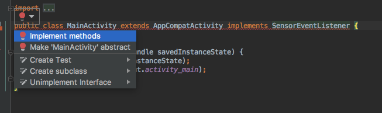

# Pendahaluan
Pada pecobaan kali ini, kita akan mencoba memanfaatkan sensor proximity. Sensor proximity adalah sensor yang mampu mendeteksi jarak obyek yang ada disekitarnya. Rata-rata jarak terjauh obyek yang dapat dideteksi sensor proximity adalah 5cm. Biasanya, sensor proximity diletakkan pada bagian depan (layar) perangkat Android. Sensor ini sering digunakan untuk mendeteksi seberapa dekat layar dengan obyek, kemudian aplikasi akan mematikan layar jika jarak terlalu dekat.

# Tujuan
Pada percobaan kali ini kita akan membuat aplikasi sederhana yang akan mengubah warna layar jika sensor proximity mendeteksi obyek yang sangat dekat.

# Tahapan

1. Buat proyek Android baru pada Android Studio dengan nama **Simple Proximity**
2. Pada `MainActivity.java` implementasi interface `SensorEventListener` pada kelas. Implementasi method yang dibutuhkan oleh interface `SensorEventListener` seperti pada gambar dibawah ini.



3. Pada `MainActivity.java` akan ditambahkan method `onSensorChanged()` dan `onAccuracyChange()`. Method `onSensorChanged()` akan dijalankan ketika terjadi perubahan nilai dari sensor. Sedangkan method `onAccuracyChange()` dipanggil ketika terjadi perubahan **nilai akurasi** dari sensor.

4. Dekalarsi obyek `SensorManager` dan `Sensor`. Tambahkan variable boolean `isSensorPresent` sebagai variabel untuk pengecekan ketersediaan sensor

```java
SensorManager sensorManager;
Sensor sensor;
Boolean isSensorPresent = false;
```

5. Inisiasi obyek `SensorManager` dan `Sensor` pada method `onCreate()`

```java
// Inisiasi SensorManager
sensorManager = (SensorManager)this.getSystemService(SENSOR_SERVICE);

// Cek sensor proximity
if(sensorManager.getDefaultSensor(Sensor.TYPE_PROXIMITY) != null) {
    sensor = sensorManager.getDefaultSensor(Sensor.TYPE_PROXIMITY);
    isSensorPresent = true;
} else {
    isSensorPresent = false;
    Toast.makeText(this, "Sensor tidak ditemukan", Toast.LENGTH_LONG).show();
}
```

6. Lakukan override untuk fungsi `onResume()` dan `onPause()`. Pada lifecycle **onResume**, kita akan meregistrasi sensor kedalam activity. Cara ini dilakukan untuk mendapatkan nilai hasil pembacaan sensor dan dijalankan pada activity. Kemudian pada lifecycle **onPause** kita akan melakukan **unregister** sensor. Hal ini dilakukan untuk melepas listner sensor, sehingga pembacaan sensor tidak terus menerus dijalankan ketika activity tidak dapat dilihat user. Isikan kode seperti berikut pada method `onResume()` dan `onPause()`

```java
@Override
protected void onResume() {
    super.onResume();

    if(isSensorPresent){
        // SENSOR_DELAY_NORMAL digunakan untuk mendelay pembacaan data sensor
        // dengan kecepatan normal
        sensorManager.registerListener(this, sensor, SensorManager.SENSOR_DELAY_NORMAL);
    }
}

@Override
protected void onPause() {
    super.onPause();
    if(isSensorPresent){
        sensorManager.unregisterListener(this);
    }
}
```

7. Pada method `onSensorChanged()` terdapat parameter dengan obyek bernama `SensorEvent`. `SensorEvent` merupakan obyek yang menyimpan data dari hasil pembacaan sensor. Method `onSensorChanged()` akan terus dipanggil selama ada perubahan data dari hasil pembacaan sensor. Tambahkan kode dibawah ini didalam method `onSensorChanged()`. 

```java
if(sensorEvent.values[0] < sensor.getMaximumRange()){
    // Jika terdapat obyek sangat dekat dengan sensor proximity
    getWindow().getDecorView().setBackgroundColor(Color.RED);
} else {
    // Jika tidak ada obyek yang dekat dengan sensor proximity
    getWindow().getDecorView().setBackgroundColor(Color.BLUE);
}
```